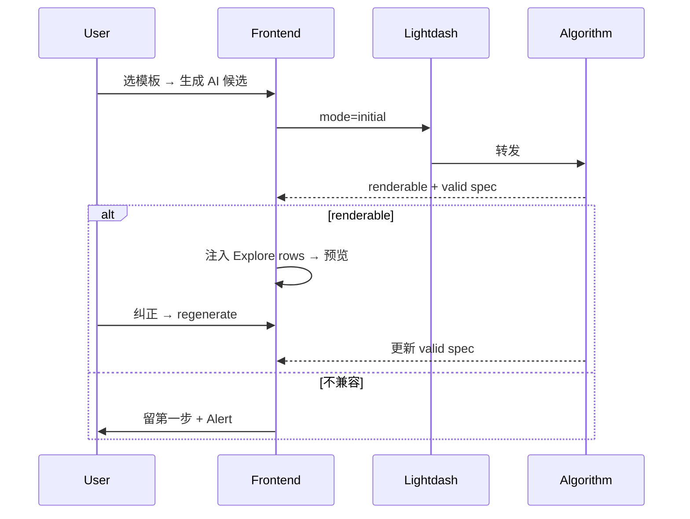

# AI 模板图表生成 API（算法服务）

图表模板 AI 候选生成的接口契约：入参、两阶段调用、响应约定。供算法服务实现与 Lightdash 联调。

> **状态**：草案。Lightdash 待算法服务就绪后接入；当前 generate 仍代理 admin-nest。

---

## 1. 概述

用户在 Explore 配置 **Metric Query** 并选择 Vega 模板后，接口负责：

1. 查询与模板兼容性判断（宽表 / pivot / 粒度等）
2. 模板占位 → Explore `fieldId` 映射
3. 返回 1～3 个可直接绑定 Explore 数据的 Vega-Lite spec 候选

```
Frontend → Lightdash  POST /api/v1/chart-templates/{id}/generate
         → Algorithm POST /v1/chart-templates/{id}/generate
         → Explore 注入查询结果 → Vega 渲染
```

| 约定 | 说明 |
|------|------|
| 查询 | 仅 **MetricQuery**（Explorer 复制 JSON），**不传 SQL** |
| 成功交付 | `renderable: true` 时返回的 spec 可直接绑定 Explore 查询结果渲染（见「spec 交付标准」） |
| 阶段 | 单接口，`mode: initial \| regenerate` |
| 鉴权 | Lightdash：Session / PAT；算法：内网 + 服务 token |

---

## 2. 接口

```
POST /api/v1/chart-templates/{templateId}/generate   # Lightdash 对外
POST /v1/chart-templates/{templateId}/generate       # 算法服务（建议）
```

`templateId` 须与 body 中 `template.id` 一致。

### 响应 envelope

| 层级 | 谁返回 | 形状 |
|------|--------|------|
| 算法服务 | 直接返回 `data` 对象（结构见「响应 data」） | `{ templateId, renderable, compatibility, selectionMeta, candidates, ... }` |
| Lightdash Backend | 包装后给前端 | `{ "status": "ok", "results": { "success", "msg", "data": { ... } } }` |

样例 JSON 中的 `status / results` 为 **Lightdash 对外形态**；算法联调时只需保证 `data` 字段正确。

---

## 3. 请求与响应

### 3.1 请求体结构

```typescript
type GenerateChartTemplateCandidatesRequest = {
  mode: 'initial' | 'regenerate';
  projectUuid: string;
  metricQuery: MetricQuery;
  template: {
    id: number;
    chartType: string | null;
    exampleName?: string | null;
    technicalName?: string | null;
  };
  fieldCatalog: Array<{
    fieldId: string;
    label: string;
    fieldKind: 'dimension' | 'metric' | 'tableCalculation' | 'unknown';
    isSelected: boolean;
  }>;
  selectedDimensions?: string[];
  selectedMetrics?: string[];
  userPrompt?: string;
  previousSelectionMeta?: SelectionMeta;
};
```

### 3.2 入参字段说明

| 字段 | 必填 | 说明 |
|------|------|------|
| `mode` | 是 | `initial`：第一步生成；`regenerate`：第二步纠正后重新生成 |
| `projectUuid` | 是 | 当前 Explore 所属项目 UUID，由 Lightdash Backend 从会话上下文注入 |
| `metricQuery` | 是 | 当前 Explore 完整语义查询，与 Explorer「复制 Metric Query」JSON 同形，见 3.3 |
| `template` | 是 | 用户选中的模板元信息，见 3.5；`id` 须与 URL 路径 `{templateId}` 一致 |
| `fieldCatalog` | 是 | Explore 字段目录，辅助 label→fieldId 消歧，见 3.4 |
| `selectedDimensions` | regenerate 可选 | 第二步 MultiSelect 覆盖的维度 fieldId 列表 |
| `selectedMetrics` | regenerate 可选 | 第二步 MultiSelect 覆盖的指标 fieldId 列表 |
| `userPrompt` | regenerate 可选 | 用户填写的自然语言纠正说明 |
| `previousSelectionMeta` | regenerate 推荐 | 上一轮响应中的 `selectionMeta` 原样回传，保留映射上下文 |

**initial 与 regenerate 差异**

| 字段 | initial | regenerate |
|------|---------|------------|
| `metricQuery` | 必填 | 必填；若用户回到 Explore 改了筛选，须传最新整段 |
| `template` | 必填 | 必填 |
| `fieldCatalog` | 必填 | 必填 |
| `selectedDimensions/Metrics` | 不传 | 用户改了 MultiSelect 时传 |
| `userPrompt` | 不传 | 有纠正说明时传 |
| `previousSelectionMeta` | 不传 | 推荐传 |

**regenerate 字段优先级**（冲突时）：`selectedDimensions/Metrics` > `userPrompt` 推断 > `previousSelectionMeta` > 从 `metricQuery` 推导。

**不传的内容**：SQL、编译后 warehouse SQL、查询结果行（sample rows）。

### 3.3 metricQuery

与 `@lightdash/common` 中 `MetricQuery` 一致。算法据此判断查询形状（维度/指标数量、宽表/长表）并做字段映射；spec 中引用的 fieldId 应来自此处选中的列。

```typescript
type MetricQuery = {
  exploreName: string;              // Explore 表名
  dimensions: string[];             // 维度 fieldId 列表
  metrics: string[];                // 指标 fieldId 列表
  filters: Filters;                 // 维度/指标筛选
  sorts: Array<{ fieldId: string; descending: boolean }>;
  limit: number;
  tableCalculations?: Array<{ name: string; /* ... */ }>;
  additionalMetrics?: unknown[];
  customDimensions?: unknown[];
  timezone?: string;
};
```

| 字段 | 算法侧用途 |
|------|------------|
| `exploreName` | 标识 Explore，一般不影响映射 |
| `dimensions` | 候选 X 轴 / 分组 / color 字段来源 |
| `metrics` | 候选 Y 轴 / 数值字段来源；多列指标可能表示宽表 |
| `filters` | 理解业务上下文（如类目、周期），不参与 spec 内嵌 |
| `sorts` / `limit` | 可选参考，一般不改 spec |
| `tableCalculations` | 若选中，其 `name` 也可作为 spec 字段引用 |

**filters 结构**：维度筛选在 `filters.dimensions` 下，支持 `and` / `or` 嵌套；每条规则含 `target.fieldId`、`operator`、`values`。

**完整示例**（initial 折线图场景）：

```json
{
  "exploreName": "ads_brandct_sales_brand_top_m",
  "dimensions": ["ads_brandct_sales_brand_top_m_biz_date"],
  "metrics": ["ads_brandct_sales_brand_top_m_total_market_share"],
  "filters": {
    "dimensions": {
      "and": [
        {
          "target": { "fieldId": "ads_brandct_sales_brand_top_m_cls_4" },
          "operator": "equals",
          "values": ["运动饮料"]
        },
        {
          "target": { "fieldId": "ads_brandct_sales_brand_top_m_period" },
          "operator": "equals",
          "values": ["2026Q1"]
        }
      ]
    }
  },
  "sorts": [
    { "fieldId": "ads_brandct_sales_brand_top_m_biz_date", "descending": false }
  ],
  "limit": 500
}
```

`tableCalculations`、`additionalMetrics`、`customDimensions` 无内容时可省略或传空数组。

### 3.4 fieldCatalog

Explore 当前可见字段列表，由 Lightdash 从 `itemsMap` 与当前查询组装，**不是**查询的主数据源（主数据源是 `metricQuery`）。

| 子字段 | 说明 |
|--------|------|
| `fieldId` | 字段唯一 ID，与 metricQuery / spec 中一致 |
| `label` | 展示名（中文或带表名），用于 label→fieldId 消歧 |
| `fieldKind` | `dimension` / `metric` / `tableCalculation` / `unknown` |
| `isSelected` | 是否出现在当前 `metricQuery.dimensions/metrics/tableCalculations` 中 |

**示例**：

```json
[
  {
    "fieldId": "ads_brandct_sales_brand_top_m_biz_date",
    "label": "业务日期",
    "fieldKind": "dimension",
    "isSelected": true
  },
  {
    "fieldId": "ads_brandct_sales_brand_top_m_total_market_share",
    "label": "市占率",
    "fieldKind": "metric",
    "isSelected": true
  },
  {
    "fieldId": "ads_brandct_sales_brand_top_m_cls_4",
    "label": "四级类目",
    "fieldKind": "dimension",
    "isSelected": false
  }
]
```

`isSelected: false` 的字段仍在 catalog 中，便于用户纠正时选用，但不应默认映射进 spec，除非 regenerate 时用户显式选中。

### 3.5 template

| 子字段 | 说明 |
|--------|------|
| `id` | 模板 ID，与 URL `{templateId}` 一致 |
| `chartType` | 模板分类，如「柱状图」「折线图」，用于兼容性规则 |
| `exampleName` | 展示名，如「趋势折线图(vl_line_trend)」 |
| `technicalName` | 技术名，如 `vl_line_trend`，算法侧匹配槽位规则的主键 |

**示例**：

```json
{
  "id": 18,
  "chartType": "折线图",
  "exampleName": "趋势折线图(vl_line_trend)",
  "technicalName": "vl_line_trend"
}
```

### 3.6 regenerate 专用字段

| 字段 | 说明 |
|------|------|
| `selectedDimensions` | 用户在第二步 MultiSelect 选中的维度 fieldId；覆盖算法默认映射 |
| `selectedMetrics` | 用户在第二步 MultiSelect 选中的指标 fieldId |
| `userPrompt` | 自然语言纠正，如「X 轴改四级类目，去掉去年同期」 |
| `previousSelectionMeta` | 上一轮返回的 `selectionMeta`，含 `fieldBindings`、`ignoredMetrics` 等，避免重复失败路径 |

### 3.7 完整请求示例

**initial**（第一步「生成 AI 候选」）：

```json
{
  "mode": "initial",
  "projectUuid": "a1b2c3d4-e5f6-7890-abcd-ef1234567890",
  "metricQuery": {
    "exploreName": "ads_brandct_sales_brand_top_m",
    "dimensions": ["ads_brandct_sales_brand_top_m_biz_date"],
    "metrics": ["ads_brandct_sales_brand_top_m_total_market_share"],
    "filters": {
      "dimensions": {
        "and": [
          {
            "target": { "fieldId": "ads_brandct_sales_brand_top_m_cls_4" },
            "operator": "equals",
            "values": ["运动饮料"]
          }
        ]
      }
    },
    "sorts": [{ "fieldId": "ads_brandct_sales_brand_top_m_biz_date", "descending": false }],
    "limit": 500
  },
  "template": {
    "id": 18,
    "chartType": "折线图",
    "exampleName": "趋势折线图(vl_line_trend)",
    "technicalName": "vl_line_trend"
  },
  "fieldCatalog": [
    { "fieldId": "ads_brandct_sales_brand_top_m_biz_date", "label": "业务日期", "fieldKind": "dimension", "isSelected": true },
    { "fieldId": "ads_brandct_sales_brand_top_m_total_market_share", "label": "市占率", "fieldKind": "metric", "isSelected": true }
  ]
}
```

**regenerate**（第二步「AI 重新生成」）在 initial 基础上增加：

```json
{
  "mode": "regenerate",
  "selectedDimensions": ["ads_brandct_sales_brand_top_m_cls_4"],
  "selectedMetrics": ["ads_brandct_sales_brand_top_m_total_market_share"],
  "userPrompt": "请用四级类目做 X 轴，只保留市占率",
  "previousSelectionMeta": {
    "chosenDimensions": ["ads_brandct_sales_brand_top_m_biz_date"],
    "chosenMetrics": ["ads_brandct_sales_brand_top_m_total_market_share"],
    "ignoredDimensions": [],
    "ignoredMetrics": [],
    "mappingConfidence": "high",
    "fieldBindings": { "x_time": "ads_brandct_sales_brand_top_m_biz_date", "y_metric": "ads_brandct_sales_brand_top_m_total_market_share" },
    "ambiguityReasons": [],
    "reasoningTags": []
  }
}
```

其余字段（`projectUuid`、`metricQuery`、`template`、`fieldCatalog`）仍须完整传递。

### 3.8 响应 data

```typescript
type GenerateChartTemplateCandidatesData = {
  templateId: number;
  model: string;          // 实际使用的策略标识，如 rule-map-v2（只读，供日志）
  renderable: boolean;    // true：至少 1 个 candidate.valid === true
  usedFallback: boolean;
  compatibility: {
    isReasonable: boolean;
    level: 'good' | 'warning' | 'error';
    reasons: string[];
    suggestions: string[];
  };
  selectionMeta: SelectionMeta | null;
  candidates: Array<{
    strategy: 'primary' | 'secondary' | 'conservative';
    reasoning: string;
    spec: Record<string, unknown>;  // 可直接绑定 Explore 数据，见「spec 交付标准」
    valid: boolean;   // true 表示 spec 通过交付自检，注入数据即可渲染
    errors: string[]; // valid=false 时非空
    fieldMapping?: Record<string, string>;  // 模板槽位 → fieldId，便于调试
  }>;
};
```

**成功语义**

| 字段 | 含义 |
|------|------|
| `renderable: true` | 至少一个 candidate 的 `valid: true`；前端可进第二步 / 更新预览 |
| `candidates[].valid: true` | 该 spec 已通过自检规则（共 7 条），Lightdash 注入数据即可渲染 |
| `candidates[].valid: false` | 不应随 `renderable: true` 返回；若返回则前端跳过该候选 |

**失败类型**

| 类型 | HTTP | 前端 |
|------|------|------|
| 硬失败 | 4xx / 5xx | 错误提示（样例 E） |
| 软失败 | 200，`renderable: false` 或全部 `valid: false` | 展示 compatibility（样例 B、D） |

```typescript
type SelectionMeta = {
  chosenDimensions: string[];
  chosenMetrics: string[];
  ignoredDimensions: string[];
  ignoredMetrics: string[];
  mappingConfidence: 'high' | 'medium' | 'low' | null;
  fieldBindings: Record<string, string>;  // 模板槽位 → fieldId
  ambiguityReasons: string[];
  reasoningTags: string[];
};
```

regenerate 时将上一轮 `selectionMeta` 原样作为 `previousSelectionMeta` 回传。

---

## 4. spec 交付标准

### 4.1 渲染模型

Lightdash CustomVis **不在 spec 内嵌数据**。Explore 执行查询后，前端将结果注入 Vega：

```
算法返回 spec（fieldId + data.name=values）
Explore 查询 → rows[fieldId].value.raw
VegaLite 渲染：spec + data.values = rows
```

因此算法成功时交付的是 **「可绑定 Explore 数据的 spec」**，不是带 sample rows 的完整图表。

### 4.2 自检规则（`valid: true` 须全部满足）

| # | 规则 | 说明 |
|---|------|------|
| 1 | Vega-Lite v5 | `$schema: https://vega.github.io/schema/vega-lite/v5.json` |
| 2 | 固定数据层 | `data: { "name": "values" }`；**禁止** `data.values`、`data.url` |
| 3 | fieldId 引用 | encoding / transform / calculate 中一律用 **fieldId**，不用 label |
| 4 | 列存在 | 引用的 fieldId ∈ `metricQuery` 选中列（或由 spec 内 transform 合法派生） |
| 5 | 值类型 | encoding `type` 与 Explore **raw** 值匹配；时间字段用 `temporal` 时 raw 须可解析为日期 |
| 6 | 无占位 | 不含 `{{...}}` mustache；不含 `rewrite: true`（算法直接输出 fieldId 终态 spec） |
| 7 | 形状一致 | pivot / layer / transform 与 metricQuery 列形状（宽表/长表）一致 |

**最小成功 spec 示例**（算法输出应接近此形态）：

```json
{
  "$schema": "https://vega.github.io/schema/vega-lite/v5.json",
  "data": { "name": "values" },
  "mark": { "type": "line", "point": true },
  "encoding": {
    "x": { "field": "ads_brandct_sales_brand_top_m_biz_date", "type": "temporal", "title": null },
    "y": { "field": "ads_brandct_sales_brand_top_m_total_market_share", "type": "quantitative", "aggregate": "sum", "title": null }
  }
}
```

**常见踩坑**

- `scale.domain` 写 formatted 标签（如 `"2024年"`）但 Explore 注入的是 raw → 图表空白；不写 domain 或 domain 与 raw 一致
- `color` 与 `x` 同字段且该字段不在查询列 → 无数据；color 字段须在 metricQuery 中
- 宽表两列指标 + pivot 模板 → 应 `renderable: false`，不要返回 `valid: true` 的 spec

### 4.3 职责划分

| 职责 | 算法 | Lightdash |
|------|------|-----------|
| 兼容性判断 | 是 | 展示 compatibility |
| 模板槽位 → fieldId | 是 | 提供 metricQuery + fieldCatalog |
| 生成可渲染 spec | 是 | — |
| `valid` / `errors` 自检 | 是 | 可选兜底（字段是否仍在当前查询中） |
| 注入 `data.values` | **否** | **是**（固定架构） |
| 容器 autosize（width/height container） | 否 | 是 |

### 4.4 算法推荐实现流程（可复用）

各模板共用同一流水线，差异仅在「模板槽位定义」与「兼容性规则」：

```
1. 解析 metricQuery → 查询形状（维度数、指标数、宽表/长表）
2. 兼容性检查（template.technicalName + chartType）
   └─ 不通过 → renderable=false, candidates=[], 填 compatibility
3. 字段映射
   ├─ initial：规则映射（时间维→x，指标→y…）+ fieldCatalog label 消歧
   └─ regenerate：selected* > userPrompt > previousSelectionMeta > 规则
4. 填充模板 → 输出 fieldId 终态 spec（去掉 mustache / 占位 layer）
5. 按自检规则校验 → valid + errors
6. 返回 1～3 个 candidate（primary 必选，secondary/conservative 可选）
```

**输入足够、无需拉数**：兼容性与映射仅依赖 `metricQuery` + `fieldCatalog` + `template`；不要求算法执行查询或返回 sample rows。

---

## 5. 两阶段流程



| mode | 触发 | 失败时前端 |
|------|------|------------|
| `initial` | 第一步「生成 AI 候选」 | 留第一步，Alert |
| `regenerate` | 第二步「AI 重新生成」 | 留第二步，保留旧预览 + hints |

---

## 6. 联调样例

对外响应均含 Lightdash envelope（`status` + `results`）。成功样例的 spec 均符合自检规则。

### 样例对照

| 样例 | mode | renderable | valid spec | 前端 |
|------|------|------------|------------|------|
| A 折线成功 | initial | true | primary.valid=true | 进第二步，直接预览 |
| B 宽表失败 | initial | false | — | 留第一步 |
| C 纠正成功 | regenerate | true | primary.valid=true | 更新预览 |
| D 纠正仍失败 | regenerate | false | — | 留第二步 + hints |
| E 硬失败 | — | — | — | 错误页 |

---

### A · initial 成功（折线图）

**请求** `POST .../chart-templates/18/generate`

```json
{
  "mode": "initial",
  "projectUuid": "proj-uuid-001",
  "metricQuery": {
    "exploreName": "ads_brandct_sales_brand_top_m",
    "dimensions": ["ads_brandct_sales_brand_top_m_biz_date"],
    "metrics": ["ads_brandct_sales_brand_top_m_total_market_share"],
    "filters": {
      "dimensions": {
        "and": [
          {
            "target": { "fieldId": "ads_brandct_sales_brand_top_m_cls_4" },
            "operator": "equals",
            "values": ["运动饮料"]
          }
        ]
      }
    },
    "sorts": [{ "fieldId": "ads_brandct_sales_brand_top_m_biz_date", "descending": false }],
    "limit": 500
  },
  "template": {
    "id": 18,
    "chartType": "折线图",
    "exampleName": "趋势折线图(vl_line_trend)",
    "technicalName": "vl_line_trend"
  },
  "fieldCatalog": [
    { "fieldId": "ads_brandct_sales_brand_top_m_biz_date", "label": "业务日期", "fieldKind": "dimension", "isSelected": true },
    { "fieldId": "ads_brandct_sales_brand_top_m_total_market_share", "label": "市占率", "fieldKind": "metric", "isSelected": true }
  ]
}
```

**响应（节选）**

```json
{
  "status": "ok",
  "results": {
    "success": true,
    "data": {
      "templateId": 18,
      "model": "rule-map-v2",
      "renderable": true,
      "compatibility": { "isReasonable": true, "level": "good", "reasons": [], "suggestions": [] },
      "selectionMeta": {
        "chosenDimensions": ["ads_brandct_sales_brand_top_m_biz_date"],
        "chosenMetrics": ["ads_brandct_sales_brand_top_m_total_market_share"],
        "fieldBindings": { "x_time": "ads_brandct_sales_brand_top_m_biz_date", "y_metric": "ads_brandct_sales_brand_top_m_total_market_share" },
        "mappingConfidence": "high",
        "ignoredDimensions": [],
        "ignoredMetrics": [],
        "ambiguityReasons": [],
        "reasoningTags": ["temporal_line"]
      },
      "candidates": [
        {
          "strategy": "primary",
          "reasoning": "X=业务日期，Y=市占率",
          "valid": true,
          "errors": [],
          "fieldMapping": { "x": "ads_brandct_sales_brand_top_m_biz_date", "y": "ads_brandct_sales_brand_top_m_total_market_share" },
          "spec": {
            "$schema": "https://vega.github.io/schema/vega-lite/v5.json",
            "data": { "name": "values" },
            "mark": { "type": "line", "point": true },
            "encoding": {
              "x": { "field": "ads_brandct_sales_brand_top_m_biz_date", "type": "temporal", "title": null },
              "y": { "field": "ads_brandct_sales_brand_top_m_total_market_share", "type": "quantitative", "aggregate": "sum", "title": null }
            }
          }
        }
      ]
    }
  }
}
```

---

### B · initial 软失败（宽表 + pivot 模板）

**请求要点**：`metrics` 含本期 + 去年同期两列；pivot 类模板。

**响应（节选）**：`renderable: false`，`candidates: []`，`compatibility.reasons` 说明宽表不兼容。

---

### C · regenerate 成功

**请求要点**：`mode: "regenerate"` + `userPrompt` + 字段覆盖 + `previousSelectionMeta`（上一轮 `selectionMeta` 原样）。

**响应（节选）**：`renderable: true`，`candidates[0].valid: true`，bar spec 的 `encoding.x.field` 为四级类目 fieldId，**无 `rewrite`、无 mustache**。

---

### D · regenerate 软失败

**响应（节选）**：`renderable: false`，`candidates: []`。前端保留上一轮预览。

---

### E · 硬失败

```
POST .../generate（缺 metricQuery）→ 422
```

---

## 7. compatibility 文案建议

| 场景 | reasons | suggestions |
|------|---------|-------------|
| 宽表 + pivot | 宽表不适用 pivot 同比模板 | 换双指标柱状图或改长表 |
| 粒度不匹配 | 月粒度 vs 年两档模板 | Explore 改年粒度 |
| 槽位不足 | 指标超出模板槽位 | 减 metrics 或换模板 |

---

## 8. 联调检查清单

**算法**

- [ ] 成功时 `candidates[].spec` 满足自检规则全部 7 条
- [ ] `valid: true` 与 `errors: []` 一致；`valid: false` 时不标 `renderable: true`
- [ ] spec 无 `data.values`、无 `rewrite`、无 `{{...}}`
- [ ] 软失败不返回 `valid: true` 的空壳 spec

**Lightdash**

- [ ] 预览：注入 Explore rows 后直接渲染 spec，不做 label 改写
- [ ] initial 不兼容 → 留第一步；regenerate 失败 → 留第二步
- [ ] 与 [`templatesApi.ts`](../packages/frontend/src/features/templates/api/templatesApi.ts) normalize 兼容

---

## 9. 版本记录

| 日期 | 说明 |
|------|------|
| 2026-06-02 | 初稿：单接口 + mode；MetricQuery 入参；样例 A～E |
| 2026-06-02 | 精简 envelope / fieldCatalog 必填 |
| 2026-06-02 | 补充入参字段说明、metricQuery/fieldCatalog/template 详解与完整请求示例 |
