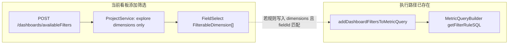

# 看板筛选「自定义 SQL 维度」可行性评估

## 1. 背景与问题

在 Lightdash 中，图表 Explore 里可以添加**自定义维度**，其中一类是 **Custom SQL 维度**（`metric_query.customDimensions` 中 `type: SQL` 的项）：由用户在界面编写 SQL 片段，并指定逻辑类型（如字符串、日期等）。

**看板筛选器**用于在 dashboard 层统一过滤多个图块。当前用户在添加看板筛选时，候选字段主要来自各已保存图表对应 **explore 上的维度**，无法在列表中选到「仅存在于某张图里的自定义 SQL 维度」。

本文评估：**是否可以在产品层面支持「看板筛选绑定自定义 SQL 维度」**，实现难度与主要改动范围。

**实现状态（仓库当前）**：该能力**已按上文范围在应用层落地**——仅当图表 `metric_query` 中**已选入**且类型可筛的 **Custom SQL 维度**会进入 `availableFilters`；编译失败项会跳过。主应用与嵌入看板（`EmbedService`）的候选字段逻辑已对齐；**自定义分箱维度**仍不在看板维度筛选范围内（与 §5 一致）。**自动化测试**：针对合并/编译/按 tile 索引的专项单测尚未补充，建议后续补上以降低回归风险。

**与 dbt / YAML 维度的区别**：在 dbt 模型里用 `sql:` 定义的维度会编译进 explore，属于普通 `CompiledDimension`，本来就会进入看板 `availableFilters` 的候选集。本文讨论的「自定义 SQL 维度」特指**保存在图表 `metric_query` 里、不在 explore 表结构中的那一类**。

---

## 2. 结论摘要

| 维度 | 结论 |
|------|------|
| **能否实现** | **可以**。执行路径上，对已编译的 Custom SQL 维度做「维度过滤器」已有支撑。 |
| **难度** | **中等**。主要工作集中在：扩展 `availableFilters` 的数据源与编译、类型与前端选字段/建规则、嵌入看板对齐、测试与产品边界（跨 tile、建议值等）。 |
| **分箱等其它自定义维度** | **Custom SQL 为主**；自定义**分箱**维度在过滤器字段解析处未与 SQL 类同等处理，若一并支持需单独改 MetricQueryBuilder（见下文）。 |

---

## 3. 当前架构与数据流

### 3.1 添加筛选：候选字段从哪里来

前端通过 `POST /api/v1/dashboards/availableFilters` 拉取候选字段，在 `DashboardProvider` 中映射为 `allFilterableFields` 与按 tile 的 `filterableFieldsByTileUuid`。

后端实现在 `ProjectService.getAvailableFiltersForSavedQueries`：对每个已保存图表加载 explore，取 **`getDimensions(explore)`** 后按 **`isFilterableDimension` + 非 hidden** 过滤，再合并去重。**不会**读取该图表 `metricQuery.customDimensions`。

### 3.2 执行查询：看板筛选如何进 SQL

看板请求图块数据时，会将 dashboard 上的维度类筛选合并进图表的 `metricQuery.filters.dimensions`（`addDashboardFiltersToMetricQuery`），再经 `compileMetricQuery` → `MetricQueryBuilder` 生成 SQL。

在 **`MetricQueryBuilder.getFilterRuleSQL`** 中，当 `fieldType === FieldType.DIMENSION` 时，解析过滤目标字段会在 **explore 维度** 与 **`compiledCustomDimensions` 中已编译的 Custom SQL 维度**（`isCompiledCustomSqlDimension`）的并集中按 `fieldId` 查找，再 `renderFilterRuleSqlFromField` 生成条件。  
因此：**只要过滤器里的 `fieldId` 与某图 `metric_query` 里该自定义 SQL 维度的 id 一致，且该维度已参与编译并出现在 `compiledCustomDimensions` 中，WHERE 子句即可生成。**

### 3.3 流程示意图

---

## 4. 为何「现在选不到」自定义 SQL 维度

1. **后端候选集不包含图表级字段**  
   `getAvailableFiltersForSavedQueries` 仅基于 explore 的 `CompiledDimension`，不包含 `metricQuery.customDimensions`。

2. **类型与建规则**  
   `createDashboardFilterRuleFromField` 的参数类型显式排除了 `CustomSqlDimension`（与 Explorer 内筛选表单对自定义维度的支持不一致）。

3. **API 与前端类型**  
   `DashboardAvailableFilters.allFilterableFields` 为 `FilterableDimension[]`，与 Custom SQL 维度的形状不完全一致，看板 `FilterConfiguration` / `AddFilterButton` 也按 `FilterableDimension` 传递。

---

## 5. 为何「执行层已基本具备」——关键代码位置

便于后续实现时对照（路径相对于仓库根目录）：

- **合并看板筛选到 metric query**：`packages/common/src/utils/filters.ts` — `addDashboardFiltersToMetricQuery`
- **维度过滤器解析含 Custom SQL 维度**：`packages/backend/src/utils/QueryBuilder/MetricQueryBuilder.ts` — `getFilterRuleSQL`（`FieldType.DIMENSION` 分支中对 `compiledCustomDimensions.filter(isCompiledCustomSqlDimension)` 的合并查找）
- **按 filter 目标解析维度（含 join 表收集）**：`packages/backend/src/utils/QueryBuilder/utils.ts` — `getDimensionFromFilterTargetId`
- **当前 availableFilters 仅 explore 维度**：`packages/backend/src/services/ProjectService/ProjectService.ts` — `getAvailableFiltersForSavedQueries` / `getAvailableFiltersForSavedQuery`

**分箱维度说明**：上述 `getFilterRuleSQL` 在并集中仅加入了 `isCompiledCustomSqlDimension`，**没有**把自定义分箱维度并入同一查找列表；若要对「分箱」做看板维度筛选，需要单独设计在 SELECT/GROUP BY/WHERE 上的语义并改 QueryBuilder，**超出「仅 Custom SQL」的轻量范围**。

---

## 6. 产品化改动清单（评估原文档；与当前实现对照）

以下为评估时的模块清单。**已实现**路径概览：`SavedChartModel.getSelectedCustomSqlDimensionsForAvailableFilters`、`compileCustomSqlDimensionsForDashboard`（编译为 `DashboardFilterableCustomSqlDimension`）、`ProjectService` / `EmbedService` 中合并 `mergeDashboardAvailableFiltersFromChartFilterSets`；common 中 `DashboardFilterableField` 与 `filters.ts` 内建规则/默认 tile 等；前端 Dashboard 筛选相关组件消费联合类型。

### 6.1 后端

- 在 `getAvailableFiltersForSavedQueries`（及单图 `getAvailableFiltersForSavedQuery` 如仍需一致行为）中：在已有 explore 的前提下，读取对应已保存图表的 `metricQuery.customDimensions`，筛出 **SQL 类型** 且 **`dimensionType` 属于可筛选类型**（与 `isFilterableDimension` 对普通维度的类型集合对齐）。
- 将上述项**编译**为带 `compiledSql`、`tablesReferences` 等信息的形态，复用现有 **`compileMetricQuery`** 相关能力，避免重复实现 SQL 编译与表引用解析。
- **按 tileUuid** 返回「该图块可用的自定义 SQL 维度」列表，供默认 tile 绑定；`allFilterableFields` 去重策略需产品决策：**仅 `fieldId` 相同且语义一致才可合并为一项**，否则可能需在 UI 上区分（例如来自不同图表的同名不同 id）。

### 6.2 common

- 扩展 `DashboardAvailableFilters`（`packages/common/src/types/dashboard.ts`）：例如 `allFilterableFields` 扩为联合类型或增加并列数组，使前端能区分 explore 维度与图表自定义 SQL 维度（若需要不同展示或图标）。
- 放宽或新增 `createDashboardFilterRuleFromField`：`packages/common/src/utils/filters.ts` 中当前对 `CustomSqlDimension` 的排除需为看板路径放开或提供专用工厂函数。
- 核对 `getDefaultTileTargets`、`getTabUuidsForFilterRules`（`packages/common/src/utils/filters.ts`）在「只有部分 tile 拥有该 `fieldId`」时的行为是否符合预期。

### 6.3 前端

- `packages/frontend/src/providers/Dashboard/DashboardProvider.tsx`：消费新 API 形态，维护 `filterableFieldsByTileUuid` / `allFilterableFieldsMap`。
- `packages/frontend/src/components/DashboardFilter/FilterConfiguration/index.tsx`、`AddFilterButton.tsx`：`FieldSelect` 的 `items` 类型与展示；筛选值控件尽量复用 Explorer 侧对 `CustomSqlDimension` 的分支（例如 `packages/frontend/src/components/common/Filters/FilterInputs/DateFilterInputs.tsx` 等）。

### 6.4 嵌入看板（EE）

- `packages/backend/src/ee/services/EmbedService/EmbedService.ts` 中与 dashboard `availableFilters` 类似的逻辑需同步，避免嵌入与主应用候选字段不一致。

### 6.5 测试

- 单测：availableFilters 合并、去重、按 tile 索引正确性。
- 集成 / e2e：添加看板筛选 → 仅命中含该自定义维度的 tile → SQL 与结果正确。

---

## 7. 风险与边界

- **跨图表一致性**：不同 tile 上两个「同名」自定义 SQL 维度往往 **id 不同**；列表可能出现多条，或需要产品规则（按 label 合并、强制用户选「作用到哪些图」等）。
- **字段重命名 / 删除**：图表侧自定义维度变更后，看板上已保存的 filter 可能失效；`RenameService` 等对 `customDimensions` 的改名是否需同步更新 dashboard 内 `fieldId` 引用，实现时需逐项核对。
- **筛选建议值 / distinct**：若普通维度依赖字段元数据或枚举查询，自定义 SQL 维度可能没有同等 API，**一期可降级为手动输入**，二期再考虑专用查询或限制运算符集合。
- **安全与性能**：自定义 SQL 本身已在图表查询中使用；看板筛选只是在 WHERE 中引用其别名/表达式，仍需保持与现有权限、warehouse 执行策略一致。

---

## 8. 工作量量级与迭代建议

| 范围 | 量级 | 说明 |
|------|------|------|
| 技术验证（手工构造 dashboard filter JSON + 确认生成 SQL） | **小** | 验证执行链无需改即可吃自定义 SQL 维度 fieldId。 |
| 产品化（availableFilters + 编译 + 类型 + 前端选字段与建规则 + embed + 测试） | **中** | 粗估约 **3–8 人日**，随 embed、测试深度与去重产品规则浮动。 |

**建议迭代**：

1. 第一期：仅 **Custom SQL 维度** + 后端候选 + 前端选择与 tile 默认绑定 + 主应用路径；建议值可简化。  
2. 第二期：embed 对齐、invalid filter 体验、distinct/建议值（若需要）。  
3. 分箱等其它自定义维度：单独立项评估 MetricQueryBuilder。

---

## 9. 文档修订记录

| 日期 | 说明 |
|------|------|
| 2025-03-26 | 初版：基于当前仓库代码路径的可行性评估 |
| 2025-03-26 | 补充实现状态说明、§6 与已落地代码的对照（与初版同日迭代） |
