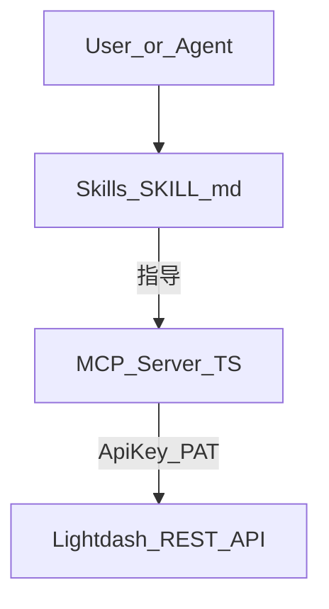

# Lightdash MCP 与 Agent Skills：设计说明与实现规划

## 1. 文档目的

说明如何基于 **Lightdash 官方 HTTP API**（Personal Access Token，下文简称 PAT）构建 **MCP（Model Context Protocol）服务**，并在其上叠加 **Claude Code（及兼容 Skills 机制的助手）** 可用的 **Skills**，使用户与代理能够稳定 **探查模型、组合 Metric Query、拉取结果数据**。

**主要使用场景**：Claude Code；配置以项目根 **`.mcp.json`**（可配套 **`.mcp.json.example`** 入库、真实密钥留在本地被 gitignore 的 `.mcp.json`）为主，在 `mcpServers` 条目里通过 **`env`** 注入 `LIGHTDASH_*`，无需把 PAT 写进 Skill 正文。

本路线与 [packages/charts-viewer](packages/charts-viewer) **解耦**：提数主通路不依赖 Next BFF；viewer 可作为可选的人工可视化或业务模板。

与看板侧「自定义 SQL 维度」产品语义的关系见 [dashboard-custom-sql-dimension-filters-feasibility.md](./dashboard-custom-sql-dimension-filters-feasibility.md)（`fieldId`、filters 与 `metric_query` 一致）。

---

## 2. 架构结论：MCP 优先，Skills 随后

| 层级 | 职责 | 说明 |
|------|------|------|
| **MCP Server** | 可调用、可 schema 化的 **tools** | **TypeScript** 实现；封装鉴权、HTTP、轮询、超时、默认 `limit`、错误归一化；代理通过工具名与参数与 Lightdash 交互。 |
| **Agent Skills** | 薄层 **SKILL.md** | 说明何时调用哪个 tool、如何拼 `MetricQuery` / `filters`、常见故障排查；**不**在 Skill 内重复实现长串 fetch，也不存放 PAT。 |
| **charts-viewer** | 可选 | 与 MCP **并行**；不作为 MCP 依赖。 |



### 2.1 Claude Code 与图表展示（含 Vega-Lite）

**结论**：Claude Code 对话区**默认不会像独立「图表站」那样内嵌交互式 Vega-Lite 渲染器**；MCP 返回的主要是 **表格型结果**（`rows` / `columns`）。若需要「图」，采用下列**组合策略**即可，无需假设客户端自带 Vega 画布。

| 做法 | 说明 |
|------|------|
| **表格与摘要** | 代理用 Markdown 表格展示小样本；完整数据用折叠代码块或提示用户导出。 |
| **Vega-Lite 规范** | 由模型根据 `rows`/`columns` **生成 Vega-Lite JSON**，放在 ` ```json ` 代码块中；用户可复制到 [Vega Editor](https://vega.github.io/editor/) 或你们自建的静态页（`vega-embed`）查看。**不依赖** Claude Code 内置渲染。 |
| **Mermaid** | 仅适合极简流程/结构示意，不适合替代统计图。 |
| **回链 Lightdash** | 若有 **已保存图表** URL 或项目内路径，在 Skill 中引导用户**在 Lightdash UI 中打开**，与产品内图表配置完全一致。 |
| **自建可视化** | [packages/charts-viewer](packages/charts-viewer) 等 Next/ECharts 应用可作为**并行入口**：MCP 负责取数，图表站负责展示（与本文 §3 解耦思路一致）。 |

实现 Skills 时，可在「拉数成功后」增加一步说明：**需要图则输出 Vega-Lite 或跳转 Lightdash**，避免用户误以为对话里会自动弹出图。

### 2.2 与 EE AiAgent（Enterprise）的参考关系

本仓库 **EE** 内置的 **Ai Agent**（产品内 Copilot）与 **对外 MCP + PAT** 是两条链路，但 **语义层与工具参数**可大量复用同一套约定，建议在实现 `lightdash-mcp` 时**对照阅读**（不必引入 EE 运行时依赖）。

**可参考的代码位置（相对于仓库根）**：

| 路径 | 用途 |
|------|------|
| [packages/common/src/ee/AiAgent/schemas/tools/index.ts](packages/common/src/ee/AiAgent/schemas/tools/index.ts) | EE 侧 **工具类型清单**（如 `find_charts`、`find_explores`、`run_metric_query`、`run_query`、`search_field_values` 等）。 |
| [packages/common/src/ee/AiAgent/schemas/tools/toolRunMetricQueryArgs.ts](packages/common/src/ee/AiAgent/schemas/tools/toolRunMetricQueryArgs.ts) | **`run_metric_query`** 参数：`filters`、`customMetrics`、`tableCalculations` 等与主应用对齐的 Zod schema。 |
| [packages/common/src/ee/AiAgent/schemas/tools/toolFindChartsArgs.ts](packages/common/src/ee/AiAgent/schemas/tools/toolFindChartsArgs.ts) | **找已保存图表** 的提示语与分页等（MCP v2 若做「按描述搜 chart」可对齐描述风格）。 |
| [packages/common/src/ee/AiAgent/schemas/tools/toolFindExploresArgs.ts](packages/common/src/ee/AiAgent/schemas/tools/toolFindExploresArgs.ts) | 与 explore 发现相关的参数与说明。 |
| [packages/common/src/ee/AiAgent/schemas/tools/toolRunQueryArgs.ts](packages/common/src/ee/AiAgent/schemas/tools/toolRunQueryArgs.ts) | 带可视化配置的 `run_query`（维度/指标/排序 + chart hints）；**图表配置**可参考 `packages/common/src/ee/AiAgent/chartConfig/`（web / Slack 下 ECharts 等），用于理解「产品内如何把查询结果变成图」，**不**要求 MCP 复刻渲染。 |

**建议**：

- **应对齐的**：`MetricQuery` 相关字段、`filters` 形状、`fieldId` 规则——与 [QueryController v2](packages/backend/src/controllers/v2/QueryController.ts) 及上文 §5 一致；可对照 EE 的 `toolRunMetricQueryArgs` 做 MCP 的 JSON Schema 与 `normalizeMetricQuery`。
- **不必复制的**：EE Agent 的**会话线程、组织计费、服务端编排**；对外 MCP 仍以 **stdio + `LIGHTDASH_API_KEY` + REST** 为边界。

### 2.3 阶段 0：直接上 MCP（最小可用）

本阶段已采用「**先实现独立 MCP 包**」方案：不再额外拆 `http-client` 包，而是在 `packages/lightdash-mcp` 内部直接封装 REST 请求与轮询，先交付最小可用的 3 个工具：

- `lightdash_list_explores`
- `lightdash_get_explore`
- `lightdash_run_metric_query`

`lightdash_run_metric_query` 的 query 默认值策略与 [QueryController v2](packages/backend/src/controllers/v2/QueryController.ts) 对齐（`dimensions/metrics/sorts/tableCalculations` 默认空数组、`filters` 默认空对象、`limit` 默认 500），并在 MCP 端增加 `LIGHTDASH_MAX_LIMIT` 上限保护。

后续若要沉淀复用层，再从 `packages/lightdash-mcp` 内部抽出共享模块，避免在阶段 0 过度设计。

---

## 3. 技能包仓库组织与命名

独立存放 **Skills + MCP 配置** 时，常见布局是：`skills/` 与 `.mcp.json.example` 同仓、密钥仅本地 `.mcp.json`、可选 `scripts/` 打包分发。与具体第三方产品仓库无关，按团队规范即可。

**仓库命名（暂定）**：独立技能包仓库使用 **`lightdash-skills`**。若后续并入更大技能总仓，再单独改仓库名即可。

拼写注意：为 **`lightdash-skills`**（`lightdash` + `skills`），勿误写为 **`lightdashs-skills`**（多一个 `s`）、**`skiils`**（多一个 `i`）或 **`kills`**（少一个 `s`）。

下文示例根目录均以 **`lightdash-skills/`** 为准。

| 元素 | 作用 |
|------|------|
| **`skills/`** | 按域分子目录，每技能一个文件夹 + `SKILL.md`（frontmatter `name` / `description`）；可设路由技能 + 子域技能。 |
| **`.mcp.json.example`** | 描述 MCP 如何接入；注释说明复制为 `.mcp.json` 并填入密钥。 |
| **`.mcp.json`** | Claude Code 实际连接配置（**勿提交**）；密钥放在本文件的 `env` 或等价字段中。 |
| **`.claude/`** | 项目级 `CLAUDE.md`、`rules/`，约束助手优先走 MCP tools 与本文档约定。 |
| **`docs/`** | 维护者文档（打包、发布、API 变更记录等）。 |
| **`scripts/`** | 可选：zip 打包（`pack.js`）便于团队分发技能包。 |

**传输方式**：Lightdash MCP 一期建议 **`stdio`**（本地/CI 启动 `node` 子进程），在 `.mcp.json` 里写 `command` / `args` / `env`。若日后将 MCP 部署为远端网关，可再增加 **`type: "http"`** + `url` / `headers` 的 `.mcp.json.example` 片段，与 stdio 示例并列。

**推荐目录树（独立 repo 或与 monorepo 并存时）：**

```
lightdash-skills/
├── .claude/
│   ├── CLAUDE.md
│   └── rules/
├── skills/
│   ├── README.md
│   ├── lightdash-data-tools/            # 路由：何时用哪个 tool
│   │   └── SKILL.md
│   └── lightdash-metric-query/          # 可选：深一点的 query 说明
│       └── SKILL.md
├── packages/lightdash-mcp/              # 可选：MCP 本体与 skills 同仓
│   ├── src/
│   ├── package.json
│   └── tsconfig.json
├── docs/
│   ├── lightdash-mcp-and-skills.md      # 可与 monorepo docs 互为链接
│   └── packaging.md
├── scripts/
│   └── pack.js                          # 可选
├── .mcp.json.example
├── .gitignore                           # 忽略 .mcp.json
└── README.md
```

若 MCP 仅存在于本 monorepo，也可使用 **`packages/lightdash-mcp/`** + 仓库根或子路径 **`skills/`**，`.mcp.json` 的 `args` 指向 `pnpm exec` 或编译产物 `dist/index.js`。

---

## 4. 目标与非目标

**目标**

- 列出项目下 explores（可选 filtered）。
- 获取单个 explore 的字段元数据（维度、指标等），供代理选 `fieldId`。
- 提交异步 metric query，轮询至 `ready`，返回 `rows` / `columns`（及可选分页策略）。
- 请求体与后端 **完整 MetricQuery** 对齐，包含 `customDimensions`、`additionalMetrics`、`timezone` 等（避免仅部分字段导致与主应用行为分叉）。

**非目标**

- 在 MCP 进程内复刻 Lightdash SQL 编译器。
- 绕过 Lightdash 权限与组织隔离（PAT 即用户身份）。
- 保证不经后端扩展即可返回「最终仓库 SQL 文本」（若需，另立 tool + API 核实）。

---

## 5. Lightdash API 对照（当前仓库侧已知路径）

以下与 [packages/charts-viewer/src/lib/lightdash.ts](packages/charts-viewer/src/lib/lightdash.ts) 及后端 v2 Query 一致，供 MCP 实现时直接对照（具体响应形状以实例 + OpenAPI 为准）。

| 能力 | 方法 | 路径 |
|------|------|------|
| 列出 explores | GET | `/api/v1/projects/{projectUuid}/explores?filtered=true\|false` |
| 单个 explore | GET | `/api/v1/projects/{projectUuid}/explores/{exploreId}` |
| 提交 metric query | POST | `/api/v2/projects/{projectUuid}/query/metric-query` |
| 查询结果（分页/状态） | GET | `/api/v2/projects/{projectUuid}/query/{queryUuid}?page=&pageSize=` |

**鉴权头**：`Authorization: ApiKey <PAT>`，`Content-Type: application/json`。

**Metric query 请求体（与后端对齐要点）**：`context`（如 `api`）、`query` 内含 `exploreName`、`dimensions`、`metrics`、`filters`、`sorts`、`limit`、`tableCalculations`；并应透传 `customDimensions`、`additionalMetrics`、`timezone` 等与 [packages/backend/src/controllers/v2/QueryController.ts](packages/backend/src/controllers/v2/QueryController.ts) 中 `MetricQuery` 一致的字段。数组/对象缺省时建议与后端默认值一致（如 `dimensions`/`metrics`/`sorts`/`tableCalculations` 空数组，`filters` 空对象，`limit` 默认 500），避免 `undefined` 导致异常。

**结果轮询**：响应中 `results.status` 常见为 `ready` / `error` / `cancelled` 等；`ready` 且存在 `rows` 即可返回；失败时抛出带 `error` 文案的明确错误。

---

## 6. MCP Tools 规划（建议）

### 6.1 v1 最小集（建议先实现）

| Tool 名（示例） | 作用 | 主要参数 |
|-----------------|------|----------|
| `lightdash_list_explores` | 列出 explores | `projectUuid`, `filtered?` |
| `lightdash_get_explore` | 拉取 explore 定义与字段 | `projectUuid`, `exploreId` |
| `lightdash_run_metric_query` | 执行查询并等待首屏结果 | `projectUuid`, `query`（完整 metric query 对象）, `pageSize?`, `maxPollAttempts?`, `pollIntervalMs?` |

`lightdash_run_metric_query` 内部顺序：`POST metric-query` → 取 `queryUuid` → 循环 `GET query/{queryUuid}` 直至 `ready` 或超时。

### 6.2 v2 扩展（按需）

| Tool 名（示例） | 前提 |
|-----------------|------|
| `lightdash_get_query_page` | 同一 `queryUuid` 拉取 `page>1`（若产品支持多页结果）。 |
| `lightdash_list_saved_charts` / `lightdash_get_saved_chart` | 需核对 v1 API 路径与权限。 |
| `lightdash_search_field_values` | 需核对字段值搜索接口与限流。 |
| `lightdash_get_compiled_sql` | **仅当** 公开 API 或内部约定可返回编译 SQL 时再实现。 |

---

## 7. 实现规划：MCP 服务（详细）

### 7.1 工程位置与运行时

**技术选型（固定）**：**TypeScript + `@modelcontextprotocol/sdk` + `stdio` transport**。可选依赖 `@lightdash/common` 做类型对齐（注意 browser 无关字段）；否则在 MCP 包内自维护窄类型。

**工程位置**：独立包 `packages/lightdash-mcp/`（本 monorepo）或独立仓库中与 `skills/`、`.mcp.json.example` 同仓，见 §3。

### 7.2 密钥与 Claude Code 配置（`.mcp.json`）

- 将 **`.mcp.json`** 加入 **`.gitignore`**；仓库只提交 **`.mcp.json.example`**。
- Claude Code 侧在 **`.mcp.json`** 的 `mcpServers` 中为本地 stdio 服务配置 `command`、`args`，并通过 **`env`** 传入：
  - `LIGHTDASH_SITE_URL`
  - `LIGHTDASH_API_KEY`（PAT）
  - 可选：`LIGHTDASH_DEFAULT_PROJECT_UUID`

**`.mcp.json.example`（stdio 示意，路径按实际构建产物调整）**：

```json
{
  "_doc": "复制为 .mcp.json 并填入真实值。勿提交 .mcp.json。",
  "mcpServers": {
    "lightdash": {
      "command": "node",
      "args": ["path/to/lightdash-mcp/dist/index.js"],
      "env": {
        "LIGHTDASH_SITE_URL": "https://your-lightdash.example.com",
        "LIGHTDASH_API_KEY": "<Personal Access Token>",
        "LIGHTDASH_DEFAULT_PROJECT_UUID": "<optional>"
      }
    }
  }
}
```

MCP 实现从 **`process.env`** 读取上述变量；**禁止**在 tool 参数 schema 中接受 PAT。

### 7.3 模块划分

1. **`client.ts`**：封装 `fetch`，统一 `baseUrl`、headers、JSON 解析、非 2xx 抛错（附带 response body 摘要）。
2. **`explores.ts`**：`listExplores`、`getExplore`。
3. **`metricQuery.ts`**：`executeMetricQuery`（POST）、`getQueryResults`（GET 单页）、`runMetricQueryUntilReady`（轮询组合 + 可配置上限）。
4. **`normalizeMetricQuery.ts`**：将 LLM/代理可能给出的不完整 `query` 规范化为后端安全默认值（与 QueryController 的 `?? []` / `?? 500` 策略一致），并 **透传** `customDimensions`、`timezone` 等。
5. **`server.ts`**：注册 MCP tools，将 tool 参数 JSON Schema 与实现绑定。

### 7.4 健壮性与产品规则

- **`limit` 上限**：在 MCP 内设置可配置 `maxLimit`（如 5000），防止单次刷仓。
- **轮询**：`maxPollAttempts` × `pollIntervalMs` 总超时上限；超时时返回明确错误（含 `queryUuid` 便于人工去 UI 查看）。
- **大结果**：默认只保证首屏；多页通过 v2 扩展 tool 或文档说明用户缩小 `limit`/维度。
- **日志**：记录 tool 名、projectUuid、exploreName、queryUuid；**不**打印完整 PAT 或完整 query body（可打 hash 或截断）。

### 7.5 测试策略

- **单元测试**：`normalizeMetricQuery`、错误解析（401、4xx JSON）。
- **集成测试**（可选，需测试实例与 PAT）：对固定 `projectUuid` + 小 `limit` 跑通 list → get → run。

### 7.6 Claude Code 接入小结

1. `pnpm install && pnpm build`（或 `npm run build`）产出 MCP 入口脚本。  
2. 复制 `.mcp.json.example` → `.mcp.json`，填写 `command`/`args`/`env`。  
3. 重启 Claude Code 或重新加载 MCP；在对话中确认 tools 列表出现 `lightdash_*`。

---

## 8. 实现规划：Agent Skills（详细）

### 8.1 存放位置（见 §3 目录约定）

- 使用仓库 **`skills/`** 目录，例如 `skills/lightdash-data-tools/SKILL.md` 作为**路由技能**（何时 list / get explore / run query），可按需增加子技能（.filters、自定义维度说明等）。
- 项目级 **`.claude/CLAUDE.md`** 写明：提数优先 MCP，`fieldId` 必须以 `lightdash_get_explore` 为准。

**不再**以 Cursor 专属的 `.cursor/skills/` 为主线；若团队有人用 Cursor，可自用其全局 skills，但**文档与示例以 Claude Code + 本仓库 `skills/` 为准**。

### 8.2 Skill 正文建议结构

1. **Frontmatter**：`name`、`description`（触发词：Lightdash、metric query、explore、拉数、自定义 SQL 维度筛选等）。
2. **何时使用**：用户要查数、要字段列表、要按条件过滤时，优先走 MCP tools。
3. **推荐流程**：`lightdash_list_explores` → `lightdash_get_explore` → 用户确认 explore → `lightdash_run_metric_query`。
4. **领域说明**：`fieldId` 格式、`filters` 与主应用一致；自定义 SQL 维度见 [dashboard-custom-sql-dimension-filters-feasibility.md](./dashboard-custom-sql-dimension-filters-feasibility.md)。
5. **故障排查**：401、explore error、query timeout、空结果。
6. **配置**：引导用户配置 **`.mcp.json`**，勿在对话中粘贴 PAT。

### 8.3 与 MCP 的契约

Skill 内 **写死 tool 名称** 与 MCP 注册名一致；MCP 升级 tool 时同步改 Skill。

---

## 9. 里程碑汇总

| 阶段 | 内容 | 验收标准 |
|------|------|----------|
| **M1** | TypeScript MCP v1：list/get explore + run metric query + normalize + 轮询 | Claude Code 加载 `.mcp.json` 后一轮对话内取数成功 |
| **M2** | `skills/` 路由 Skill + `.mcp.json.example` + `.gitignore` + `.claude/CLAUDE.md` | 新成员仅照 README 可复现 |
| **M3** | 扩展 tools（saved charts、field values、分页） | 按业务需求逐项 OpenAPI 核对后上线 |

---

## 10. 与 charts-viewer 现状对照（避免双实现分叉）

[packages/charts-viewer/src/lib/lightdash.ts](packages/charts-viewer/src/lib/lightdash.ts) 中 `MetricQueryPayload` / `executeMetricQuery` **当前未包含** `customDimensions`、`additionalMetrics`、`timezone` 等字段；若继续在 viewer 上扩展提数能力，应与 **MCP 内 `normalizeMetricQuery` + 后端 `MetricQuery`** 保持同一形状，否则同一 explore 在「viewer」与「MCP」下行为可能不一致。**建议**：以 MCP（或单一共享小模块）为规范化入口，viewer 仅调用该模块或复制其类型定义。

---

## 11. 风险与边界

- **PAT 泄露**：只放在 **`.mcp.json`（本地）** 或系统级 secrets，勿提交仓库；轮换流程写在运维文档。
- **API 版本漂移**：升级 Lightdash 后复查 v2 query 与响应字段。
- **自定义 SQL 维度 / 复杂 filters**：代理易拼错；Skill 中强调「先 get_explore + 对照 fieldId」。
- **与 charts-viewer 重复逻辑**：`lightdash.ts` 可作为 **参考实现**；长期以 MCP 内 `client` + `normalizeMetricQuery` 为唯一真源，避免双处漂移。

---

## 12. 修订记录

| 日期 | 说明 |
|------|------|
| 2026-03-26 | 初版：MCP 优先架构、API 对照、tools 规划、MCP/Skills 分阶段实现说明 |
| 2026-03-26 | 技术选型固定 TypeScript；主场景改为 Claude Code；配置改为 `.mcp.json` / `env`；仓库组织（`skills/`、`.claude/`、示例配置） |
| 2026-03-26 | 移除第三方产品仓库文案；暂定技能包仓库名为 `lightdash-skills`，全文示例目录与之统一 |
| 2026-03-26 | 补充 §2.1 Claude Code 与 Vega-Lite/图表展示边界；§2.2 与 EE AiAgent 参考路径及应对齐范围 |
| 2026-03-26 | 新增 §2.3 阶段 0：直接上 MCP（最小可用）实现口径，明确当前不拆独立 HTTP 包 |
