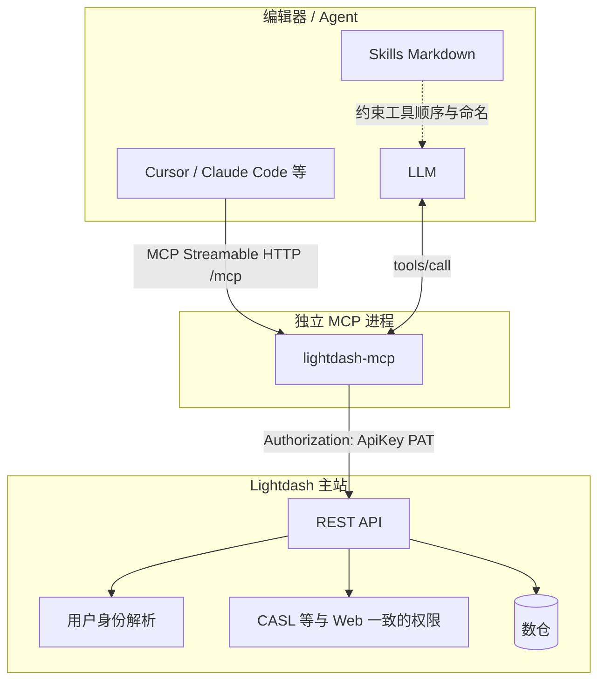

# 架构说明

## 为什么要自己搞一套

Lightdash 官方有内置 MCP，但它跟着 Enterprise 版走，要主站开启 EE 才能用。

自己搭 `lightdash-mcp` + `lightdash-skills` 一般是这几个原因：

- **独立部署**：MCP 单独跑一个进程，和主站发版解耦，扩缩容互不影响。
- **OSS 或混合环境也能跑**：通过 REST + PAT 就能连上，不需要依赖主站内置的那套东西。
- **Skills 帮忙调度**：MCP 只管"有哪些工具"，Skills 管"什么时候用什么工具"，配合着用能少踩很多坑。

如果你们已经在用主站内置 MCP 而且没什么痛点，继续用官方方案就行，没必要换。

## 整体架构

Skills 本身不监听端口，就是一些 Markdown 文件放在你的项目里供模型阅读。真正发请求出去的是 `lightdash-mcp` 这个独立进程。

## 鉴权是怎么跑的

编辑器把 PAT 发给 `lightdash-mcp`，MCP 用这个 PAT 发 REST 请求给 Lightdash 主站。主站把 PAT 转换成对应的用户身份，然后按和 Web UI 一样的权限模型（CASL、项目成员、空间权限等）来判断请求能不能执行。

换句话说：你在主站给这个用户开了什么权限，经 MCP 操作的时候还是那些权限。换一个 PAT 就等于换了一个人在操作 Lightdash。

`X-Lightdash-User-Attributes` 这个可选头在部分场景下参与行级策略，具体语义看主站 API 文档。

有一点要说明：`set_project` 设的默认项目 UUID 只存在 MCP 进程的内存里，用来省掉重复参数，**不会改变**主站对该 PAT 的权限判定。

**与 PAT 的区分**：PAT 无效或未授权时多为 **401/403**。此前若 MCP 暴露依赖主站 EE `…/aiAgents` 等路由的工具，在 OSS 或未开通能力的主站上会稳定 **404**——那是「主站没有这条 REST」，不是 API Key 鉴权失败；本仓库的 `lightdash-mcp` 已**不再注册**这类与 Skills 流程无关、易混淆的 Agent 工具，仅保留与常规 REST 对齐的 12 个标准工具 + 4 个扩展。

## 和主站内置 MCP 的区别

| | 主站内置（EE） | 自建 MCP |
|---|---|---|
| 进程 | 跑在 Lightdash API 进程内 | 独立 Node 进程 |
| 会话 | PostgreSQL 存 `mcp_context` | 默认内存（按 PAT 隔离，有 TTL） |
| 鉴权 | 随主站会话和产品路由 | PAT → 主站 REST，权限同 Web |

## 源码结构

`packages/lightdash-mcp/src/` 下大概是这样：

| 路径 | 负责什么 |
|------|---------|
| `http.ts`、`http/authAndCache.ts` | HTTP 入口、MCP transport、PAT 校验缓存 |
| `lib/requestContext.ts` | 把 `x-api-key`、User-Attributes 注入到工具逻辑 |
| `mcp/createMcpServer.ts` | 组装 MCP Server；顺序是：扩展工具 → 核心 12 工具 → `lightdash-analyst` prompt |
| `mcp/registerCoreMcpTools.ts` 等 | 核心工具，按功能域拆分 |
| `mcp/registerExtensionTools.ts` | 四个 `lightdash_*` 前缀的扩展工具 |
| `rest/lightdashRest.ts` 等 | 发请求、异步查询轮询 |
| `lib/*` | 指标查询归一化、CSV、会话、URL 拼接等公共逻辑 |

## 工具列表

工具注册顺序：先扩展 tools → 再核心 12 tools → 最后注册 analyst prompt。发版后如果列表有变化，以源码或客户端 `tools/list` 为准。

### 12 个标准工具

和 Lightdash 官方文档对齐，名字没有 `lightdash_` 前缀：

| 工具名 | 干什么 |
|--------|--------|
| `get_lightdash_version` | 查实例版本和健康状态 |
| `list_projects` | 列出这个 PAT 能访问的所有项目 |
| `set_project` | 设本会话的默认 projectUuid（内存，支持 `tags` 过滤数据目录搜索） |
| `get_current_project` | 看看当前设的是哪个项目 |
| `list_explores` | 列出项目的所有 explores（`filtered: true` 默认只显示已启用的） |
| `find_explores` | 按关键词搜索 explore |
| `find_fields` | 在某个 explore 里搜索字段 |
| `find_content` | v2 内容搜索，返回 webUrl |
| `list_verified_content` | 已验证的图表和看板 |
| `search_field_values` | 枚举维度取值（异步轮询） |
| `run_sql` | 跑原始 SQL（异步轮询） |
| `run_metric_query` | 指标查询 v2（异步轮询） |

### 4 个扩展工具

只有自建 MCP 才有的 `lightdash_*` 前缀工具：

| 工具名 | 干什么 |
|--------|--------|
| `lightdash_get_site_info` | 返回 siteBaseUrl |
| `lightdash_list_spaces` | 列出当前项目下的空间 |
| `lightdash_get_saved_chart` | 取已保存图表的元数据，含 webUrl |
| `lightdash_run_saved_chart` | 按已保存的图表跑数据 |

### Prompt

`lightdash-analyst` 是给模型看的角色说明，不是可调用的工具。

## Skills

`lightdash-insight-router` 是唯一入口，所有请求先经过它路由到三条路径之一：保存图表、维度指标、SQL。

`lightdash-metric-query` 是 `run_metric_query` 的补充说明，包括参数构造顺序、扁平参数约束、过滤/排序/维度规格说明，以及常见 422 报错排查。

MCP 和 Skills 同版本号发，用 `pnpm bump-mcp-skills -- x.y.z` 一起升级。
