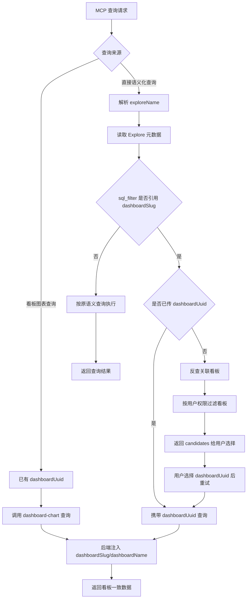
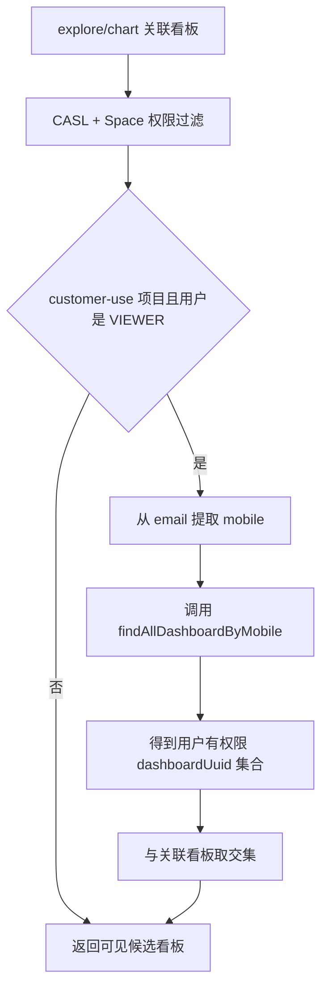

# MCP Dashboard 上下文查询

## 背景与目标

部分 dbt 模型的 `sql_filter` 会引用 `lightdash.user.dashboardSlug`。如果 MCP 查数时没有携带看板上下文，后端会使用默认值 `NA`，可能导致结果和看板 UI 不一致。

本次改动目标：

- 看板查询使用 dashboard-aware 接口，确保携带 `dashboardUuid`。
- 语义化查询仅在数据集依赖 `dashboardSlug` 时要求选择看板。
- 返回候选看板前，由后端过滤到当前用户可见的看板。
- 不依赖 `dashboardSlug` 的查询保持原有 MCP 语义。

## 主流程

## 权限过滤

候选看板先按 `exploreName` 或 `chartUuid` 反查，再在后端统一做权限过滤。

说明：

- 非 VIEWER：只应用 Lightdash 自身的 CASL/Space 权限。
- VIEWER 且 customer-use 项目：额外调用 `findAllDashboardByMobile`，按 email 提取 mobile 后过滤可见看板。
- MCP 收到的 `candidates` 已经是“关联该数据集/图表，并且当前用户可见”的集合。

## 规则

| 场景 | 行为 |
| --- | --- |
| `run_dashboard_tiles` | 使用 `/query/dashboard-chart` 跑图表 |
| `run_saved_chart` 不依赖 `dashboardSlug` | 保持普通 saved chart 查询 |
| `run_saved_chart` 依赖 `dashboardSlug` 且未传 `dashboardUuid` | 返回候选看板 |
| `run_metric_query` / `run_semantic_metric_query` 不依赖 `dashboardSlug` | 保持原查询 |
| `run_metric_query` / `run_semantic_metric_query` 依赖 `dashboardSlug` 且未传 `dashboardUuid` | 返回候选看板，不直接跑数 |
| 已显式传入 `dashboardUuid` | 以用户传入值为准 |

是否依赖 `dashboardSlug` 由 MCP 读取 compiled Explore 判断：只检查 base table 的 `sqlWhere` 和 `uncompiledSqlWhere` 是否包含 `dashboardSlug`。

## 实现点

- `DashboardService.getDashboardContexts`：按 `exploreName` / `chartUuid` 查关联看板，并做权限过滤。
- `DashboardService.getAllowedDashboardUuidsForViewer`：VIEWER customer-use 场景下获取可见看板 UUID。
- `CategoryRpcClient.findAllDashboardByMobile`：调用外部 RPC 按 mobile 查询看板权限。
- `dashboardContextResolver`：MCP 内部解析候选看板，不暴露新 tool。
- `exploreRequiresDashboardContext`：判断 Explore 是否依赖 `dashboardSlug`。

## 边界

- 不默认选择看板，避免使用错误权限上下文。
- 不处理 dbt 权限模型自身的 fan-out 问题。
- 不修改 Lightdash UI 查询链路。
- 当前只检查 base table；如果未来 joined table 也依赖 `dashboardSlug`，需要扩展检测范围。
