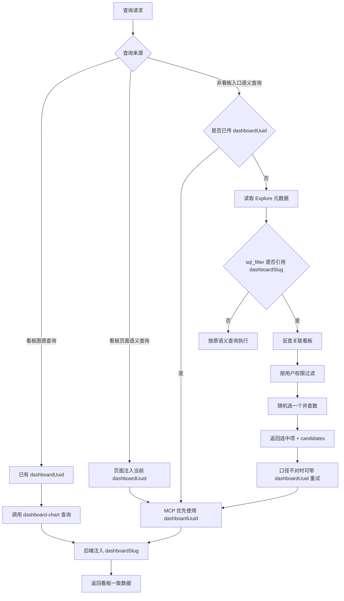
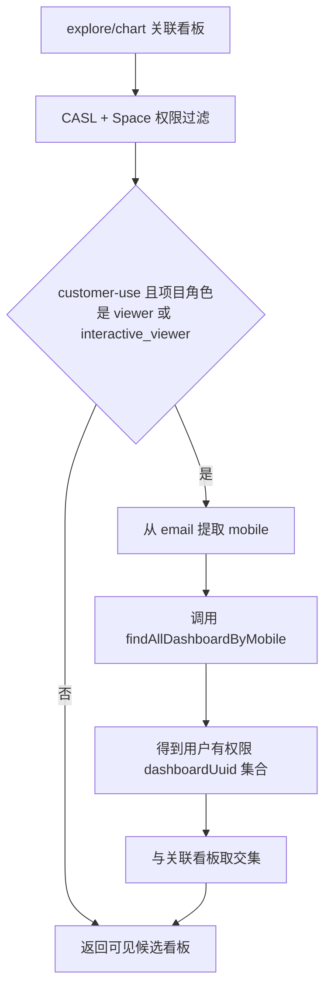

# MCP Dashboard 上下文查询

## 背景与目标

部分 dbt 模型的 `sql_filter` 会引用 `lightdash.user.dashboardSlug`。如果 MCP 查数时没有携带看板上下文，后端会使用默认值 `NA`，可能导致结果和看板 UI 不一致。

本次改动目标：

- 从看板页面发起语义查询时，页面直接透传当前 `dashboardUuid`（Dashboard UI 本身已有该值，无需 MCP 反查）。
- 看板图表查询使用 dashboard-aware 接口，确保携带 `dashboardUuid`。
- 非看板入口的语义化查询，仅在数据集依赖 `dashboardSlug` 且未传 `dashboardUuid` 时，才反查关联看板。
- 有候选则选用并查数（多个时随机选一个）；完整可见候选仍返回。0 个候选才返回空列表、不跑数。
- 返回候选前，由后端过滤到当前用户可见的看板。随机只在过滤后的列表上做。
- 不依赖 `dashboardSlug` 的查询保持原有 MCP 语义。

## 页面注入优先路径

Dashboard UI 场景下，语义查询不需要 MCP 反查看板。从看板进入 Explorer（URL 带 `fromDashboard=<dashboardUuid>`）时，「语义查询」面板会自动把当前看板 UUID 写入展示/复制 JSON：

```json
{
  "exploreName": "ads_touziren_sales_m",
  "dimensions": ["ads_touziren_sales_m_month_2"],
  "metrics": ["ads_touziren_sales_m_total_active_branch_count"],
  "dashboardUuid": "当前看板 uuid"
}
```

说明：

- 页面只展示/复制 `dashboardUuid`，不需要 `dashboardSlug`。
- 将该 JSON 作为 `run_semantic_metric_query.metricQuery` 传入时，MCP 会自动解析其中的 `dashboardUuid`（也可用独立参数 `dashboardUuid`，独立参数优先）。
- 后端根据 `dashboardUuid` 解析出 `dashboardSlug` 并注入 `lightdash.user` 上下文。
- 无 `fromDashboard` 时，语义查询 JSON 不包含 `dashboardUuid`，保持原样。

## 主流程


```mermaid
flowchart TD
  start["查询请求"] --> queryType{"查询来源"}

  queryType -->|"看板图表查询"| dashboardTile["已有 dashboardUuid"]
  dashboardTile --> dashboardChart["调用 dashboard-chart 查询"]
  dashboardChart --> withSlug["后端注入 dashboardSlug"]
  withSlug --> resultOk["返回看板一致数据"]

  queryType -->|"看板页面语义查询"| pageInject["页面注入当前 dashboardUuid"]
  pageInject --> mcpUseUuid["MCP 优先使用 dashboardUuid"]
  mcpUseUuid --> withSlug

  queryType -->|"非看板入口语义查询"| hasUuid{"是否已传 dashboardUuid"}
  hasUuid -->|"是"| mcpUseUuid
  hasUuid -->|"否"| getExplore["读取 Explore 元数据"]
  getExplore --> hasFilter{"sql_filter 是否引用 dashboardSlug"}
  hasFilter -->|"否"| normalQuery["按原语义查询执行"]
  hasFilter -->|"是"| findDashboards["反查关联看板"]
  findDashboards --> permissionFilter["按用户权限过滤"]
  permissionFilter --> pick["随机选一个并查数"]
  pick --> echo["返回选中项 + candidates"]
  echo --> retry["口径不对时可带 dashboardUuid 重试"]
  retry --> mcpUseUuid
```

## 权限过滤

候选看板先按 `exploreName` 或 `chartUuid` 反查，再在后端统一做权限过滤。仅在未传 `dashboardUuid`、需要返回 candidates 时走此子流程。


```mermaid
flowchart TD
  contexts["explore/chart 关联看板"] --> casl["CASL + Space 权限过滤"]
  casl --> customerUse{"customer-use 且项目角色是 viewer 或 interactive_viewer"}
  customerUse -->|"否"| visible["返回可见候选看板"]
  customerUse -->|"是"| extractMobile["从 email 提取 mobile"]
  extractMobile --> rpc["调用 findAllDashboardByMobile"]
  rpc --> allowed["得到用户有权限 dashboardUuid 集合"]
  allowed --> intersect["与关联看板取交集"]
  intersect --> visible
```

说明：

- 所有角色先走 CASL + Space：没有 `view Dashboard` 的丢掉。
- 项目角色 `viewer` 或 `interactive_viewer` 且 customer-use：再调 `findAllDashboardByMobile`，按 email 提取 mobile 后过滤可见看板。
- 编辑者 / 开发者 / 管理员、组织 member、以及 API token / MCP PAT：不走 RPC，只剩 CASL。
- MCP 收到的 `candidates` 已经是“关联该数据集/图表，并且当前用户可见”的集合。随机只在这份列表上做。

## 规则

| 场景 | 行为 |
| --- | --- |
| 看板页面语义查询 | 页面注入当前 `dashboardUuid`，MCP 直接使用 |
| `run_dashboard_tiles` | 使用 `/query/dashboard-chart` 跑图表 |
| `run_saved_chart` 不依赖 `dashboardSlug` | 保持普通 saved chart 查询 |
| `run_saved_chart` 依赖 `dashboardSlug` 且未传 `dashboardUuid` | 有候选则随机选用并跑数，返回选中项 + candidates |
| `run_metric_query` / `run_semantic_metric_query` 不依赖 `dashboardSlug` | 保持原查询 |
| `run_metric_query` / `run_semantic_metric_query` 依赖 `dashboardSlug` 且未传 `dashboardUuid` | 有候选则随机选用并跑数，返回选中项 + candidates；0 个候选才返回空列表 |
| 已显式传入 `dashboardUuid` | 始终优先，后端据此解析 `dashboardSlug` |

语义查询参数：

- 看板入口复制的语义查询 JSON 可包含 optional `dashboardUuid`。
- MCP `run_semantic_metric_query` 会从 metricQuery JSON 内解析该字段；也支持独立参数 `dashboardUuid`（独立参数优先）。
- 不要求、也不建议传 `dashboardSlug`。
- 显式 `dashboardUuid` 优先级高于 MCP 反查 candidates。

是否依赖 `dashboardSlug` 由 MCP 读取 compiled Explore 判断：只检查 base table 的 `sqlWhere` 和 `uncompiledSqlWhere` 是否包含 `dashboardSlug`。

## 实现点

- **页面侧**：从看板进入时（`fromDashboard`），「语义查询」面板 JSON 自动注入 `dashboardUuid`。
- **MCP**：`prepareSemanticMetricQueryBody` 从 metricQuery JSON 解析 `dashboardUuid` 并在送 API 前剥离；独立参数优先。
- `DashboardService.getDashboardContexts`：按 `exploreName` / `chartUuid` 查关联看板，并做权限过滤。
- `DashboardService.getAllowedDashboardUuidsForViewer`：customer-use 且项目角色为 viewer / interactive_viewer 时获取可见看板 UUID。
- `CategoryRpcClient.findAllDashboardByMobile`：调用外部 RPC 按 mobile 查询看板权限。
- `dashboardContextResolver`：MCP 内部解析候选看板，不暴露新 tool；显式 `dashboardUuid` 优先；N>=1 自动选用（N>1 随机）。
- `exploreRequiresDashboardContext`：判断 Explore 是否依赖 `dashboardSlug`。

## 边界

- 默认随机选一个可见关联看板并查数；完整候选仍返回，口径不对时可带 `dashboardUuid` 重试。
- 不处理 dbt 权限模型自身的 fan-out 问题。
- 不修改非看板入口、非 `dashboardSlug` 数据集的原查询行为。
- 当前只检查 base table；如果未来 joined table 也依赖 `dashboardSlug`，需要扩展检测范围。
