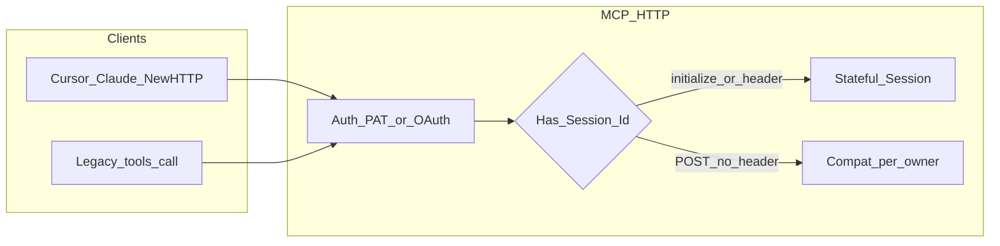
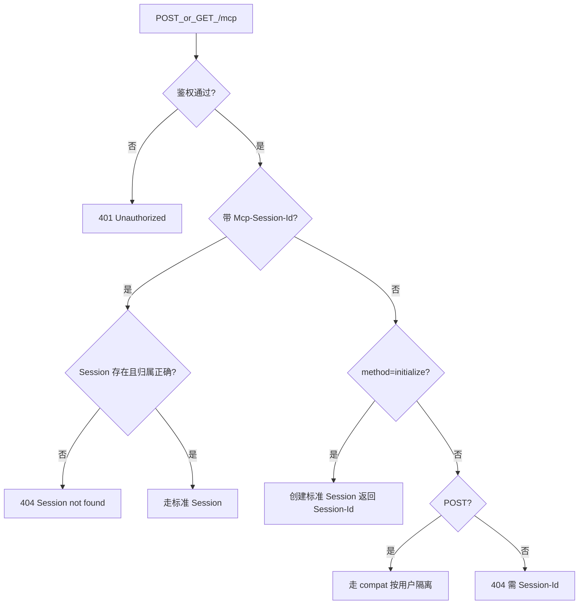
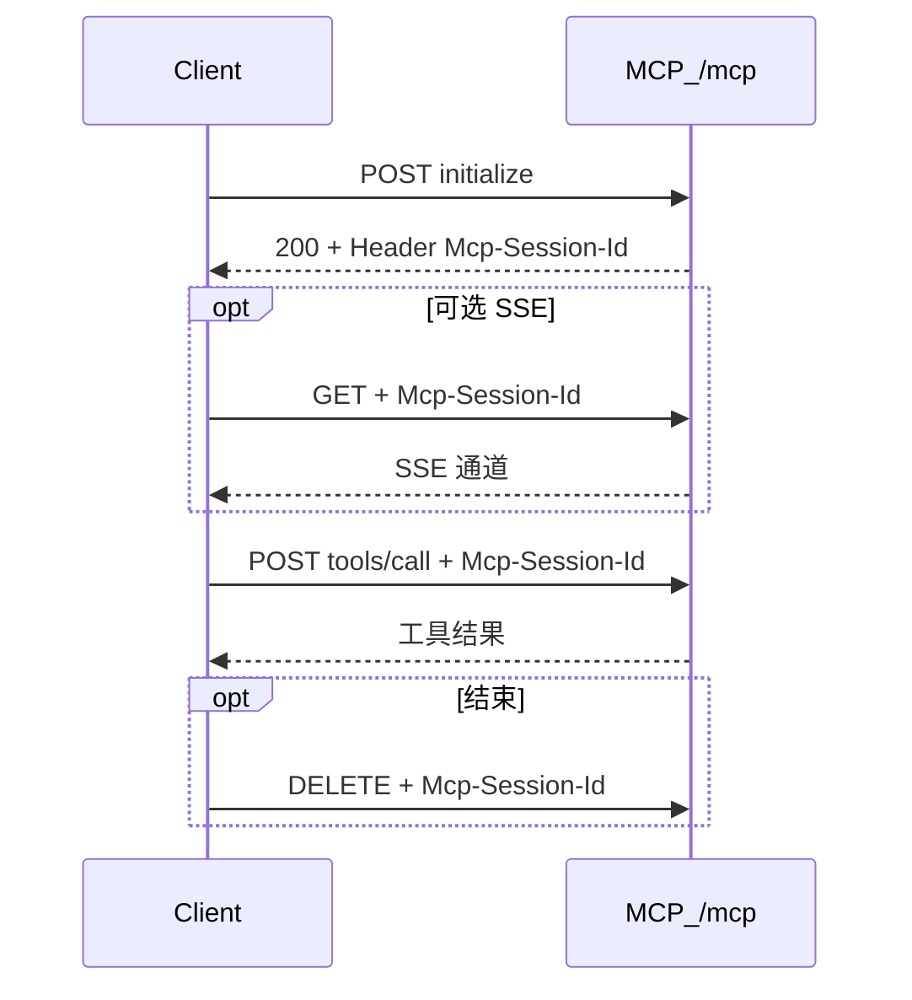
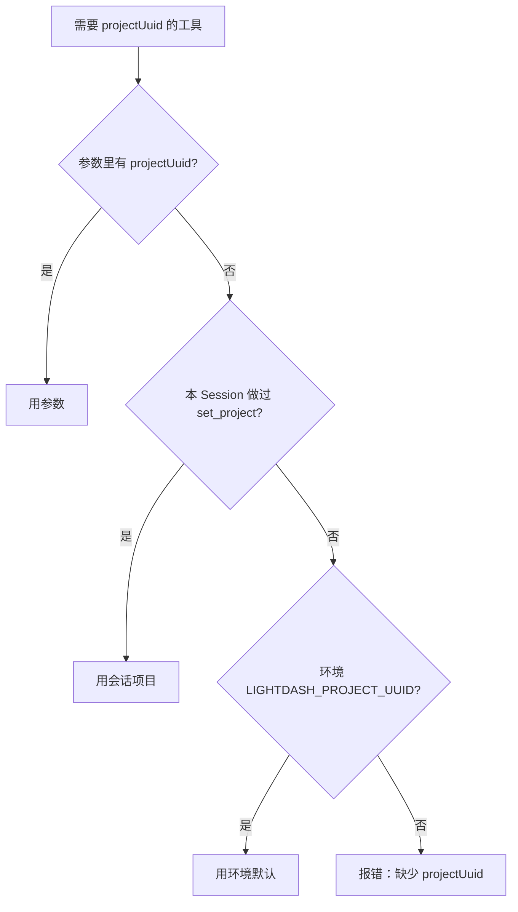

# Lightdash MCP 标准客户端使用规范

面向：**接入 MCP 的应用开发者、平台运维、自研 HTTP 客户端维护者**。  
说明推荐的标准调用方式，以及存量无 Session 客户端的兼容行为。

分析师怎么提问请看 [用户使用说明](./lightdash-mcp-user-guide.md)。  
文档总入口：[README](./README.md)。  
**对外单独转发**请用：[外部接入指南](./lightdash-mcp-external-guide.md)（自包含，不依赖本文）。

---

## 1. 结论先看

| 场景 | 推荐做法 | `initialize` / `Mcp-Session-Id` |
|------|----------|--------------------------------|
| Cursor / Claude Code / 标准 MCP 客户端 | **标准有状态 Session** | **需要**（宿主自动处理） |
| 自研 HTTP 客户端（新接入） | **标准有状态 Session** | **需要** |
| 存量业务直接 `POST tools/call`（如 goldeneye） | **兼容模式**（可继续用） | **不需要** |
| AI / 业务写工具参数 | 每次查询显式传 `projectUuid` | 与传输层无关 |

**原则：**

1. **新接入一律按标准 Session 协议实现。**
2. **存量无 Session 调用可继续工作**（按鉴权身份隔离的 compat 通道），但不要作为新项目模板。
3. **`initialize` 是传输层握手，不是业务工具**；业务 / AI 不要手工调 `initialize`。
4. **多副本不要依赖 `set_project` 的跨请求状态**；查询参数里带 `projectUuid`。

### 请求怎么分流





---

## 2. 唯一入口

| 方法 | 路径 | 用途 |
|------|------|------|
| `GET` | `/health` | 健康与 Session 计数 |
| `ALL` | `/mcp` | MCP Streamable HTTP |

**错误示例（不要这样）：**

```text
GET  /mcp/tools/list
POST /mcp/tools/call
```

`tools/list`、`tools/call` 是 **JSON-RPC 的 method**，写在 `POST /mcp` 的 body 里，不是 URL 路径。

鉴权（任选其一，或环境兜底 PAT）：

- `x-api-key: <PAT>`
- `Authorization: ApiKey <PAT>`
- `Authorization: Bearer <OAuth access token>`（需开启 OAuth）

请求体要求：`Content-Type: application/json`，body 必须是**合法 JSON**。非法 / 空 body 会返回 **400**（见第 8 节），不会进入工具逻辑。

---

## 3. 标准用法（推荐）

适用于 Cursor、Claude Code，以及新写的自研客户端。

### 3.1 流程



```text
1. POST /mcp  method=initialize
   ← 响应头 Mcp-Session-Id: <uuid>

2. （可选）GET /mcp  + Header Mcp-Session-Id
   ← SSE 通道（断线不销毁 Session，可同 Id 重连）

3. POST /mcp  + Header Mcp-Session-Id
   body method=tools/list | tools/call | ...

4. （结束）DELETE /mcp + Header Mcp-Session-Id
```

同 PAT（或同一 OAuth subject）可同时持有**多个**标准 Session（多客户端并行）。Session 与认证身份绑定；带他人 Session-Id 会 **404**。

> 说明：同一邮箱多次 `initialize`（重连 / 重载 MCP）会让 `activeSessions` 上涨，这是预期行为，不等于在线人数。空闲约 **15 分钟**无业务活动后回收；满额时 LRU 淘汰空闲至少约 5 分钟的 Session。部分宿主（Cursor、Claude Code）退出时未必发送 `DELETE`，回收依赖服务端兜底。

### 3.2 Cursor / Claude `.mcp.json`

```json
{
  "mcpServers": {
    "lightdash": {
      "type": "http",
      "url": "http://mcp.example.com/mcp",
      "headers": {
        "x-api-key": "<your-pat>"
      }
    }
  }
}
```

说明：

- `type: "http"` 的宿主会自动完成 `initialize` 并保存 `Mcp-Session-Id`。
- 业务 / AI **只需调用工具**，不要自己发 Session 头。

Claude Code CLI：

```bash
export LIGHTDASH_MCP_APIKEY="your-personal-access-token"
claude mcp add lightdash-mcp http://localhost:3333/mcp \
  -H "x-api-key: $LIGHTDASH_MCP_APIKEY" \
  -t http
```

### 3.3 curl 冒烟（标准 Session）

```bash
# 1) initialize，保存响应头里的 Mcp-Session-Id
curl -i -X POST 'http://localhost:3333/mcp' \
  -H 'x-api-key: YOUR_PAT' \
  -H 'Content-Type: application/json' \
  -H 'Accept: application/json, text/event-stream' \
  -d '{"jsonrpc":"2.0","id":1,"method":"initialize","params":{"protocolVersion":"2025-03-26","capabilities":{},"clientInfo":{"name":"curl","version":"1.0"}}}'

# 2) tools/list（必须带回 Session-Id）
curl -X POST 'http://localhost:3333/mcp' \
  -H 'x-api-key: YOUR_PAT' \
  -H 'Content-Type: application/json' \
  -H 'Accept: application/json, text/event-stream' \
  -H 'Mcp-Session-Id: <上一步的 session id>' \
  -d '{"jsonrpc":"2.0","id":2,"method":"tools/list"}'

# 3) tools/call 示例
curl -X POST 'http://localhost:3333/mcp' \
  -H 'x-api-key: YOUR_PAT' \
  -H 'Content-Type: application/json' \
  -H 'Accept: application/json, text/event-stream' \
  -H 'Mcp-Session-Id: <session id>' \
  -d '{"jsonrpc":"2.0","id":3,"method":"tools/call","params":{"name":"list_projects","arguments":{}}}'
```

### 3.4 自研客户端清单

1. `POST initialize` 后读取响应头 `Mcp-Session-Id`
2. 后续所有 `/mcp` 请求回传该头
3. Session 过期 / 404 时重新 `initialize`（不要复用旧 id）
4. 需要项目的工具参数里传 `projectUuid`
5. 进程退出时可选 `DELETE /mcp` 释放 Session
6. 请求体始终是合法 JSON；`Accept` 建议包含 `application/json, text/event-stream`

---

## 4. 兼容用法（存量业务，可不改代码）

适用于已上线的 HTTP 客户端：直接 `POST tools/call`，不维护 Session。

### 4.1 行为


```text
POST /mcp
Header: x-api-key
Body:   { "jsonrpc":"2.0", "method":"tools/call", ... }
```

- **无** `Mcp-Session-Id` 且 method 不是 `initialize` 的 **POST** → 进入 **compat 模式**
- 按鉴权身份（PAT 哈希 / OAuth subject）复用该用户的兼容通道
- **不同用户互不共享**（避免早期全局单 transport 串扰）
- 请求日志会出现 `compat=1`

### 4.2 约束

| 点 | 说明 |
|----|------|
| 兼容范围 | 仅 **POST JSON-RPC**；无 Session 的 GET/DELETE 仍 404 |
| 同 PAT | 同一 PAT 的多个无 Session 进程共享同一 compat 通道 |
| `set_project` | 进程内存；多副本不共享，**compat 路径不要依赖它** |
| 新项目 | 请用第 3 节标准 Session，不要新写 compat 风格客户端 |

### 4.3 兼容 curl 示例

```bash
# 无需 initialize / Session-Id（存量风格）
curl -X POST 'http://localhost:3333/mcp' \
  -H 'x-api-key: YOUR_PAT' \
  -H 'Content-Type: application/json' \
  -H 'Accept: application/json, text/event-stream' \
  -d '{"jsonrpc":"2.0","id":1,"method":"tools/call","params":{"name":"get_lightdash_version","arguments":{}}}'
```

---

## 5. 项目选择（AI 与业务都要遵守）

需要项目的工具解析顺序：



1. **本次工具参数** `projectUuid`（最高优先）
2. 当前连接内的 `set_project`（单实例 / 同一标准 Session 内有效）
3. 环境变量 `LIGHTDASH_PROJECT_UUID`

### 推荐

```text
每次 run_semantic_metric_query / run_metric_query / list_spaces 等
都显式传 projectUuid
```

### 不推荐

```text
先 set_project，再依赖后续请求“记得”项目
→ 多副本或 compat 路径下可能落到错误项目或报缺 projectUuid
```

`set_project` 仍可用于：交互式探索、单实例、同一 MCP Session 内的连续对话。  
自动化批处理、多副本、无 Session 兼容客户端：**请直接传 `projectUuid`。**

---

## 6. AI 应该知道什么 / 不应该知道什么

### 应该知道（工具描述 / analyst prompt）

- 工具名与参数
- `projectUuid` 优先级：参数 > `set_project` > 环境默认
- 批处理 / 多副本应显式传 `projectUuid`
- `set_project` 不保证跨副本共享

### 不应该关心（由 MCP 宿主 / HTTP 客户端处理）

- `initialize`
- `Mcp-Session-Id`
- compat transport
- sticky session / 副本路由

Cursor / Claude 连接好 MCP 后，AI 只调用工具即可。

---

## 7. 健康检查与容量

```bash
curl -s http://localhost:3333/health
```

预期：

```json
{
  "ok": true,
  "activeSessions": 0,
  "pendingSessions": 0,
  "compatSessions": 0
}
```

| 字段 | 含义 |
|------|------|
| `activeSessions` | 已完成 initialize 的标准 Session（≠ 在线人数；重连会囤） |
| `pendingSessions` | 正在 initialize、尚未绑定 Id 的临时 Session |
| `compatSessions` | 无 Session-Id 的兼容通道数（按 owner） |
| `activeSseConnections` | 当前挂起的 SSE（GET）连接数 |
| `inFlightRequests` | 进行中的业务请求数（POST/DELETE） |

相关环境变量：

| 变量 | 默认 | 说明 |
|------|------|------|
| `LIGHTDASH_MCP_MAX_SESSIONS` | `100` | 全局并发 Session 硬上限（含 compat + pending） |
| `LIGHTDASH_MCP_SOFT_SESSIONS_PER_OWNER` | `10` | 单 owner 标准 Session 软上限 |
| `LIGHTDASH_MCP_MAX_SESSIONS_PER_OWNER` | `20` | 单 owner 标准 Session 硬上限 |
| `LIGHTDASH_MCP_LRU_MIN_IDLE_MS` | `300000`（5 分钟） | LRU 候选最小空闲时间 |
| `LIGHTDASH_MCP_SESSION_TTL_MS` | `900000`（15 分钟） | 无业务活动（POST/DELETE）后的回收 TTL |
| `LIGHTDASH_MCP_PRUNE_INTERVAL_MS` | `300000`（5 分钟） | prune 间隔 |

满额行为：

- 超过单 owner **软上限**：优先 LRU 该 owner 空闲 ≥5 分钟且无进行中请求的最旧标准 Session
- 达到单 owner **硬上限**且无可回收候选：拒绝新 initialize（**503**）
- 全局满额：只 LRU 空闲 ≥5 分钟且无进行中请求的候选；无候选则 **503**
- SSE 单独连接**不**阻止 TTL/LRU；仅进行中的业务请求受保护
- GET/SSE 重连**不**刷新业务活动时间

---

## 8. 常见错误对照

| 现象 | 常见原因 | 处理 |
|------|----------|------|
| `404` 且 URL 是 `/mcp/tools/list` | 把 method 当成路径 | 改为 `POST /mcp`，body 写 `method` |
| `404 Session not found` + 有 Session 头 | Session 过期 / 被回收 / 错用户 | 重新 initialize；确认同一 PAT |
| `404` + GET/DELETE 无 Session | 未带 `Mcp-Session-Id` | SSE/DELETE 必须带 Session；或不要发 GET |
| **`400 Invalid JSON body`** | body 不是合法 JSON / 空 body + `application/json` | 检查 Content-Type 与 body；日志含 `invalid_json_body` |
| `401 Unauthorized` | 未带 PAT / OAuth | 加 `x-api-key` 或 Bearer |
| 查询报缺 `projectUuid` | 未传参且未 set_project / 无环境默认 | 工具参数传 `projectUuid` |
| 偶发项目错乱 | 依赖跨请求 `set_project` | 每次查询显式传 `projectUuid` |
| `503 Too many active MCP sessions` | 并发 Session 触顶 | 增大 `LIGHTDASH_MCP_MAX_SESSIONS` 或缩短 TTL |
| HTML `Bad Request`（旧镜像） | 非法 JSON 未优雅处理 | 升级到带 JSON 错误中间件的版本 |

服务端对非法 JSON 的预期日志：

```text
[RequestLog] ... POST /mcp | ... | 400 | ... | invalid_json_body | ...
```

---

## 9. 多副本部署

| 路径 | 要求 |
|------|------|
| 标准 Session（有 `Mcp-Session-Id`） | 网关按 Session 做 **sticky**，否则后续请求可能 404 |
| 兼容模式（无 Session） | 不依赖 sticky；但 `set_project` / 会话态不跨副本 |
| 业务查询 | **始终显式 `projectUuid`**，与是否 sticky 无关 |

---

## 10. 接入检查清单

新系统：

- [ ] URL 使用 `…/mcp`，不要拼 `/tools/list`
- [ ] 标准 Session：initialize → 保存并回传 `Mcp-Session-Id`
- [ ] 鉴权使用 `x-api-key`（或 OAuth Bearer）
- [ ] body 为合法 JSON；`Accept` 含 json + event-stream
- [ ] 查询类工具每次传 `projectUuid`
- [ ] 不把 `set_project` 当作跨服务 / 跨副本全局状态
- [ ] `/health` 能看到 `activeSessions` / `compatSessions`
- [ ] 第 3.3 节 curl 冒烟通过后再接业务

存量无 Session 直调：

- [ ] **可以不改传输层代码**，依赖服务端 compat
- [ ] 确认查询已带 `projectUuid`（或服务端配置了默认项目）
- [ ] 有余力时再迁移到标准 Session

---

## 11. 版本演进（简表）

| 版本 | 行为 |
|------|------|
| **0.3.4** | 全局无状态；无 Session 能通，多用户易冲突 |
| **0.3.5+** | 强制有状态 Session；无 Session 客户端会 404 |
| **0.3.7+** | 同 PAT 可多标准 Session 并存（不再互踢） |
| **0.3.8+ / 0.4.x** | 恢复无 Session **POST compat**（按用户隔离）；标准路径不变；`/health` 含 `compatSessions`；非法 JSON 返回结构化 400 |

本文描述的是 **0.4.x** 推荐用法。包内运行时版本见 `packages/lightdash-mcp/package.json`。

---

## 相关文档

- [文档索引](./README.md)
- [包 README](../../packages/lightdash-mcp/README.md)
- [Docker 部署](./lightdash-mcp-docker-deploy.md)
- [查询工具速查](./lightdash-mcp-query-tools-quickref.md)
- [用户使用说明](./lightdash-mcp-user-guide.md)
