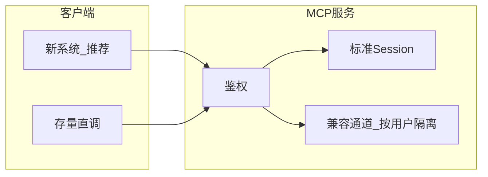
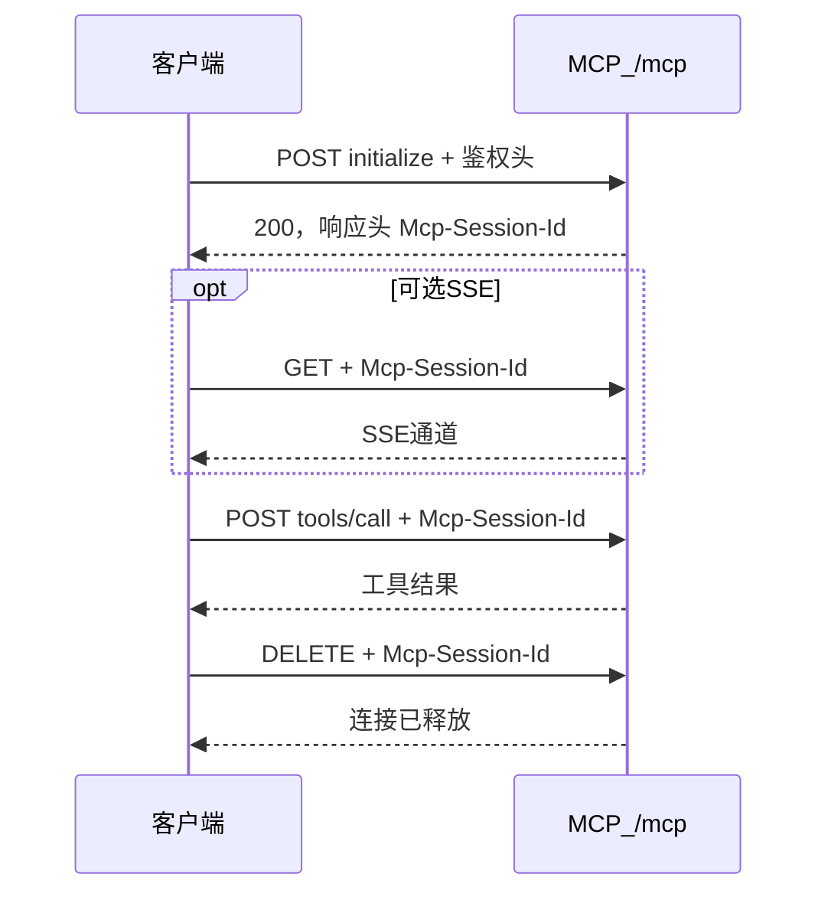
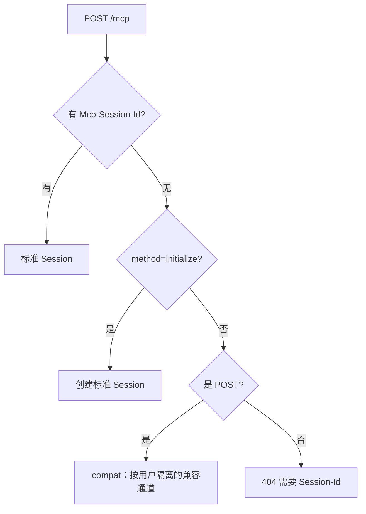
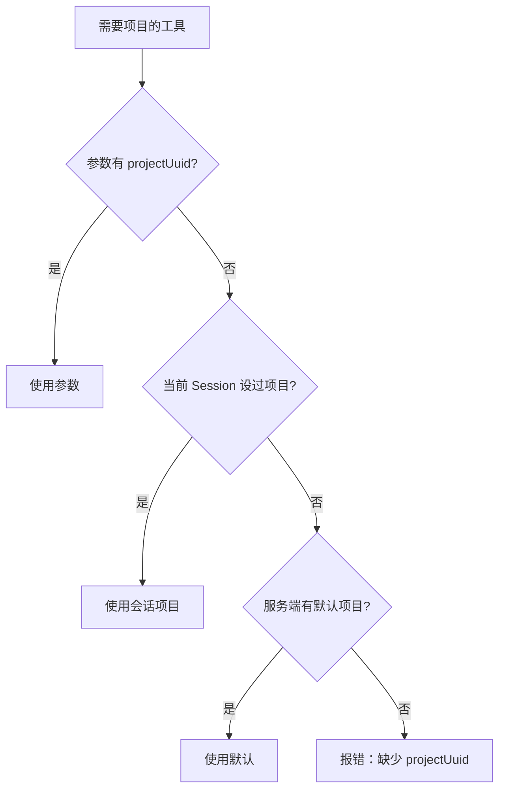

# Lightdash MCP 标准客户端使用规范

本文面向要**接入并使用** Lightdash 独立 MCP 服务的业务系统、平台、自研 HTTP 客户端。  
按「连接 → 调用 → 断开」说明推荐用法；可单独转发，不依赖仓库内其它文档。

---

## 1. 使用原则（先看）

| 场景 | 推荐做法 | 是否需要 Session |
|------|----------|------------------|
| 新系统、Cursor / Claude、自研 MCP 客户端 | **标准 Session** | **需要** |
| 已上线、直接 `POST tools/call` 的旧客户端 | **兼容模式**（可继续用） | **不需要** |



规范要点：

1. **新项目一律走标准 Session**（握手 → 带 Session 调工具 → 用完断开）。
2. 旧项目可不改代码走兼容模式；有余力再迁到标准 Session。
3. 查询请每次传 **`projectUuid`**，不要依赖跨请求的「记住项目」。
4. **SSE 断线 ≠ Session 结束**；真正释放连接请用 `DELETE`（见第 4 节）。

---

## 2. 服务地址与鉴权

| 方法 | 路径 | 用途 |
|------|------|------|
| `GET` | `/health` | 健康检查 |
| `POST` | `/mcp` | 握手、调工具（JSON-RPC） |
| `GET` | `/mcp` | 可选：打开 SSE 通道 |
| `DELETE` | `/mcp` | **断开连接 / 释放 Session** |

**不要**把工具名写进 URL：

```text
❌ /mcp/tools/list
❌ /mcp/tools/call
✅ POST /mcp   （method 写在 JSON body 里）
```

鉴权（任选其一，之后每次请求都要带）：

- `x-api-key: <个人访问令牌 PAT>`
- `Authorization: ApiKey <PAT>`
- `Authorization: Bearer <OAuth Token>`（若环境已开启 OAuth）

请求要求：

- `Content-Type: application/json`（有 body 时）
- body 必须是合法 JSON
- 建议 `Accept: application/json, text/event-stream`

---

## 3. 标准 Session：连接与调用

### 3.1 生命周期



```text
1. 连接：POST /mcp  method=initialize
   ← 记住响应头 Mcp-Session-Id

2. （可选）打开 SSE：GET /mcp + 同一 Session-Id
   ← 通道断线不会销毁 Session，可用同一 Id 再 GET

3. 调用：每次 POST /mcp 都带
   Header: Mcp-Session-Id: <上一步的值>
   body：tools/list | tools/call | …

4. 断开：DELETE /mcp + 同一 Session-Id
   ← 主动释放；之后勿再复用该 Id
```

同一令牌可同时开多个 Session（多进程 / 多窗口）。  
Session 与令牌身份绑定，不要把别人的 Session-Id 拿来用。

空闲约 **30 分钟**未使用会被服务端回收；触顶时也可能淘汰最久未用的 Session。收到 **404 Session not found** 时，应重新 `initialize`，**不要**继续用旧 Id。

### 3.2 curl：连接与调用

把 `MCP_BASE`、`YOUR_PAT` 换成实际值。

```bash
MCP_BASE='http://mcp.example.com'
PAT='YOUR_PAT'

# 1) 连接（握手）
curl -i -X POST "$MCP_BASE/mcp" \
  -H "x-api-key: $PAT" \
  -H 'Content-Type: application/json' \
  -H 'Accept: application/json, text/event-stream' \
  -d '{"jsonrpc":"2.0","id":1,"method":"initialize","params":{"protocolVersion":"2024-11-05","capabilities":{},"clientInfo":{"name":"my-app","version":"1.0"}}}'

# 2) 调用工具（替换 SESSION_ID）
curl -X POST "$MCP_BASE/mcp" \
  -H "x-api-key: $PAT" \
  -H 'Content-Type: application/json' \
  -H 'Accept: application/json, text/event-stream' \
  -H 'Mcp-Session-Id: SESSION_ID' \
  -d '{"jsonrpc":"2.0","id":2,"method":"tools/call","params":{"name":"list_projects","arguments":{}}}'
```

### 3.3 Cursor / Claude

```json
{
  "mcpServers": {
    "lightdash": {
      "type": "http",
      "url": "http://mcp.example.com/mcp",
      "headers": {
        "x-api-key": "<your-pat>"
      }
    }
  }
}
```

这类宿主会自动完成连接与 Session；应用侧只需调用工具，一般不必自己管 Session 头与断开。

---

## 4. 断开连接（标准 Session）

用完或进程退出时，应**主动断开**，避免 Session 堆积占用并发额度。

| 动作 | 做法 | 说明 |
|------|------|------|
| **正式断开** | `DELETE /mcp` + `Mcp-Session-Id` + 鉴权头 | 释放该标准 Session；之后该 Id 失效 |
| **仅关掉 SSE** | 关闭 GET 长连接 | **不会**销毁 Session；仍可用同一 Id 继续 POST 或再开 SSE |
| **不主动 DELETE** | 依赖空闲回收 | 约 30 分钟空闲后回收；频繁重连不 DELETE 易推高 `activeSessions` |

```bash
# 3) 断开连接（替换 SESSION_ID）
curl -X DELETE "$MCP_BASE/mcp" \
  -H "x-api-key: $PAT" \
  -H 'Mcp-Session-Id: SESSION_ID'
```

规范：

- 自研客户端：**进程退出 / 任务结束时发 DELETE**。
- Session 已 404 或已过期：无需再 DELETE；直接重新 `initialize`。
- 兼容模式（无 Session）：没有可 DELETE 的标准 Session；停止发 POST 即可。
- GET / DELETE **必须**带 `Mcp-Session-Id`，否则会 404。

---

## 5. 兼容模式（存量，无 Session）

适合：已经在用「只 POST、不维护 Session」的系统。



```bash
curl -X POST "$MCP_BASE/mcp" \
  -H "x-api-key: $PAT" \
  -H 'Content-Type: application/json' \
  -H 'Accept: application/json, text/event-stream' \
  -d '{"jsonrpc":"2.0","id":1,"method":"tools/call","params":{"name":"get_lightdash_version","arguments":{}}}'
```

注意：

- 仅 **POST** 支持无 Session；GET / DELETE 仍要 Session-Id
- 不同用户互不共用通道
- 查询请显式传 `projectUuid`
- 新项目请优先用第 3～4 节标准连接 / 断开流程

---

## 6. 项目参数



**推荐：每次调用都传 `projectUuid`。**

---

## 7. 健康检查

```bash
curl -s "$MCP_BASE/health"
```

示例：

```json
{
  "ok": true,
  "activeSessions": 0,
  "pendingSessions": 0,
  "compatSessions": 0
}
```

| 字段 | 含义 |
|------|------|
| `activeSessions` | 标准 Session 数量（多次 initialize 不 DELETE 会上涨） |
| `compatSessions` | 兼容通道数量 |

服务有并发上限与空闲回收；触顶时新连接可能收到 **503**，稍后重试或先 DELETE 释放闲置 Session。

---

## 8. 常见错误

| HTTP / 现象 | 原因 | 处理 |
|-------------|------|------|
| 404 且路径含 `/tools/` | 把 method 写成了 URL | 改为 `POST /mcp` |
| 404 Session not found | Session 过期、已 DELETE、或 Id 错误 | 重新 `initialize`，勿复用旧 Id |
| 404 + GET/DELETE 无 Session 头 | 未带 `Mcp-Session-Id` | SSE / 断开必须带 Session-Id |
| 400 Invalid JSON body | body 不是合法 JSON | 检查 Content-Type 与正文 |
| 401 | 未带令牌 | 加 `x-api-key` 或 Bearer |
| 缺 projectUuid | 未传项目 | 在工具参数中传入 |
| 503 sessions | 连接数触顶 | DELETE 闲置 Session、稍后重试，或联系运维调大容量 |

---

## 9. 多实例部署时

| 方式 | 注意 |
|------|------|
| 标准 Session | 网关最好按 `Mcp-Session-Id` 做会话粘滞（sticky） |
| 兼容模式 | 可不依赖 sticky |
| 查询 | 无论哪种方式，都建议每次传 `projectUuid` |

---

## 10. 使用检查清单

**标准 Session（推荐）**

- [ ] 只请求 `/mcp`，不拼 `/tools/list`
- [ ] `initialize` → 保存并回传 `Mcp-Session-Id`
- [ ] 鉴权头正确；body 为合法 JSON
- [ ] 查询类工具带 `projectUuid`
- [ ] 用第 3 节 curl 冒烟通过
- [ ] 任务结束 / 进程退出时 `DELETE /mcp` 断开连接
- [ ] 收到 Session 404 时重新握手，不复用旧 Id

**存量无 Session**

- [ ] 确认兼容模式可调用（第 5 节）
- [ ] 确认已传 `projectUuid`（或服务端已配置默认项目）
