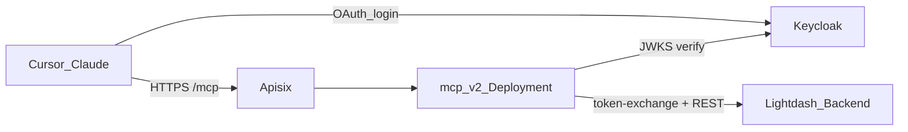

# MCP v2 运维部署（K8s + Docker 穿透）

面向运维：独立 `@lightdash/mcp-v2` + 主站换票密钥。客户端只配 MCP URL，走 Keycloak OAuth。

关联：[文档索引](./README.md) · [v2 说明](./lightdash-mcp-v2.md) · [Keycloak](./lightdash-mcp-v2-keycloak-oauth.md) · [镜像构建](./lightdash-mcp-docker-deploy.md)  
K8s 清单仓库：`../k8s-config`（常见分支：`pre` / `master`）。

---

## 1. 架构



- **产品入口**：独立 MCP（`mcp-*.…/mcp`），不是主站 `{SITE}/api/v1/mcp`。
- **换票**：`POST {SITE}/api/v1/mcp/token-exchange` 默认挂路由；主站与 MCP **共享** `LIGHTDASH_MCP_TOKEN_EXCHANGE_SECRET`（密钥不是开关，勿用 `MCP_ENABLED`）。

---

## 2. 两套实例对照

| | 马上赢X（msyx） | 内部平台 |
|--|----------------|----------|
| K8s 目录 | `lightdash-mcp/` | `lightdash-internal-mcp/` |
| Deployment | `lightdash-mcp` | `lightdash-internal-mcp` |
| 集群内 SITE | `http://lightdash:8080`（pre）/ `http://lightdash.default:8080`（prod） | `http://lightdash-internal:8080` / `http://lightdash-internal.default:8080` |
| 预发 MCP 主机（AR） | `mcp.x.pre.banmahui.cn` | `mcp.lightdash.pre.banmahui.cn` |
| 生产 MCP 主机（AR） | `mcp-x.brandct.com` / `mcp.x.brandct.com` | `mcp-lightdash.banmahui.cn` / `mcp.lightdash.banmahui.cn` |
| 客户端推荐 URL | `https://…/mcp`（优先连字符主机名，见 [v2 · §2](./lightdash-mcp-v2.md#2-快速接入)） | 同左 |

`MCP_PUBLIC_URL` 必须等于浏览器访问的 **MCP 根 URL**（无尾斜杠、不含 `/mcp`），并与 Apisix `hosts`、Keycloak audience 一致。

---

## 3. 环境变量

### 3.1 MCP（ConfigMap + Secret）

| 变量 | 放哪 | 必填 | 说明 |
|------|------|------|------|
| `PORT` | ConfigMap | 建议保留 | 监听端口；应用兼容：`LIGHTDASH_MCP_HTTP_PORT` → `PORT` → `3333` |
| `LIGHTDASH_MCP_HTTP_PORT` | ConfigMap | 否 | 若设置则优先于 `PORT` |
| `LIGHTDASH_SITE_URL` | ConfigMap | 是 | 集群内主站根（MCP 调 REST / 换票） |
| `LIGHTDASH_PROJECT_UUID` | ConfigMap | 建议 | 单项目默认 |
| `KEYCLOAK_REALM_URL` | ConfigMap | 是 | 如 `https://keycloak…/realms/mcp` |
| `MCP_PUBLIC_URL` | ConfigMap | 是 | 对外 MCP 根 URL（OAuth resource） |
| `MCP_OAUTH_AUDIENCE` | ConfigMap | 否 | 默认 `{MCP_PUBLIC_URL}/mcp` |
| `OAUTH_REQUIRED_SCOPES` | ConfigMap | 否 | 默认 `openid,mcp:read` |
| `LIGHTDASH_MCP_TOKEN_EXCHANGE_SECRET` | **Secret** | 是 | 与主站相同；**勿**进 ConfigMap |

**勿再配**：`LIGHTDASH_API_KEY`、`OAUTH_RESOURCE_METADATA_URL`、`OAUTH_INTROSPECT_URL`、`MCP_OAUTH_ENABLED`（v2 主鉴权已移除）。

### 3.2 主站 Backend

| 变量 | 放哪 | 说明 |
|------|------|------|
| `LIGHTDASH_MCP_TOKEN_EXCHANGE_SECRET` | **SopsSecret** → Secret | 与 MCP 相同；未配则换票 401 |
| `LIGHTDASH_MCP_PAT_TTL_SECONDS` | ConfigMap 可选 | 默认 `3600` |
| `LIGHTDASH_MCP_PAT_TTL_MAX_SECONDS` | ConfigMap 可选 | 默认 `86400` |
| `MCP_ENABLED` | — | **不要**为开换票/产品 v2 而设 true（只管 EE 内置 `/api/v1/mcp`） |

---

## 4. K8s 改法

### 4.1 MCP ConfigMap 示例（预发 msyx）

路径：`k8s-config/lightdash-mcp/lightdash-mcp-config.yaml`

```yaml
apiVersion: v1
kind: ConfigMap
metadata:
  name: lightdash-mcp-config
  namespace: pre
data:
  # 端口：LIGHTDASH_MCP_HTTP_PORT → PORT → 3333（二者都设时以前者为准）
  PORT: '3333'
  LIGHTDASH_SITE_URL: 'http://lightdash:8080'
  # LIGHTDASH_PROJECT_UUID: '<uuid>'
  KEYCLOAK_REALM_URL: 'https://REPLACE_KEYCLOAK/realms/REPLACE_REALM'
  # 必须与 Apisix hosts / 客户端 URL 一致（对外根，无 /mcp）
  MCP_PUBLIC_URL: 'https://mcp.x.pre.banmahui.cn'
  # 换票密钥勿写在此：见 Deployment secretKeyRef / 主站 SopsSecret
```

内部预发：`LIGHTDASH_SITE_URL: 'http://lightdash-internal:8080'`，`MCP_PUBLIC_URL: 'https://mcp.lightdash.pre.banmahui.cn'`，可保留 `LIGHTDASH_PROJECT_UUID`。

生产（`master`，无 `namespace: pre`）示例：

```yaml
PORT: '3333'
LIGHTDASH_SITE_URL: 'http://lightdash.default:8080'
LIGHTDASH_PROJECT_UUID: '3667f682-4080-44a4-8365-49f405936e09'
KEYCLOAK_REALM_URL: 'https://REPLACE_KEYCLOAK/realms/REPLACE_REALM'
MCP_PUBLIC_URL: 'https://mcp-x.brandct.com'
```

### 4.2 MCP Deployment：注入换票密钥

与 ConfigMap 并列，从主站同名 Secret 取键（msyx 用 `lightdash-secret`，内部用 `lightdash-internal-secret`）：

```yaml
envFrom:
  - configMapRef:
      name: lightdash-mcp-config
env:
  - name: LIGHTDASH_MCP_TOKEN_EXCHANGE_SECRET
    valueFrom:
      secretKeyRef:
        name: lightdash-secret
        key: LIGHTDASH_MCP_TOKEN_EXCHANGE_SECRET
```

镜像打 `mcp-v*` 后使用 `@lightdash/mcp-v2` 构建的 `winwin/lightdash-mcp:<semver>`。

### 4.3 主站 SopsSecret

在对应 SopsSecret 的 `stringData` **增加**键（需 `sops` 加密后提交，勿明文）：

```text
LIGHTDASH_MCP_TOKEN_EXCHANGE_SECRET: <长随机串，与 MCP 相同>
```

- msyx：`lightdash/lightdash-sopssecret.yaml` → Secret `lightdash-secret`
- 内部：`lightdash-internal/lightdash-internal-sopssecret.yaml` → `lightdash-internal-secret`

主站 Deployment 若已 `envFrom` 该 Secret，换票即可用。TTL 可不配。

### 4.4 Apisix `limit-req`

生产（`master`）曾用 `key: http_x_api_key`。OAuth 后客户端**不再**带 `x-api-key`，该 key 常为空，限流会误伤全员。

改为按客户端 IP，或去掉该插件：

```yaml
plugins:
  - name: limit-req
    config:
      rate: 1
      burst: 1
      key: remote_addr
      rejected_code: 429
      policy: local
```

预发 AR 若本无 `limit-req`，可保持不变。

---

## 5. 本地 Docker + 穿透

### 5.1 仅本机

```bash
docker run --rm -p 3333:3333 \
  -e LIGHTDASH_SITE_URL="https://your-lightdash.example.com" \
  -e KEYCLOAK_REALM_URL="https://keycloak.example.com/realms/mcp" \
  -e MCP_PUBLIC_URL="http://localhost:3333" \
  -e LIGHTDASH_MCP_TOKEN_EXCHANGE_SECRET="replace-with-long-random-secret" \
  -e PORT=3333 \
  registry.cn-hangzhou.aliyuncs.com/winwin/lightdash-mcp:<version>
```

`PORT` 与 `LIGHTDASH_MCP_HTTP_PORT` 二选一即可；都设时后者优先。

### 5.2 Docker 穿透（frp / ngrok / 云隧道）

OAuth resource / redirect 必须是浏览器能打开的**公网 URL**：

| 变量 | 穿透时怎么填 |
|------|----------------|
| `MCP_PUBLIC_URL` | **穿透后的公网根**（如 `https://xxx.ngrok-free.app`），**禁止**仍写 `localhost` |
| `MCP_OAUTH_AUDIENCE` | 一般省略（默认 `{MCP_PUBLIC_URL}/mcp`）；若 Keycloak audience mapper 钉死了固定值，须与穿透 URL 对齐 |
| `LIGHTDASH_SITE_URL` | MCP 容器能访问的主站（内网或公网） |
| `KEYCLOAK_REALM_URL` | 不变 |
| `LIGHTDASH_MCP_TOKEN_EXCHANGE_SECRET` | 与主站一致 |

另：Keycloak Trusted Hosts / redirect 允许该公网域名与 Cursor 回调。

```bash
# 假设穿透把本机 3333 暴露为 https://REPLACE_TUNNEL_HOST
docker run --rm -p 3333:3333 \
  -e LIGHTDASH_SITE_URL="https://your-lightdash.example.com" \
  -e KEYCLOAK_REALM_URL="https://keycloak.example.com/realms/mcp" \
  -e MCP_PUBLIC_URL="https://REPLACE_TUNNEL_HOST" \
  -e LIGHTDASH_MCP_TOKEN_EXCHANGE_SECRET="replace-with-long-random-secret" \
  -e PORT=3333 \
  registry.cn-hangzhou.aliyuncs.com/winwin/lightdash-mcp:<version>
```

客户端 `.mcp.json` 的 `url` 为 `https://REPLACE_TUNNEL_HOST/mcp`。

---

## 6. 上线检查

1. MCP `/health`：含 `"package":"@lightdash/mcp-v2"`、`"auth":"keycloak"`。
2. 未带 Bearer 访问 `/mcp` → **401** + `WWW-Authenticate` / `resource_metadata`。
3. `GET {MCP_PUBLIC_URL}/.well-known/oauth-protected-resource` → `authorization_servers` 指向 Keycloak。
4. 主站与 MCP 的 `LIGHTDASH_MCP_TOKEN_EXCHANGE_SECRET` 一致；未配时换票 401。
5. Cursor 只配 MCP URL，能完成 Keycloak 登录并调 `list_projects`。
6. 确认 ConfigMap **无**明文 PAT / 旧 `LIGHTDASH_API_KEY`。
7. 生产 Apisix 限流不再依赖 `http_x_api_key`。

---

## 7. 相关路径

| 路径 | 说明 |
|------|------|
| `k8s-config/lightdash-mcp/` | 马上赢X MCP |
| `k8s-config/lightdash-internal-mcp/` | 内部 MCP |
| `k8s-config/lightdash/lightdash-sopssecret.yaml` | msyx 主站密钥（加换票键） |
| `k8s-config/lightdash-internal/lightdash-internal-sopssecret.yaml` | 内部主站密钥 |
| `packages/lightdash-mcp-v2/` | MCP v2 源码 |
| `.github/workflows/build-docker-mcp.yml` | `mcp-v*` 镜像 |
