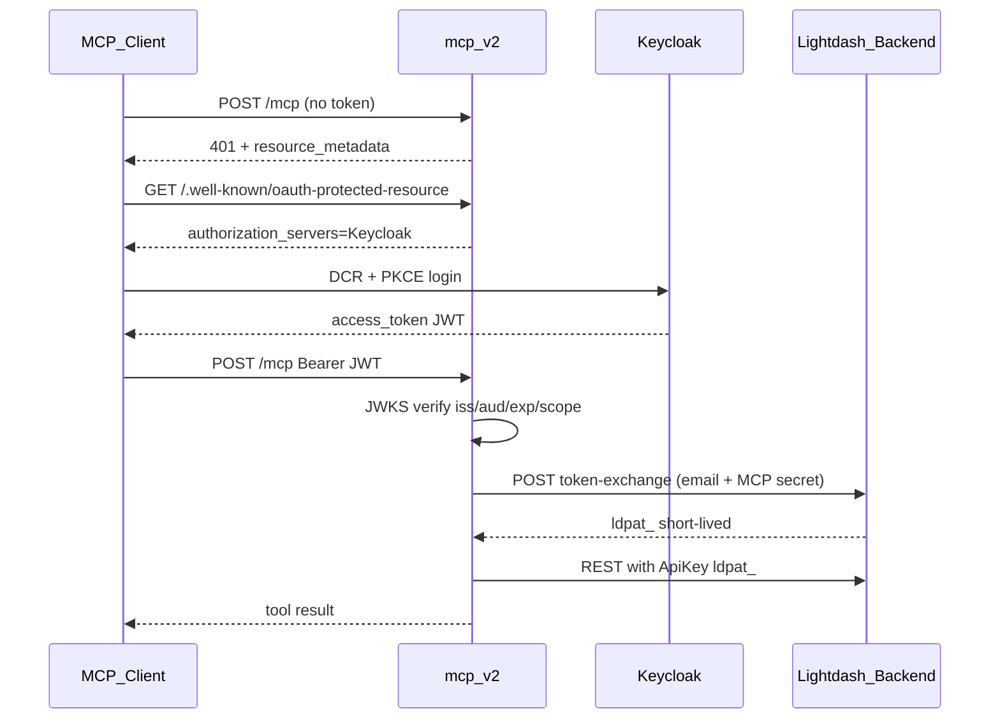
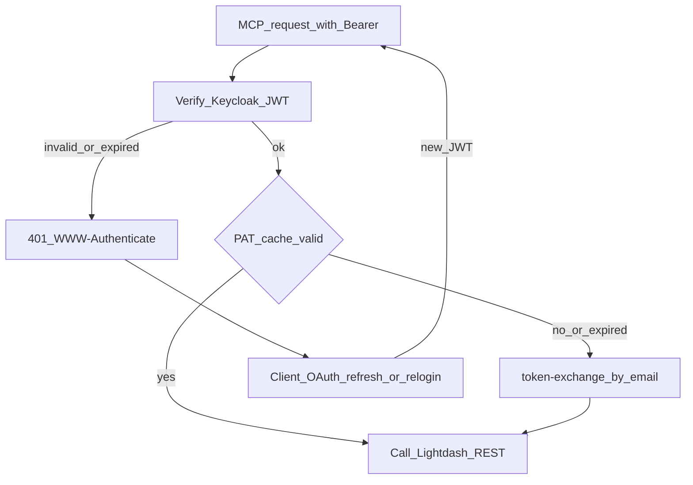

# MCP v2 Keycloak OAuth + 邮箱换票

本文档描述 `@lightdash/mcp-v2` 的鉴权方案：**客户端不再配置 `x-api-key`**；浏览器登录 Keycloak 后，MCP 用 JWT 中的 email 向 Lightdash 后端换取短期 PAT，再以对应用户身份调用 REST。

相关代码：`packages/lightdash-mcp-v2`、`packages/backend` 的 `POST /api/v1/mcp/token-exchange`。

---

## 1. 流程概览



要点：

- Keycloak JWT **不能**直接调 Lightdash REST。Lightdash 认的是 `ApiKey ldpat_*`（PAT）。
- 因此必须：**验签通过 → 取 email → 后端按邮箱签发短期 PAT → MCP 用该 PAT 调 REST**。
- **一人一票**：JWT `email` 是当前登录者邮箱，换出的 PAT 继承该用户在 Lightdash 的 CASL 权限。

---

## 2. 客户端配置

`.mcp.json` 只配 URL，**不配** api-key / 用户名密码：

```json
{
  "mcpServers": {
    "lightdash": {
      "type": "http",
      "url": "https://mcp-lightdash.example.com/mcp"
    }
  }
}
```

| 场景 | 用户动作 |
|------|----------|
| 第一次连接（或客户端无缓存） | 弹出浏览器 → 用**自己的** Keycloak / SSO 登录一次 |
| 之后正常使用 | 只配 URL、点连接；客户端带已缓存的 Bearer |
| access token 过期 | 客户端静默 refresh，仍不用手输密码 |
| refresh 也过期 / 清缓存 / 换机器 | 再弹一次浏览器登录 |

**不会**做成「服务端存密码自动代登」。用户密码只出现在 Keycloak 登录页。

---

## 3. 环境变量

### 3.1 MCP（`packages/lightdash-mcp-v2`）

| 变量 | 作用 |
|------|------|
| `LIGHTDASH_SITE_URL` | 下游 REST 根 |
| `KEYCLOAK_REALM_URL` | 如 `https://keycloak.dev.banmahui.cn/realms/mcp` |
| `MCP_PUBLIC_URL` | MCP 对外根 URL（resource） |
| `MCP_OAUTH_AUDIENCE` | 可选；默认 `{MCP_PUBLIC_URL}/mcp` |
| `OAUTH_REQUIRED_SCOPES` | 默认 `openid,mcp:read` |
| `LIGHTDASH_MCP_TOKEN_EXCHANGE_SECRET` | 调后端换票的共享密钥 |
| `LIGHTDASH_PROJECT_UUID` | 可选默认项目 |
| `LIGHTDASH_MCP_HTTP_PORT` | 默认 `3333` |

**不再**使用客户端侧 `LIGHTDASH_API_KEY` / `OAUTH_INTROSPECT_URL` 作为主鉴权路径。

### 3.2 Backend（PAT TTL 权威在此）

换票路由 `POST /api/v1/mcp/token-exchange` **随主站默认注册**，**没有**单独的「打开换票 / 打开 v2 MCP」开关。

| 变量 | 是不是开关 | 说明 |
|------|------------|------|
| `LIGHTDASH_MCP_TOKEN_EXCHANGE_SECRET` | **否，是共享密钥** | **必须配**。与独立 MCP 进程相同；未配时换票直接 401。勿用 `LIGHTDASH_SECRET` 顶替（那是 cookie/会话密钥，不该发给 MCP 进程） |
| `LIGHTDASH_MCP_PAT_TTL_SECONDS` | 否 | 签发默认 TTL（秒），**默认 `3600`（1 小时）**；可不配 |
| `LIGHTDASH_MCP_PAT_TTL_MAX_SECONDS` | 否 | 上限钳制，默认 `86400`（24h）；可不配 |
| `MCP_ENABLED` | 是，但**只管** EE `{SITE}/api/v1/mcp` | **不要**用它开换票或产品 v2；产品交付保持不为 true 即可 |

为何 MCP 不配 TTL：

- Backend 写入 PAT 的 `expiresAt`，API 鉴权拒绝过期 token —— 这是安全边界的唯一权威。
- 换票响应带 `expiresAt`，MCP 只按该时间做进程内缓存与静默再换票。
- Body 里的自定义 TTL **本期不开放**（避免绕过运维配置）。

---

## 4. 换票 API

`POST /api/v1/mcp/token-exchange`

- **默认可用**：TSOA 路由已挂在主站；启用条件是配置了共享密钥，**不是** `MCP_ENABLED`。
- 鉴权：`Authorization: Bearer <LIGHTDASH_MCP_TOKEN_EXCHANGE_SECRET>`（仅 MCP 服务可调）
- Body：`{ "email": "user@example.com" }`
- 逻辑：
  1. 按主邮箱查找已有 Lightdash 用户（**不自动建用户**）
  2. 用户不存在 → `404`
  3. 创建短生命周期 PAT（description：`mcp-keycloak-exchange`）
  4. 返回 `{ accessToken, tokenType: "ApiKey", expiresAt, userUuid, email }`

---

## 5. 失效与续期（两层 token）



1. **Keycloak access token（JWT）过期**  
   - MCP 验签失败 → `401` + `WWW-Authenticate`（带 `resource_metadata`）  
   - 由 MCP 客户端按 OAuth 规范 refresh / 重登  
   - 用户不必手动再配 key  

2. **Lightdash 短期 PAT 过期**  
   - MCP 按 email 缓存 PAT，以后端返回的 `expiresAt` 为准（提前 skew 默认 60s）  
   - 缓存未命中或已过期、且当前 Keycloak JWT 仍有效 → **静默再换票**，不要求用户重新登录  
   - 若下游 REST 仍返回 401（如 PAT 被吊销）→ 清缓存并重试一次换票  

原则：**能自动续就自动续；只有 Keycloak 会话本身失效才打断用户。TTL 权威在 Backend。**

---

## 6. Keycloak 前提（代码外配置）

Realm URL 用环境变量 `KEYCLOAK_REALM_URL`，**不写死**。

### 6.1 谁登录：每人自己的 Keycloak 账号

`testuser` / `password123` **只是当前开发 realm 里的联调用例**，用来验证「浏览器能登、JWT 能验、email 能换票」。**不是产品给所有人共用的账号，也不写进代码或 MCP / Lightdash 环境变量。**

| 环境 | 谁登录 | 密码从哪来 |
|------|--------|------------|
| 开发联调 | 可用 realm 里已有的 `testuser` | 仅开发者在浏览器里输入一次 |
| 预发 / 生产 | **每个用户自己的 Keycloak 账号**（或公司 SSO） | 用户自己的密码 / SSO，与 Lightdash 主邮箱对应 |

如果所有人都用 `testuser`，换出来的永远是同一个人的 Lightdash 权限，方案就失效了。

### 6.2 Realm 其它要求

- Keycloak **≥ 26.6.0**（DCR 兼容）
- 开启 Dynamic Client Registration；Trusted Hosts 允许 MCP / 客户端 redirect（本地 `localhost`、Cursor 等）
- Audience mapper：`aud` = MCP public resource URL（与 `MCP_OAUTH_AUDIENCE` 一致），挂在 `mcp:read` 上
- Client scope `mcp:read` **Type 必须是 Default**（禁止 Optional）；并 **Include in token scope**。Optional 时新版 Claude refresh 后票无 `aud`，MCP 401
- 每个 Keycloak 用户的 **email claim** 必须等于其在 Lightdash 中已有账号的主邮箱

---

## 7. 与旧 api-key 鉴权的差异

| | 旧（api-key / introspect） | 现（Keycloak + 换票） |
|--|--|--|
| 客户端配置 | `.mcp.json` 里 `x-api-key` | 仅 URL，走 OAuth |
| 身份来源 | 手填 PAT | Keycloak 登录 → JWT email |
| 下游 REST | 客户端 PAT 或 OAuth Bearer 转发 | 一律换来的短期 `ApiKey` |
| 权限模型 | 谁持有 PAT 谁有权 | 一人一票，按邮箱对应用户 |

---

## 8. 风险与边界

- 所有 Keycloak 用户必须在 Lightdash **预先存在同邮箱账号**；否则换票 404。
- 短 TTL PAT 会在 DB 中累积；建议后续加过期清理 job。
- 生产务必配 `audience`，避免任意 audience 的 Keycloak token 被接受。

---

## 9. 与内置 MCP 协议端点的关系

Lightdash 主站还有一个 **EE 内置 MCP 协议端点** `{SITE_URL}/api/v1/mcp`（约 10 个工具，鉴权为 Lightdash OAuth / PAT，不是 Keycloak）。**本部署不把它当作产品接入方式。**

| 名称 | 路径 / 进程 | 给谁用 |
|------|-------------|--------|
| **产品 MCP（本方案）** | 独立 `@lightdash/mcp-v2`，`https://mcp-*.…/mcp` | Cursor / Claude 等外部客户端 |
| **内置 MCP 协议端点** | `{SITE}/api/v1/mcp`（EE `McpService`） | 官方「直连主站」能力；代码保留，**勿宣传、勿配置进 `.mcp.json`** |
| **换票 API** | `POST {SITE}/api/v1/mcp/token-exchange` | **仅**独立 v2 服务调用（共享密钥）；不是 MCP 协议、不是给客户端连的 |

注意：

- `token-exchange` 与内置协议端点同前缀 `/api/v1/mcp`，但是 TSOA REST，**不是** MCP Streamable HTTP。
- 换票**默认挂路由**；只需 `LIGHTDASH_MCP_TOKEN_EXCHANGE_SECRET`，**不依赖** `MCP_ENABLED`。
- 前端 Copilot 不走内置 MCP HTTP，而是直接调 AI tools。
- 生产建议保持 `MCP_ENABLED` 不为 true（避免误开 EE 内置协议端点）；若开了 AiCopilot，内置端点可能仍可用，但仍不作为交付入口。
