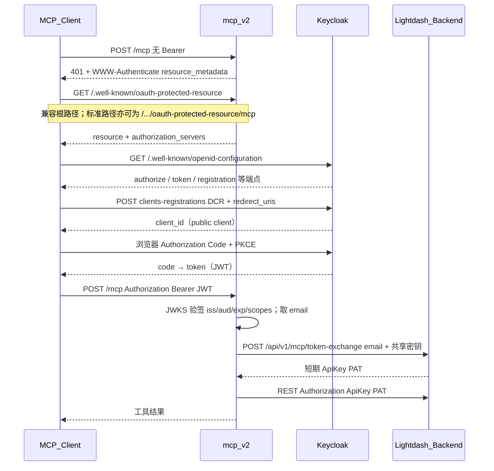
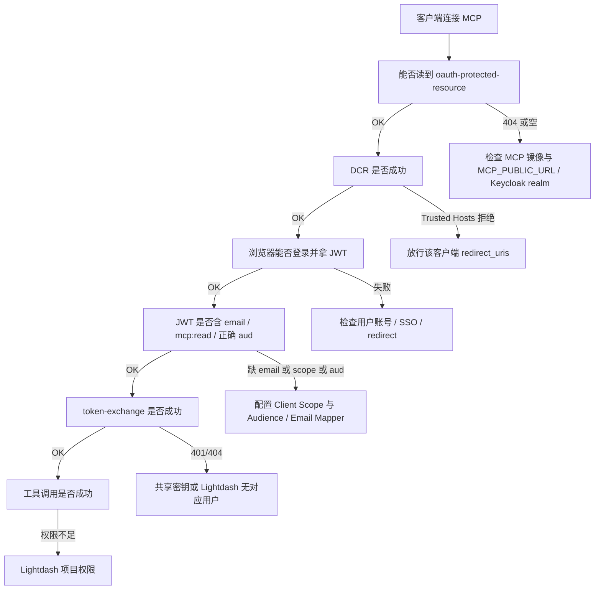

# Lightdash MCP v2：OAuth 客户端接入（独立说明）

本文说明独立进程 `@lightdash/mcp-v2` 如何与 Claude Code、WorkBuddy、Cursor 等 MCP 客户端通过 **Keycloak OAuth + Dynamic Client Registration（DCR）** 完成鉴权，以及运维需要配置的 Keycloak 策略与环境变量。

本文自洽，不依赖仓库内其他文档。

---

## 1. 产品边界

| 组件 | 作用 |
|------|------|
| MCP 客户端（Claude Code / WorkBuddy / Cursor 等） | 发现 OAuth、DCR、浏览器登录、携带 Bearer JWT 调 `/mcp` |
| Keycloak（Authorization Server） | 用户登录、签发 JWT、接受匿名 DCR |
| `@lightdash/mcp-v2`（Resource Server） | 暴露 `/mcp` 与 OAuth metadata；校验 JWT；按 email 向主站换短期 PAT |
| Lightdash Backend | `POST /api/v1/mcp/token-exchange`；按邮箱签发短期 `ApiKey`（PAT） |

不在交付范围内：

- 主站 `{SITE}/api/v1/mcp`（EE 内置 MCP 协议端点）
- 本地 Python FastMCP 示例程序（仅开发联调诊断，**不要部署到预发/生产**）

预发马上赢X 示例（以实际为准）：

| 项 | 值 |
|----|----|
| MCP 对外根 | `https://mcp-x.pre.banmahui.cn` |
| 客户端 MCP URL | `https://mcp-x.pre.banmahui.cn/mcp` |
| Keycloak realm | `https://keycloak.dev.banmahui.cn/realms/mcp` |

---

## 2. 交互流程

### 2.1 成功路径（时序）



要点：

1. Keycloak JWT **不能**直接调 Lightdash REST；必须换短期 PAT。
2. **一人一票**：JWT 的 `email` 必须等于 Lightdash 已有用户的主邮箱。
3. WorkBuddy / Claude Code / Cursor 均走 **DCR**（动态注册），不依赖预注册固定 Client ID（Cursor 也可用回调白名单兼容 DCR）。

### 2.2 失败定位（流程）



---

## 3. OAuth Metadata（MCP 服务端）

MCP 对外应可访问：

| 路径 | 说明 |
|------|------|
| `GET /.well-known/oauth-protected-resource` | 根路径兼容（WorkBuddy 等客户端常用） |
| `GET /.well-known/oauth-protected-resource/mcp` | 与 resource URL `/mcp` 对应的标准路径 |
| `GET /.well-known/oauth-authorization-server` | 透传/代理 Keycloak AS metadata（由 MCP 路由提供） |

根路径响应示例：

```json
{
  "resource": "https://mcp-x.pre.banmahui.cn/mcp",
  "authorization_servers": [
    "https://keycloak.dev.banmahui.cn/realms/mcp"
  ],
  "scopes_supported": ["openid", "mcp:read"]
}
```

未带 Bearer 访问 `POST /mcp` 预期 **401**，响应头含类似：

```http
WWW-Authenticate: Bearer ..., resource_metadata="https://mcp-x.pre.banmahui.cn/.well-known/oauth-protected-resource/mcp"
```

---

## 4. 各客户端回调（DCR redirect_uris）

Keycloak Anonymous Client Registration 的 **Trusted Hosts / Client URIs Must Match** 必须覆盖客户端实际提交的 **全部** `redirect_uris`。任一 URI 不匹配，DCR 会失败，浏览器登录页不会出现。

### 4.1 Claude Code

典型：

```text
http://localhost:{动态端口}/callback
http://127.0.0.1:{动态端口}/callback
```

Trusted Hosts / Domains 至少：

```text
localhost
127.0.0.1
```

### 4.2 WorkBuddy

文档约定：

1. **首选**（`<source>` 为连接器 `source`，例如 `lightdash-mcp`）：

```text
workbuddy://workbuddy/mcp/connector%3Alightdash-mcp/oauth/callback
```

2. **回退**（私有协议被拒时）：

```text
http://127.0.0.1:{动态端口}/oauth/callback
```

注意路径为 `/oauth/callback`，与 Claude/Python 常见的 `/callback` 不同。

Trusted Hosts / Domains 至少：

```text
workbuddy
127.0.0.1
localhost
```

WorkBuddy 连接器示例（标准 MCP OAuth，**不要**填长期 Token；`auth_mode` 省略）：

`mcp.json`：

```json
{
  "mcpServers": {
    "lightdash-mcp": {
      "type": "streamableHttp",
      "url": "https://mcp-x.pre.banmahui.cn/mcp",
      "timeout": 30000
    }
  }
}
```

`connector-meta.json` 关键字段示例：

```json
{
  "name": "Lightdash MCP",
  "source": "lightdash-mcp",
  "type": "mcp",
  "version": "1.0.0"
}
```

`source` 必须与回调 URI 中 `connector%3A<source>` 一致。

### 4.3 Cursor

当前桌面/Agent 可能在一次 DCR 中同时提交多个回调（以 Keycloak 拒绝日志中的完整数组为准），常见包括：

```text
http://localhost:8787/callback
https://www.cursor.com/agents/mcp/oauth/callback
cursor://anysphere.cursor-mcp/oauth/callback
```

Trusted Hosts / Domains 建议额外包含：

```text
localhost
www.cursor.com
cursor.com
anysphere.cursor-mcp
```

Cursor 不是当前主交付目标；若仅服务 Claude Code / WorkBuddy，可优先保证 §4.1 / §4.2，再按需补 Cursor。

### 4.4 本地 Python 诊断客户端（可选）

仅用于验证「同一 Keycloak realm 上 DCR + PKCE 是否通」。典型回调：

```text
http://localhost:{动态端口}/callback
```

**不要**把该示例部署到预发；后端同事只需知道：本地能通 DCR ≠ 已放行 WorkBuddy/Cursor 的全部 URI。

---

## 5. Keycloak 运维配置清单

Realm 示例：`https://keycloak.dev.banmahui.cn/realms/mcp`

### 5.1 Anonymous Client Registration

| 项 | 建议 |
|----|------|
| 允许匿名创建 client | 是（MCP DCR 需要） |
| Client type | Public |
| Standard Flow | ON |
| PKCE | S256 必开 |
| Client authentication | OFF（无 client_secret） |
| Host Sending Client Registration Request Must Match | **OFF**（否则每位用户出网 IP 都可能被拒） |
| Client URIs Must Match | **ON** |
| Trusted Hosts / Domains | 覆盖 §4 各客户端 |
| Allowed Client Scopes | 至少 `openid`、`email`、`mcp:read`（及可选 `offline_access`） |

开放 DCR 后请配置：注册接口限流、动态 client 数量/生命周期限制。

### 5.2 Client Scope：`mcp:read`

新建（或确认）Client Scope `mcp:read`，并加入 Anonymous 策略允许列表。

Audience Mapper（示例）：

| 字段 | 值 |
|------|----|
| Mapper Type | Audience |
| Name | mcp-audience |
| Included Custom Audience | `https://mcp-x.pre.banmahui.cn/mcp` |
| Add to access token | ON |

Audience 必须与 MCP 的 `MCP_OAUTH_AUDIENCE`（默认 `{MCP_PUBLIC_URL}/mcp`）一致。

### 5.3 Email

| 检查项 | 要求 |
|--------|------|
| 用户资料 | Keycloak 用户已填 email |
| Client Scope `email` | User Property Mapper：`email` → claim `email`，写入 access token |
| 与 Lightdash | 同邮箱账号已存在于目标 Lightdash 环境（换票不自动建用户） |

预期 access token 关键 claims：

```json
{
  "iss": "https://keycloak.dev.banmahui.cn/realms/mcp",
  "aud": "https://mcp-x.pre.banmahui.cn/mcp",
  "scope": "openid email mcp:read",
  "email": "user@example.com"
}
```

`OAUTH_REQUIRED_SCOPES` **不是**「指定登录哪个用户」；每个用户仍用自己的 Keycloak/SSO 账号登录。Scope 只声明客户端应申请的权限集合。

### 5.4 Keycloak 版本

建议 Keycloak **≥ 26.6.0**，并对 MCP 客户端的匿名 DCR / PKCE 行为做过验证。

---

## 6. 环境变量

### 6.1 MCP（`@lightdash/mcp-v2`）

| 变量 | 必填 | 说明 |
|------|------|------|
| `LIGHTDASH_SITE_URL` | 是 | 集群内或可达的主站根（REST + 换票） |
| `KEYCLOAK_REALM_URL` | 是 | Keycloak realm 根 URL |
| `MCP_PUBLIC_URL` | 是 | MCP 对外根 URL（无尾斜杠、不含 `/mcp`） |
| `LIGHTDASH_MCP_TOKEN_EXCHANGE_SECRET` | 是 | 与 Backend 共享的换票密钥（放 Secret） |
| `MCP_OAUTH_AUDIENCE` | 否 | 默认 `{MCP_PUBLIC_URL}/mcp` |
| `OAUTH_REQUIRED_SCOPES` | 否 | 默认 `openid,mcp:read`；建议预发显式为 `openid,email,mcp:read` |
| `LIGHTDASH_PROJECT_UUID` | 建议 | 单项目默认 |
| `PORT` / `LIGHTDASH_MCP_HTTP_PORT` | 否 | 监听端口，默认 3333 |

预发示例：

```env
LIGHTDASH_SITE_URL=http://lightdash:8080
KEYCLOAK_REALM_URL=https://keycloak.dev.banmahui.cn/realms/mcp
MCP_PUBLIC_URL=https://mcp-x.pre.banmahui.cn
MCP_OAUTH_AUDIENCE=https://mcp-x.pre.banmahui.cn/mcp
OAUTH_REQUIRED_SCOPES=openid,email,mcp:read
LIGHTDASH_MCP_TOKEN_EXCHANGE_SECRET=<与主站相同的长随机串>
```

缺任一必填项时，较新镜像会 **degraded listen**：进程不 CrashLoop，`/health` 与 `/mcp` 返回 **503** 并带 `missingEnv`（仍须补齐 ConfigMap/Secret）。

### 6.2 Lightdash Backend

| 变量 | 说明 |
|------|------|
| `LIGHTDASH_MCP_TOKEN_EXCHANGE_SECRET` | 与 MCP 相同；未配则换票 401 |
| `LIGHTDASH_MCP_PAT_TTL_SECONDS` | 可选，默认约 3600 |
| `LIGHTDASH_MCP_PAT_TTL_MAX_SECONDS` | 可选，默认约 86400 |

换票路由：`POST {LIGHTDASH_SITE_URL}/api/v1/mcp/token-exchange`  
鉴权：`Authorization: Bearer <LIGHTDASH_MCP_TOKEN_EXCHANGE_SECRET>`  
Body：`{ "email": "user@example.com" }`

**不要**用 `MCP_ENABLED` 当作换票开关（该变量只管 EE 内置协议端点）。

---

## 7. WorkBuddy / Claude Code 接入摘要

### Claude Code

```text
claude mcp add --transport http --scope local msyx-pre https://mcp-x.pre.banmahui.cn/mcp
```

随后在会话中 `/mcp` → 选择服务 → Authenticate → Keycloak 登录。

### WorkBuddy

1. 连接器 `url` 指向 `https://mcp-x.pre.banmahui.cn/mcp`，`type: streamableHttp`。
2. 确保 Keycloak 已放行 §4.2 回调。
3. 确保 MCP 镜像含根路径 `/.well-known/oauth-protected-resource`。
4. 用户安装连接器后点「连接」，按浏览器完成登录。

### Cursor（可选）

`.mcp.json`：

```json
{
  "mcpServers": {
    "msyx-pre": {
      "type": "http",
      "url": "https://mcp-x.pre.banmahui.cn/mcp"
    }
  }
}
```

若报 `Trusted Hosts` / `URI doesn't match`，把 Output 中完整错误与 Keycloak DCR 请求体的 `redirect_uris` 交给运维补齐 §4.3。

---

## 8. 上线验证清单

1. `GET {MCP_PUBLIC_URL}/health` → `ok: true`，`auth: keycloak`。
2. `GET {MCP_PUBLIC_URL}/.well-known/oauth-protected-resource` → 含 `authorization_servers`。
3. `GET {MCP_PUBLIC_URL}/.well-known/oauth-protected-resource/mcp` → 同上。
4. 无 Bearer `POST {MCP_PUBLIC_URL}/mcp` → **401** + `resource_metadata`。
5. Claude Code / WorkBuddy DCR 成功并弹出 Keycloak 登录页。
6. 登录后 JWT 含 `email`、`mcp:read`（或约定 scopes）、正确 `aud`。
7. 主站与 MCP 共享密钥一致；换票对已存在用户返回 PAT。
8. 能调用如 `list_projects` 等工具。

---

## 9. 常见错误对照

| 现象 | 原因 | 处理 |
|------|------|------|
| `Trusted Hosts` / `URI doesn't match` | DCR 的 redirect_uris 未放行 | 按 §4 补 Trusted Hosts；看 Keycloak 日志中的完整 URI 列表 |
| metadata 根路径 404 | 旧镜像无根路径兼容 | 部署含 `/.well-known/oauth-protected-resource` 的 MCP 镜像 |
| 登录成功但 MCP 401 缺 email | token 无 email claim | §5.3 Email Mapper + 用户资料 |
| 缺 `mcp:read` | scope 未申请或未允许 | §5.2 + `OAUTH_REQUIRED_SCOPES` |
| aud 校验失败 | Audience Mapper 与 `MCP_OAUTH_AUDIENCE` 不一致 | §5.2 与 §6.1 |
| token-exchange 404 | Lightdash 无该邮箱用户 | 先在主站建同邮箱账号 |
| token-exchange 401 | 共享密钥不一致或未注入 | 检查两边 Secret |
| `/health` 503 + `missingEnv` | MCP 缺必填环境变量 | 补 ConfigMap/Secret 并重建 Pod |

---

## 10. 给后端同事的说明

后端需要保证：

1. `POST /api/v1/mcp/token-exchange` 可用，且配置了 `LIGHTDASH_MCP_TOKEN_EXCHANGE_SECRET`。
2. 仅接受 MCP 服务端用共享密钥调用；按 **email** 查找已有用户并签发短期 PAT。
3. **不需要**部署或维护本地 Python OAuth 示例；该示例只证明 Keycloak DCR 对「单 localhost 回调」可用，不能替代 WorkBuddy/Cursor 的回调策略配置。

MCP 服务端负责：JWT 校验、scopes/audience、发起换票、用 PAT 调 REST。

---

## 11. 部署顺序建议

1. Keycloak：Trusted Hosts + scopes + email/audience mapper（§5）。
2. Backend：换票密钥与 TTL（§6.2）。
3. 发布含根路径 metadata 的 MCP 镜像，注入 §6.1 环境变量。
4. 用 Claude Code / WorkBuddy 走完整登录与工具调用（§8）。
5. （可选）再补 Cursor 回调白名单。

*文档版本：2026-09-20 · 独立成篇，可直接转发运维 / 接入方。*
