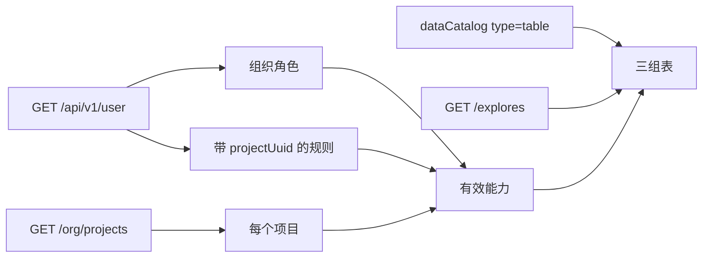

# MCP 权限查询：`get_my_access`

查当前 PAT 的组织角色、每个可访问项目上的有效能力，以及该项目里哪些表可以跑临时指标查询。AI 应先调这个工具，再选表。`run_metric_query` / `run_semantic_metric_query` 对非 `queryable` 表会拒绝查询，不会返回空结果。`search_field_values` 允许 `queryable` 和 `metadataOnly`，仍拒绝 `attributeDenied` 和未知表。

本工具加在 v1 包 `packages/lightdash-mcp`。最低要求是 PAT 已认证，不要求更高项目角色。对照表见 [mcp-tools-permissions.md](./mcp-tools-permissions.md)。

## 入参

| 参数 | 必填 | 说明 |
|---|---|---|
| `projectUuid` | 否 | 只看这一个项目。不传则返回当前令牌能看到的全部项目。 |
| `includeExplores` | 否 | 默认 `false`：不返回 `explores`，也不拉表名单。`true` 时返回三组表。建议同时传 `projectUuid`。 |

两种调用的外层形状相同：始终返回 `email`、`firstName`、`lastName`、`userUuid`、`organization` 和 `projects` 数组。传入 `projectUuid` 时 `projects` 只含匹配的一项；找不到则为空数组。不跟 `set_project` 或环境变量绑死。默认项目对象没有 `explores` 字段。

## 组织权限和项目权限

两套角色存在不同的地方，调用时叠加，取更高的一边。

- **组织角色**来自 `GET /api/v1/user` 的 `role`。代码值含 `member`。成员几乎不能看内容。查看者及以上的组织角色，规则条件是 `organizationUuid`，对这个组织里每个项目都生效。
- **项目角色**来自同一份 `abilityRules` 里、条件带 `projectUuid` 的规则。只对这一个项目生效。项目角色没有「成员」。直接加入项目和通过用户组得到的角色，最后都是这种规则；本工具不再拆开。

因此不要揉成一个顶层 `projectAccessLevel`。组织放顶层，每个项目各自带：

| 字段 | 含义 |
|---|---|
| `projectRole` | 只看带这个 `projectUuid` 的规则，推出 `viewer` / `interactive_viewer` / `editor`。没有则为 `null`。开发者、管理员记成 `editor`。 |
| `effectiveAccessLevel` | 组织能力与该项目角色取并集后推出的等级。 |
| `effectiveCapabilities` | 能不能调其他 MCP 工具，只看这一份。 |
| `explores` | 仅 `includeExplores=true` 时出现。按该项目有效的 `runMetricQuery` 分成三组。 |

组织能力只统计「带 `organizationUuid`、不带 `projectUuid`」的规则。例如组织是成员时，四项能力都是 false；组织是交互式查看者时，每个项目的有效 `runMetricQuery` 都是 true，即使该项目的 `projectRole` 是 `null`。

规则对不上查看者 / 交互式查看者 / 编辑者这三档时（自定义角色的能力组合），`projectRole` 或 `effectiveAccessLevel` 为 `null`，四项能力仍按规则逐项填写。调用方以能力标志为准。

## 能力标志

与 [mcp-tools-permissions.md](./mcp-tools-permissions.md) 对齐。`manage` 视为包含 `view`。

| 标志 | 对应检查 | 最低角色 |
|---|---|---|
| `browseContent` | `view Project` | 查看者 |
| `runSavedChart` | `view SavedChart` | 查看者 |
| `runMetricQuery` | `view Explore` | 交互式查看者 |
| `exportDashboardCode` | `view ContentAsCode` | 编辑者 |

## 表分组

每个项目用两份名单做差：

- `GET /explores?filtered=true`：项目已选表，**不**按用户属性 `requiredAttributes` 裁剪。客户使用 + viewer / interactive_viewer 还会按白名单看板用到的表再裁一刀。
- `GET /dataCatalog?type=table`：已按用户属性去掉无权的表，也受表选择约束。客户使用 + viewer / interactive_viewer 同样只保留白名单看板用到的表。

| 分组 | 规则 | 用法 |
|---|---|---|
| `queryable` | 目录里有，且该项目有效 `runMetricQuery` 为真 | 临时指标查询只从这里选表。客户使用查看者/交互式查看者的目录已按白名单看板收口，不是项目全量。同一指标出现在两张表时，只用这里的那张。`search_field_values` 也可以用这里的表。 |
| `metadataOnly` | 目录里有，但不能跑临时指标查询 | 只能走已保存图表（`run_saved_chart` / `run_dashboard_tiles`）。`search_field_values` 可以用这里的表。 |
| `attributeDenied` | explores 有、目录没有 | 用户属性不满足，不要用来查数。 |

`run_metric_query`、`run_semantic_metric_query` 会按这三组预检：不在 `queryable` 里的表会**拒绝查询**，不会返回空结果。`search_field_values` 允许 `queryable` 和 `metadataOnly`，`attributeDenied` 与未知表仍拒绝。请先 `get_my_access(..., includeExplores=true)` 再选表。行级 `sql_filter` 滤成 0 行仍可能是「表本身没数据」，与表级无权不同。

每项只含 `name`、`label`、`groupLabel`，没有字段和数据。没有表时对应数组为空。无权表只在打开 `includeExplores` 后出现在 `attributeDenied` 里，同样只有名字。

本工具不返回图表 ID。看板图表查询用 `chartUuid` / `dashboardUuid`；临时指标查询用 explore 的 `name`。

## 返回 JSON

### 组织成员 + 项目交互式查看者（默认）

```json
{
  "email": "13328775080@brandct.cn",
  "firstName": "欣琦",
  "lastName": "王",
  "userUuid": "d1ab39f4-dfdc-4211-bff7-7b7f9bd08aca",
  "organization": {
    "organizationUuid": "76be0310-00ab-42da-bee1-6dd216a76080",
    "name": "马上赢",
    "role": "member",
    "capabilities": {
      "browseContent": false,
      "runSavedChart": false,
      "runMetricQuery": false,
      "exportDashboardCode": false
    }
  },
  "projects": [
    {
      "projectUuid": "3667f682-4080-44a4-8365-49f405936e09",
      "name": "品牌CT",
      "projectRole": "interactive_viewer",
      "effectiveAccessLevel": "interactive_viewer",
      "effectiveCapabilities": {
        "browseContent": true,
        "runSavedChart": true,
        "runMetricQuery": true,
        "exportDashboardCode": false
      }
    }
  ]
}
```

`email`、`firstName`、`lastName`、`userUuid` 来自 `GET /api/v1/user`，传入 `projectUuid` 时也照常返回。姓名按接口原样给出，缺了则为 `null`。`organization.role` 用组织角色代码值（含 `member`）。`projectRole` 与 `effectiveAccessLevel` 为 `viewer`、`interactive_viewer`、`editor`，或 `null`。

### 内部开发者（预发，默认）

组织是开发者时，四项组织能力都是 true。没有单独项目角色的项目，`projectRole` 为 `null`，有效等级仍是 `editor`。姓名未填则为 `null`。

```json
{
  "email": "yangzhiqiang@brandct.com",
  "firstName": null,
  "lastName": null,
  "userUuid": "f27a400e-c340-41f7-9e93-71cddc511a35",
  "organization": {
    "organizationUuid": "64908119-d4f0-4b57-8eaa-87f42ba1bcd2",
    "name": "马上赢",
    "role": "developer",
    "capabilities": {
      "browseContent": true,
      "runSavedChart": true,
      "runMetricQuery": true,
      "exportDashboardCode": true
    }
  },
  "projects": [
    {
      "projectUuid": "2774bc2f-68bd-4671-8a92-1415206dfec2",
      "name": "Lightdash pem",
      "projectRole": null,
      "effectiveAccessLevel": "editor",
      "effectiveCapabilities": {
        "browseContent": true,
        "runSavedChart": true,
        "runMetricQuery": true,
        "exportDashboardCode": true
      }
    }
  ]
}
```

### 打开 includeExplores 之后

`includeExplores=true` 且建议带 `projectUuid`。不传项目时每个可访问项目都会带完整表名单，可能很大。

```json
{
  "projectUuid": "3667f682-4080-44a4-8365-49f405936e09",
  "name": "品牌CT",
  "projectRole": "interactive_viewer",
  "effectiveAccessLevel": "interactive_viewer",
  "effectiveCapabilities": {
    "browseContent": true,
    "runSavedChart": true,
    "runMetricQuery": true,
    "exportDashboardCode": false
  },
  "explores": {
    "queryable": [
      { "name": "pinleibaohsm_cls_top", "label": "类目分析&TOP商品", "groupLabel": "品类宝HSM" }
    ],
    "metadataOnly": [],
    "attributeDenied": []
  }
}
```


## 数据来源



- 身份与 `abilityRules`：`GET /api/v1/user`
- 项目名单：`GET /api/v1/org/projects`
- 表（仅 `includeExplores=true`）：`GET /api/v1/projects/{uuid}/dataCatalog?type=table` 与 `GET /api/v1/projects/{uuid}/explores?filtered=true` 的差集
