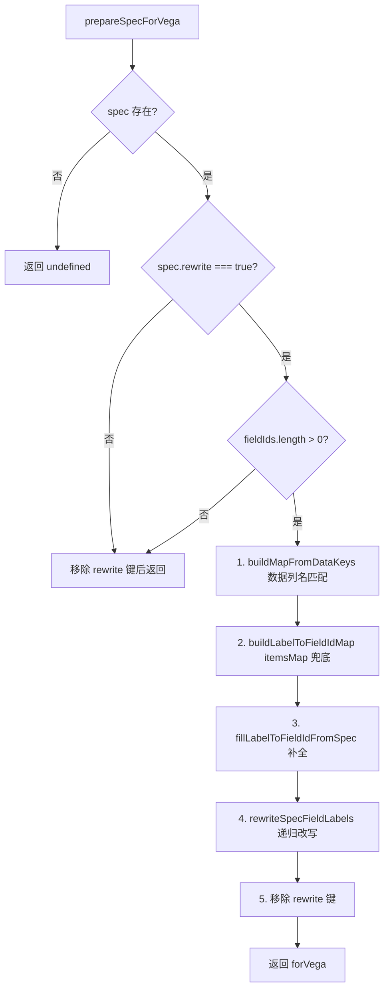
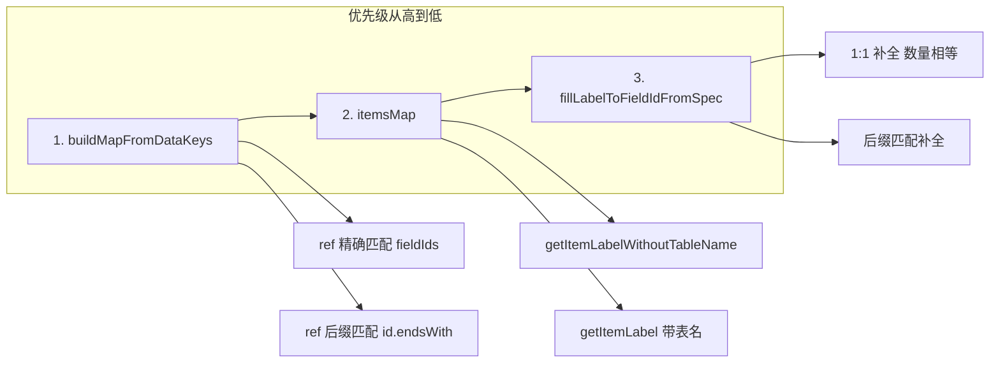
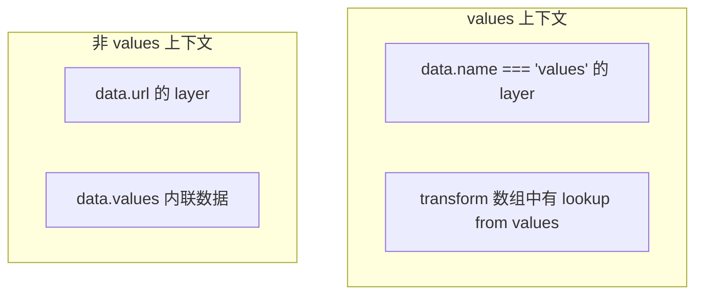
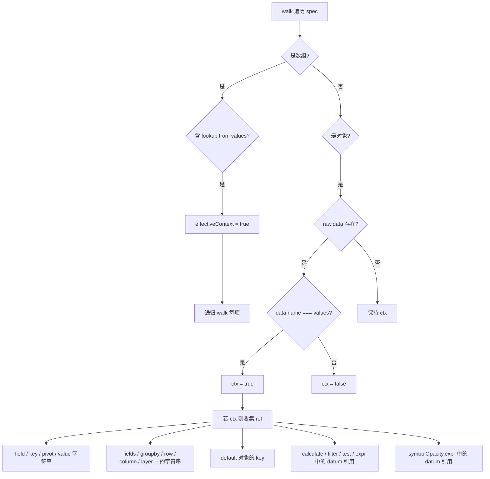
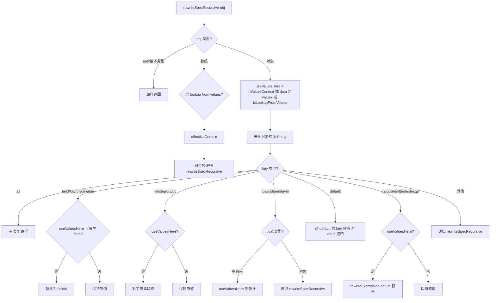
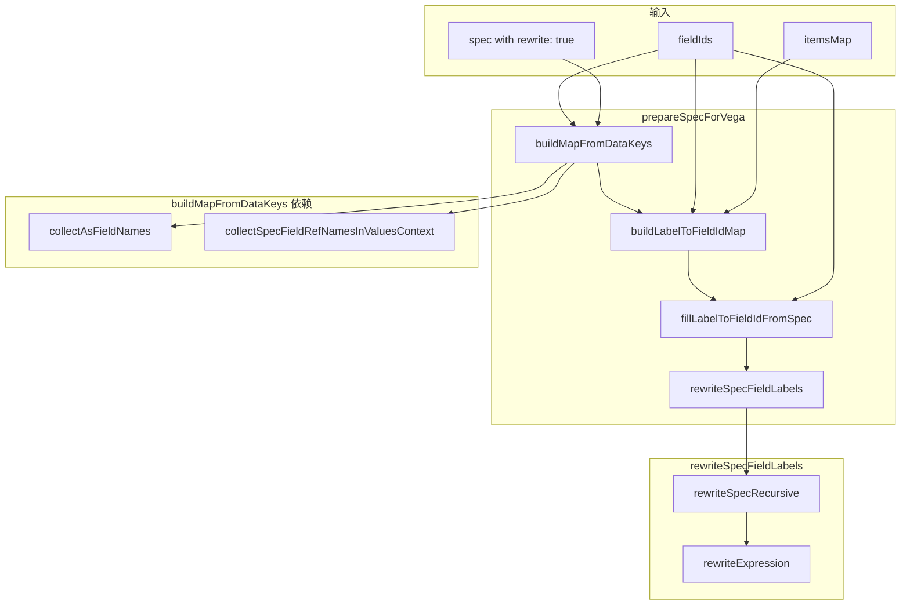

# Vega Spec Label 改写逻辑梳理

## 一、概述

当 Custom Visualization 的 spec 带 `rewrite: true` 时，将 spec 中的**中文/带表名 label**（如 `省份`、`集团`）替换为**当前探索的 fieldId**（如 `ads_province_basetmap_sales_group_top_m_province_name`），以便注入的 `data.values` 能正确绑定到查询结果列。

**改写范围**：仅对来自主数据 `data.name === "values"` 的 layer，或含 lookup from values 的 transform 中的字段引用进行改写，避免误改 URL/内联数据层。

---

## 二、主流程（prepareSpecForVega）

---

## 三、labelToFieldId 映射构建优先级

| 步骤 | 函数                       | 说明                                                                      |
| ---- | -------------------------- | ------------------------------------------------------------------------- |
| 1    | buildMapFromDataKeys       | spec 中收集的 ref 与 fieldIds 精确/后缀匹配，排除 `as` 计算字段           |
| 2    | buildLabelToFieldIdMap     | 用 itemsMap 建立 label → fieldId，需 spec 中 label 与 explore schema 一致 |
| 3    | fillLabelToFieldIdFromSpec | 未映射的 ref 与 fieldIds 按 1:1 或后缀补全                                |

---

## 四、Values 上下文判定

**改写只在「values 上下文」中进行**，避免误改内联/URL 数据层。

| 场景                                                                                     | 是否改写 |
| ---------------------------------------------------------------------------------------- | -------- |
| `data: { name: "values" }` 的 layer                                                      | ✅       |
| `data: { url: "..." }` 的 layer 中，含 lookup `from.data.name === "values"` 的 transform | ✅       |
| `data: { values: [...] }` 内联数据                                                       | ❌       |

---

## 五、collectSpecFieldRefNamesInValuesContext 收集流程

收集 spec 中**在 values 上下文内**的字段引用名，供 buildMapFromDataKeys 和 fillLabelToFieldIdFromSpec 使用。

---

## 六、rewriteSpecRecursive 改写流程

### 改写的键与不改写的键

| 改写                                             | 不改写                                       |
| ------------------------------------------------ | -------------------------------------------- |
| field, key, fields, groupby, default 的 key      | as（计算字段名）                             |
| pivot, value                                     | encoding.condition.value（字面量如 "white"） |
| row, column, layer（元素为字符串时）             |                                              |
| calculate / filter / test / expr 中的 datum 引用 |                                              |
| default 对象的 key                               |                                              |
| symbolOpacity.expr                               |                                              |

---

## 七、rewriteExpression 表达式改写

对 `calculate`、`filter`、`test`、`expr` 中的字符串进行 datum 引用替换：

| 模式             | 示例                                               |
| ---------------- | -------------------------------------------------- |
| `datum["label"]` | `datum["省份"]` → `datum["ads_..._province_name"]` |
| `datum['label']` | `datum['集团']` → `datum['ads_..._group_name']`    |
| `datum.label`    | 仅当 label 为合法标识符时                          |

---

## 八、数据流与调用关系

---

## 九、关键设计点

1. **仅改 values 上下文**：`data.url`、内联 `data.values` 的 layer 不参与改写，避免破坏 topojson、静态数据等。
2. **lookup 传播上下文**：含 `from.data.name === "values"` 的 lookup transform 会使整个 transform 数组及其子节点进入 values 上下文。
3. **layer 递归**：`layer` 是对象数组，需对每个 layer 递归改写，不能像 `fields`/`groupby` 那样只做字符串替换。
4. **计算字段排除**：`as` 产生的字段名（market_share、brand_name 等）不参与映射，避免误改写。
5. **映射优先级**：数据列名 → itemsMap → fill 补全，保证 explore 的 label 与 spec 一致时 itemsMap 能正确映射。
