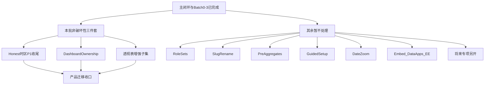

# 上游 CHANGELOG 高价值后置候选（0.2513 → 2.57）

> **用途**：罗列相对上游 `../lightdash` 在 **0.2513.0 → 2.57.0** 窗口内出现、**尚未写入**主迁移评估表（[`v2-upgrade-and-migration-guide.md`](v2-upgrade-and-migration-guide.md) §二）、但对**中文自托管 BI fork** 仍有明显价值的能力，供试跑稳定后排期。  
> **不阻塞**当前试跑门禁（FF + migrate + 手测，见 [`v2-implemented-features-qa.md`](v2-implemented-features-qa.md)）。  
> **上游对齐基线**与迁移指南文首「上游对齐基线」小节保持一致。

---

## 1. 背景与基线

| 字段 | 当前值 | 含义 |
|------|--------|------|
| 迁移窗口起点 | 上游 **0.2513.0** | fork 按模块追齐的 CHANGELOG 下沿 |
| 对齐水位 / 窗口终点 | 上游 **2.57.0** | 本 backlog 评估上沿；下一波升级从该版本之后介入 |
| 上游对照 commit | `c2ac5d553a`（`../lightdash`，2026-08-30） | 比版本号更准 |
| 本仓产品版本 | `2.0.1-test.1`（≠ 上游版本号） | fork 发版号 |
| 本仓工作分支 | `feat/v2-upgrade` | 主迁移合入线 |
| 策略 | **禁止**整仓 `merge` / `rebase` | 主清单见迁移指南 §二 |
| 本文档定位 | **增量候选 backlog** | 不改写主迁移结论 |
| 与主闭环关系 | 主功能闭环开发侧已可收口 | 本文为下一波产品增量 |

### 1.1 产品取舍与收口定义（2026-09-09）

> **产品迁移收口** = 主功能闭环 + 试跑门禁 + **本批非破坏性 Web 增强**；不等于上游全量移植，也不等于永久不再吸收增量。

| 方向 | 决策 | 说明 |
|------|------|------|
| Embed / 三方嵌入能力包 | **本批不做 / 暂缓** | 当前业务几乎无用 |
| Data Apps Sandbox / generate、Chart Types 全量 | **本批不做 / 暂缓** | Data Apps 尚未形成精品；运行时收口 A 保持现状 |
| EE 解绑（Direct Access / Homepage / Autopilot 等） | **本批不做 / 暂缓** | 暂无需求 |
| Role Sets / Slug rename / Pre-aggregates / GuidedSetup / Date Zoom | **本批不做** | 破坏性或强冲突；将来专项另开。Slug / Date Zoom 增强说明见下文 **§暂缓归档** |
| **本批迁（非破坏性三件套）** | Honest/时区 P1 收尾、Dashboard Ownership、透视表增强子集 | 见 §1.2 |

**维护约定**：抬高对照窗口或完成一批上游移植时，同步更新本表与 [`v2-upgrade-and-migration-guide.md`](v2-upgrade-and-migration-guide.md) 文首基线。

### 1.2 本批非破坏性收口范围

| 项 | 状态 | 做什么 | 明确不做 |
|----|------|--------|----------|
| Honest Metadata / 时区 P1 剩余 | **本批迁** | warehouse `dataTimezone` UI + Preview；结果 `resolvedTimezone` 标注 MVP | 完整 echarts `timezoneShift`（破坏面大，后置） |
| Dashboard Ownership | **本批迁** | `owner_user_uuid` + 转让 API/UI；不绑 Direct Access/EE | as-code / Promote 深集成可第二刀 |
| 透视表增强子集 | **本批迁** | 行合并 / 冻结列（VTable 增量）；**不改** `MAX_PIVOT_COLUMN_LIMIT=150` | 整换上游 DOM PivotTable |

实施顺序：

---

## 2. 已覆盖（勿重复排期）

以下已在主迁移清单内（已完成 / 部分完成 / 已标后置），**不要**再当「新发现」重复立项：

| 状态 | 主题 |
|------|------|
| 已完成（主路径） | Formula、Query SDK、Nested Table Groups、Merge Queries、Results Cache TTL、Dashboard Tabs / Filter reconcile / 锁筛选、PoP、查询时区 MVP、Honest Metadata 主路径、TotalQueryBuilder、PoP fanout、项目级 queryTimezone、**Batch 4：dataTimezone UI + resolvedTimezone MVP、Dashboard Ownership、透视冻结/行合并** |
| 部分完成 | Data Apps 运行时收口（UI/API/tile ✅；Sandbox / generate 端到端待） |
| 主清单已列、后置 | Project Chart Types、External Sources、i18n ns 硬重构、echarts timezoneShift |
| 主迁移明确不做解绑 | Direct Access、Homepage / Themes、Validator / Autopilot（EE 专项） |
| 明确不做 | 整仓对齐上游 2.57 全量 migration / 工具链全量追齐 |

---

## 3. P0 候选

| 模块 | 对本仓价值 | 本仓现状 | 依赖与风险 |
|------|------------|----------|------------|
| ~~**CJK 截图字体 + Omnibar 中日韩检索**~~ | 定时推送/分享截图中文可读；搜索不必硬凑 3 字符 | **已移植** | — |
| ~~**Dashboard Filter Requirements**~~（含 scheduler 门禁） | 必填筛选未满足时拦截看板使用与定时推送 | **语义核已移植**；GuidedSetup UI **本批不做** | FilterConfiguration 冲突 |
| ~~**看板异步导出 / 单 XLSX 多 sheet**~~ | 多 Tab 交付刚需 | **已移植** workbook | — |
| **Embed 能力包** | 嵌入完整度 | 部分 | **本批不做 / 暂缓** |
| **Role Sets / 多角色组合** | 多项目/类目权限 | 部分 customRoles | **本批不做**（CategoryRpc 冲突；将来专项） |
| ~~**SQL 编写权限收紧**~~ | 合规可审计 | **表计算侧已补** | — |

---

## 4. P1 候选

| 模块 | 对本仓价值 | 本仓现状 | 备注 |
|------|------------|----------|------|
| **Honest / 时区 P1 剩余** | 数仓时区配置与结果标注 | **本批迁**（dataTimezone UI + resolvedTimezone MVP） | echarts shift 后置 |
| **Dashboard Ownership** | 资产治理闭环 | **本批迁** | 不绑 EE |
| **透视表增强**（行合并 / 冻结列） | Explore 表格分析升级 | **本批迁子集**（VTable） | 不改 150 列上限 |
| **Date Zoom 看板控件** | 看板级时间粒度 | 部分（基础已有；增强未追） | **本批不做**；见 §暂缓归档 |
| **Pre-aggregates 预聚合** | 降数仓成本 | 缺 | **本批不做**（EE） |
| **Content-as-Code / Git write-back** | 多环境发布 | 缺 | **不做 GitOps 可 skip** |
| **Chart URL Slug 重命名** | 书签/外链稳定 | 边缘 | **本批不做**；见 §暂缓归档 |
| **Filter Requirements GuidedSetup UI** | 配置体验 | 语义核已有 | **本批不做** |

---

## 5. 明确不进「高价值必迁」清单

CHANGELOG 体量大、但对当前试跑 / 主闭环 ROI 低或冲突大：

- **AI / ai-agents / deep-research / managed-agent / ai-writeback**（上游主战场；本仓有自研 MCP 另线，不全量追齐）
- **纯工具链全量追齐**（Node 24 / TS 7 / Turbo 等；Step 0 仅做入站适配水位）
- **整仓 rebase / 对齐 2.57 全量 migration**
- 国内渠道弱的投递（Google Chat / Teams 等，按需再开）
- Theme Packages 单独立项（随 EE Homepage 专项即可）

---

## 6. 建议落地顺序

> **2026-09-09**：按「非破坏性优先」锁定本批三件套；其余本窗口**不再处理**。

1. ~~**CJK 截图字体 + Omnibar 中日韩检索**~~（已移植）
2. ~~**Dashboard Filter Requirements**~~（语义核 + scheduler 已移植；GuidedSetup **本批不做**）
3. ~~**看板异步导出 / 单 XLSX 多 sheet**~~（已移植）
4. ~~**Embed 能力包**~~（**本批不做**）
5. ~~**Role Sets**~~（**本批不做**；将来专项）
6. **Honest / 时区 P1 收尾** — **本批迁**
7. **Dashboard Ownership** — **本批迁**
8. **透视表增强子集** — **本批迁**
9. 其余 P1（Date Zoom / Pre-agg / Slug / GuidedSetup）— **本批不做**

主清单内 **Chart Types / Data Apps 端到端 / External Sources / EE 解绑**：**暂缓深挖**；与本批收口 **不互相阻塞**。

### 6.1 本轮移植备注

| 批次 | 内容 | 状态 |
|------|------|------|
| Batch 0 | 表计算 Modal / Data Ops 预发 i18n | ✅ |
| Batch 1 | CJK 截图字体、Omnibar CJK 最短 1 字、CustomSql Table Calculations | ✅ |
| Batch 2 | Filter Requirements 语义核 + 调度校验；GuidedSetup UI **延期/本批不做** | ✅（UI 不做） |
| Batch 3 | `xlsxFileLayout=workbook` + WorkbookExportHelper + 看板导出 Modal XLSX | ✅ |
| 补齐 | 调度 create/update 后端必填筛选硬门禁；tabs 校验 i18n | ✅ |
| Batch 4a | Honest/时区：dataTimezone UI + Preview + resolvedTimezone 标注 MVP | ✅ |
| Batch 4b | Dashboard Ownership：migration + API + UpdateModal/离职转让 | ✅ |
| Batch 4c | 透视表子集：VTable 冻结列 + 行合并（不改 150 列） | ✅ |
| 本批不做 | Role Sets / Slug rename / Pre-agg / GuidedSetup / Date Zoom / Embed / Data Apps 深挖 / EE | ⏸️ |
| **收口** | 主闭环 + Batch 0–3 + Batch 4a/b/c → **本窗口产品迁移收口**（≠ 上游全量） | ✅ |

---

## 7. 暂缓归档（上游有、本窗口不实现）

> 记录「可以后专项做」的说明；**不等于排期**。交测勿当缺陷。

### 7.1 Chart / Content Slug 重命名（非 EE）

| | |
|--|--|
| **是什么** | 改图表/看板可读 URL（slug），并尽量维护旧链 / as-code 引用 |
| **不是什么** | 「能用 slug 打开」——本仓已有；缺的是 rename 闭环 |
| **上游** | `contentSlug.ts`、`cli/slugUpdate.ts`、`SavedChartModel.renameSlug`、Promote/Coder |
| **为何暂缓** | 边缘需求；深链 / MCP / as-code 破坏面大 |
| **再开条件** | 大量外链依赖 slug 且频繁改名，或 promote 强依赖 rename |

### 7.2 Date Zoom 增强（非 EE）

| | |
|--|--|
| **基础（已有）** | 顶栏切日/周/月等，改时间聚合颗粒（非筛选器） |
| **增强（未追）** | 上游 `dateZoomConfig`、ControlPills / ControlConfig |
| **上游** | `dashboard.ts` 的 `DateZoomConfig`、`utils/dateZoom.ts`、前端 `DateZoomControl*` |
| **为何暂缓** | 与动态日期 + Tabs 易冲突；基础能力已够用 |
| **再开条件** | 业务要可配置粒度集合/默认值，并愿意专项处理冲突 |

### 7.3 其它本批不做（详见上文表）

Embed 解绑、Pre-agg（EE）、Role Sets、GuidedSetup UI、External Sources、Chart Types 全量、Data Apps Sandbox/generate、echarts `timezoneShift` 等。

---

## 8. 相关文档

- **索引**：[`v2-README.md`](v2-README.md)
- 交测清单：[`v2-implemented-features-qa.md`](v2-implemented-features-qa.md)
- 迁移全景：[`v2-upgrade-and-migration-guide.md`](v2-upgrade-and-migration-guide.md)
- 自动化：`pnpm v2:verify`
