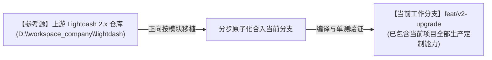
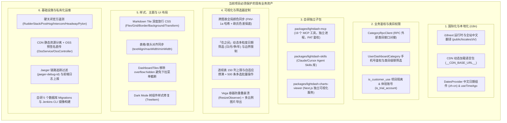
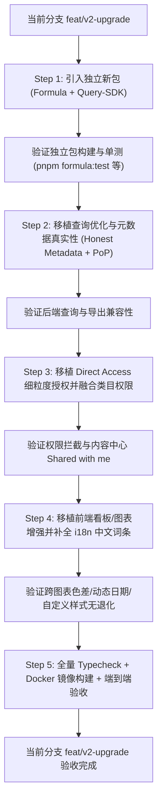

# Lightdash 2.x 功能正向迁移与集成实施指南

> **核心原则**：以当前项目 **`lightdash-i18n`（现有稳定分支）为绝对主体与基线**，全面梳理上游官方（Lightdash 0.2513.0 -> 2.57.0）期间新增的高价值功能模块，制定**自底向上、模块化移植、逐步合入当前项目**的实施方案，确保不破坏当前项目现有的国际化、类目权限、自研 MCP、样式定制等所有生产特性。

---

## 一、迁移策略与基准（以当前 `feat/v2-upgrade` 分支为主体）

1. **当前分支即为主战场**：我们直接在当前分支 **`feat/v2-upgrade`** 上开展所有功能移植与升级工作，该分支已具备当前项目的全部自研能力（i18n、类目权限、自研 MCP、样式定制、OSS直传、遥测关闭等）。
2. **正向吸收上游 2.x 模块**：参考外部上游仓库 `D:\workspace_company\lightdash` 的 2.x 实现，将上游高价值模块（`formula`、`query-sdk`、`Honest Metadata`、`Direct Access` 等）分批正向移植进当前分支。
3. **保护基线资产**：每一次移植后均执行类型检查与单测，确保当前分支既有的业务功能和样式不退化、不被意外覆盖。

---

## 二、上游 2.x 待迁移的高价值功能模块清单

```mermaid
flowchart TB
    subgraph UpstreamModules ["上游 Lightdash 2.x 待移植功能全景"]
        direction TB

        subgraph M_Formula ["1. 独立公式计算引擎 (Formula Engine)"]
            F1["新建 packages/formula (Peggy 语法解析器)"]
            F2["新建 packages/formula-tests (跨数仓/DuckDB 校验)"]
            F3["支持前端复杂自定义计算公式与字段派生"]
        end

        subgraph M_SDK ["2. 数据应用开放 SDK (Query SDK)"]
            S1["新建 packages/query-sdk (独立 React 语义层组件库)"]
            S2["支持轻量级自定义数据小应用 (Data Apps)"]
            S3["uiOverrides 机制 (外部定制与多语言覆盖通道)"]
        end

        subgraph M_Perm ["3. 细粒度资源直接授权 (Direct Access)"]
            P1["单图表/看板/Data Apps 直接授权与分享 (无需整个Space)"]
            P2["内容中心增加 'Shared with me' (与我共享) 筛选视图"]
            P3["Direct Access 管理面板与权限生命周期"]
        end

        subgraph M_Query ["4. 查询真实元数据与展示优化 (Honest Metadata)"]
            Q1["Query-Write 阶段直接固化字段元数据 (Honest Column Metadata)"]
            Q2["SQL、Merge 和 Compose 复杂混合查询元数据统一"]
            Q3["Period-to-date (PoP) 同比环比查询过滤保留修复"]
        end

        subgraph M_Viz ["5. 图表与看板增强 (Chart Types & Dashboards)"]
            V1["Project Chart Types (自定义图表版本锁定与升级摘要)"]
            V2["图表 URL Slug 动态重命名与维护"]
            V3["Dashboard 共享筛选器覆盖冲突协调 (Reconcile Filter Override)"]
        end

        subgraph M_TableGroups ["6. 侧边栏多层级嵌套分组 (PR #22768 Nested Groups)"]
            G1["meta.groups 多层级分组 (替代弃用的 group_label，支持5级嵌套)"]
            G2["Explore 侧边栏递归树 (Recursive Tree + 深度缩进 + 搜索自动展开)"]
            G3["projects.table_groups (lightdash.config.yml 全局组标签与描述持久化)"]
            G4["解决大项目海量模型平铺展示、难以检索的问题"]
        end

        subgraph M_Merge ["7. 多查询合并与混合计算引擎 (Merge Queries & Compose)"]
            MQ1["跨 Explore / 跨数据源合并查询引擎 (Merge Query Engine)"]
            MQ2["基于 DuckDB 的透视合并与计算合成 (Pivoted Merges)"]
            MQ3["可视化合并查询结果与 SQL 导出 (Merged Visualizations)"]
        end

        subgraph M_External ["8. 外部即席数据源接入 (External Sources)"]
            EX1["直接上传 CSV / 关联 Google Sheets 生成临时 Explore"]
            EX2["支持外部数据与数仓表一键 Join 关联分析 (Merge Picker)"]
            EX3["基于内置 DuckDB 引擎执行外部数据即席查询"]
        end

        subgraph M_Cache ["9. 结果集缓存与项目级 TTL 控制 (Query Caching)"]
            QC1["项目设置新增 Query Caching 控制面板与 API"]
            QC2["支持针对具体 Project 配置查询结果缓存过期时间 (Results Cache TTL)"]
            QC3["支持 MotherDuck 实例缓存优化与多环境密钥轮转 (Keyring)"]
        end

        subgraph M_HomeTheme ["10. 全新模块化主页与主题包管理 (Homepage & Themes)"]
            HT1["全新可编排主页 (Homepage Builder): 个人空间快捷操作/公告发布/多布局"]
            HT2["内容中心组织级主题包导出与导入 (Theme Packages Import/Export)"]
            HT3["支持自定义组织主题规范与品牌主色全局下发"]
        end

        subgraph M_Autopilot ["11. 内容健康度巡检与无效资产治理 (Validator & Autopilot)"]
            AU1["失效模型与孤儿图表根因分组汇总 (Grouped Root Cause Summary)"]
            AU2["已离职用户内容/长期无流量资产自动探测与批量清理 (Bulk Delete Guardrails)"]
            AU3["已验证内容强保护锁 (manage:VerifiedContent 权限隔离)"]
        end
    end
```

### 待移植功能详细技术评估表

> **版本属性说明**：
> - 🟢 **OSS（开源免费）**：代码公开可用，无 License 门槛，可直接移植。
> - 🟡 **EE 架构（企业收费特性）**：官方归类在 `packages/*/src/ee/` 目录下，通常受 `license.licenseKey` 或商业 feature flag 门槛保护。**自托管免费版无法直接使用，必须对其进行「开源化改造/解绑 License」后方可使用**。

| 模块名称 | 版本属性 | 上游实现位置 | 移植难易度 | 对当前项目的影响与收益 | 移植与开源化改造要点 |
|---|:---:|---|:---:|---|---|
| **Formula 公式引擎** | 🟢 **OSS** | `packages/formula/` `packages/formula-tests/` | **低（零耦合）** | 引入强大的自定义指标计算公式能力，用户可在前端自由编写计算公式 | 直接将 `formula` 作为独立 workspace package 拷入当前仓库，并在 `package.json` 添加构建命令。 |
| **Query SDK & Data Apps** | 🟢 **OSS** | `packages/query-sdk/` | **低（零耦合）** | 允许第三方或独立业务页面直接调用语义层组件；提供 `uiOverrides` 扩展 | 直接将 `query-sdk` 作为独立包移入当前 monorepo，与已有 `lightdash-mcp` 形成互补。 |
| **多层级表格分组 (Nested Table Groups)** | 🟢 **OSS** | `packages/frontend/src/components/Explorer/ExploreSideBar/` `packages/common/src/types/explore.ts` `packages/backend/src/models/ProjectModel/` | **中** | **彻底解决模型过多平铺展示难以查找的问题**，支持 `meta.groups: string[]`（替代已弃用的 `group_label`），侧边栏递归树形渲染（带深度缩进与搜索自动展开） | **必须重点迁移**。包含 `20260506135156_add_table_groups_to_projects.ts` 迁移、`exploreTree.ts` 递归树构建及 `lightdash.config.yml` 的 `table_groups` 配置解析，同时向后兼容旧版 `group_label`。 |
| **真实字段元数据 (Honest Metadata)** | 🟢 **OSS** | `packages/backend/src/utils/QueryBuilder/` `packages/common/src/types/` | **中** | 彻底解决复杂 SQL 查询、合并查询在前端数据类型展示错误、格式化丢失的问题 | 移植 QueryBuilder 中写入 column metadata 的逻辑，不改动现有数据源连接机制。 |
| **图表版本体系 (Project Chart Types)** | 🟢 **OSS** | `packages/frontend/src/features/chartTypes/` `packages/backend/src/models/` | **中** | 规范自定义可视化版本管理，在 Explorer 中支持平滑升级图表配置 | 合入到前端图表编辑区，并为新界面补充对应的 i18n 中文字典。 |
| **查询结果集缓存与 TTL (Query Caching)** | 🟢 **OSS** | `packages/backend/src/services/ProjectService/` `packages/frontend/src/pages/ProjectSettings/` | **低** | 项目级可配置结果缓存时间（Results Cache TTL），显著降低数仓查询压力并提升二次打开速度 | 移植 `query_results_cache_ttl` 配置字段及项目设置面板。 |
| **看板筛选器冲突解决 (Reconcile Overrides)** | 🟢 **OSS** | `packages/frontend/src/hooks/useSavedDashboardFiltersOverrides.ts` `packages/common/src/types/filter.ts` | **中** | 修复复杂看板多 Tab 与全局筛选器覆盖时的 ID 冲突 | 移植上游修复逻辑，注意保持我们自研的「在之间」动态粒度筛选器不受影响。 |
| **PoP 同比环比查询过滤修复** | 🟢 **OSS** | `packages/backend/src/utils/QueryBuilder/MetricQueryBuilder.ts` | **低** | 修复 Period-to-Date 开启时同比环比查询条件被意外丢弃的问题 | 直接 cherry-pick 或合并对应 QueryBuilder 单测与修复代码。 |
| **跨模型合并查询 (Merge Queries)** | 🟢 **OSS** | `packages/backend/src/services/MergeQueryService/` `packages/frontend/src/features/mergeQueries/` | **中~高** | **支持将多个不同 Explore 的查询结果在前端直接通过公共维度合并为一个图表/表格展示** | 包含后端 DuckDB compose 查询引擎与前端 Merge Query 编辑器。为跨业务模型对比分析提供极大便利。 |
| **外部即席数据源接入 (External Sources)** | 🟢 **OSS** | `packages/backend/src/services/ExternalSourceService/` `packages/frontend/src/features/externalSources/` | **中** | 支持上传外部 CSV 或连接 Google Sheets 直接生成临时 Explore，并能与数仓数据做跨源 Join | 移植 CSV/Google Sheets Ingest Pipeline，路由到内置轻量 DuckDB 执行。 |
| **细粒度直接授权 (Direct Access)** | 🟡 **EE 特性** | `packages/backend/src/ee/services/DirectAccessService/` `packages/frontend/src/ee/features/directAccess/` | **中~高** | 支持直接把看板/图表共享给特定用户（内容中心新增 Shared with me） | ⚠️ **需解绑改造**：上游位于 `ee/` 目录下且通过 `gateDirectAccessService` 做商业鉴权。需剥离 License 校验，直接将核心授权服务移入常规 `services/` 并与自研 `CategoryRpc` 权限打通。 |
| **模块化主页 (Homepage Builder)** | 🟡 **EE 特性** | `packages/frontend/src/ee/features/homepageBuilder/` `packages/backend/src/ee/controllers/` | **中** | 支持自定义主页模块（个人空间直达、公告发布、卡片/紧凑布局）及企业级主题包导入导出 | ⚠️ **需解绑改造**：上游主页编排组件和 API 被 EE 特性开关限制。移植时需直接作为通用功能在 OSS 注册，绕过 `isHomepageBuilderEnabled` 的商业授权拦截。 |
| **内容治理与失效资产清理 (Validator/Autopilot)** | 🟡 **EE 特性** | `packages/backend/src/ee/services/AutopilotService/` `packages/frontend/src/ee/features/autopilot/` | **中** | 自动探测因底层 dbt 删改字段导致的失效图表/看板并按根因聚合，支持一键批量清理 | ⚠️ **需解绑改造**：部分自动探测动作（Autopilot actions）属于 EE 闭源扩展。可抽取其开源基础版 `ValidationService` 根因聚合逻辑，并在前端开放操作面板。 |

---

## 三、当前项目自研功能资产保护清单（移植过程严禁覆盖/破坏）

在将上游功能移入当前项目的过程中，必须通过自动化测试和人工检查，严格保护以下现有业务资产：

---

## 四、分步骤正向迁移实施路线图

直接在当前 **`feat/v2-upgrade`** 分支上，按以下 **5 个阶段** 逐步移植上游 2.x 模块：

### 阶段详细任务拆解：

#### Step 1: 移植零耦合的独立工具包（风险：极低）
1. 将上游 `packages/formula` 和 `packages/formula-tests` 复制到当前 monorepo。
2. 将上游 `packages/query-sdk` 复制到当前 monorepo。
3. 在根 `package.json` 和 `pnpm-workspace.yaml` 中配置相关 scripts，执行 `pnpm formula:build && pnpm formula:test` 验证通过。

#### Step 2: 移植后端查询层与元数据优化（风险：低）
1. 移植 `packages/backend/src/utils/QueryBuilder/` 中的 Honest Column Metadata 机制。
2. 移植 `MetricQueryBuilder` 中的 Period-to-date (PoP) 过滤保留修复。
3. 移植 `ExcelService` / `CsvService` 相关的元数据格式化输出优化（保留我们已有的 NaN/空单元格兜底）。
4. 运行 `pnpm backend-typecheck` 与后端查询单测。

#### Step 3: 移植细粒度资源共享 (Direct Access) 并融合鉴权（风险：中）
1. 移植上游 Direct Access 相关的数据库迁移与 Model/Service。
2. 在 `DashboardService` / `ProjectService` 中，将 Direct Access 权限检查与现有的 `CategoryRpcClient`、`UserDashboardCategoryModel` 权限逻辑做组合判定。
3. 移植前端 Direct Access 管理弹窗与内容中心的 `Shared with me` 列表。
4. 在 `public/locales/zh/translation.json` 中补齐 Direct Access 相关的全部中文翻译。

#### Step 4: 移植前端图表、看板与多层级分组树特性（风险：中）
1. **移植 PR #22768 Nested Table Groups (多层级表格分组树)**：
   - 执行后端 migration：`20260506135156_add_table_groups_to_projects.ts`。
   - 移植 `packages/common/src/types/explore.ts` 与 `compiler/translator.ts` 中 `meta.groups` 解析逻辑（保持向后兼容 `group_label`）。
   - 移植前端 `packages/frontend/src/components/Explorer/ExploreSideBar/exploreTree.ts`、`VirtualizedExploreList.tsx` 及 `useProjectTableGroups.ts`，支持多层递归缩进展示与搜索自动展开。
2. 移植 Project Chart Types 版本化管理逻辑与 Explorer 升级摘要提示。
3. 移植 Dashboard 共享筛选器覆盖协调逻辑（`useSavedDashboardFiltersOverrides.ts`）。
4. **关键校验**：确保自研的「跨图表全局颜色同步」、「动态日期粒度筛选」、「Markdown Tile CSS 放行」、「表格对齐样式」依然生效。
5. 全量补齐新增界面的 i18n 词条。

#### Step 5: 全量回归与构建验收（风险：低）
1. 执行 `pnpm common-typecheck`、`pnpm backend-typecheck`、`pnpm frontend-typecheck`。
2. 重新运行 `pnpm generate-api` 确保 OpenAPI / Swagger 与 TSOA 路由一致。
3. 构建 Docker 镜像，验证私有化部署、OSS 直传、MCP 服务（19 个工具）及生产看板运行无误。
