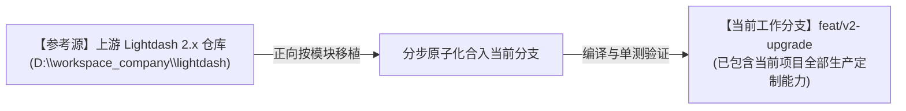
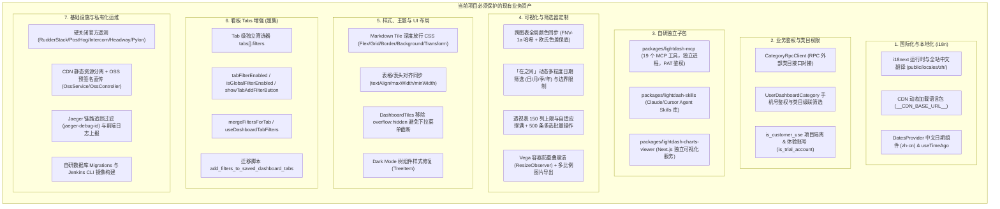
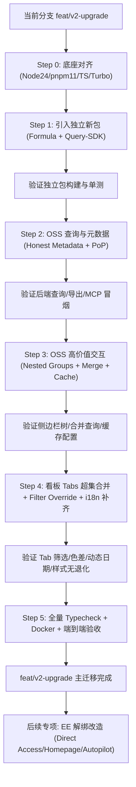

# Lightdash 2.x 功能正向迁移与集成实施指南

> **核心原则**：以当前项目 **`lightdash-i18n`（现有稳定分支）为绝对主体与基线**，全面梳理上游官方（Lightdash 0.2513.0 -> 2.57.0）期间新增的高价值功能模块，制定**自底向上、模块化移植、逐步合入当前项目**的实施方案，确保不破坏当前项目现有的国际化、类目权限、自研 MCP、样式定制等所有生产特性。
>
> **与 Cursor Plan 的分工**：可执行主线（Step0~5、优先级、验收、禁止项）以 Cursor Plan `v2-upgrade-optimized` 为准；本文档保留功能全景、评估表、风险长文与自研保护清单细节。**两边需同步维护，不可只留精简版。**
>
> **主迁移代码状态（2026-09-03）**：Step 0–4 已合入 `feat/v2-upgrade`；Step 5 自动化用 `pnpm v2:verify`；预发人工项见 [`v2-smoke-checklist.md`](v2-smoke-checklist.md)。**`packages/query-sdk` 已引入**；**common `ee/apps` 宿主类型已引入**；**Data Apps 运行时收口（A）已落地**：`features/apps` UI + 路由/Nav/`EnableDataApps` + CASL/`HealthService.dataApps` + Dashboard tile ✅；后端 AppModel/API/preview/migrations 已从上游拷入且 `backend typecheck` 通过。**仍待**：Sandbox 真跑通 / generate 端到端、去部分 STUB。后置专项：Chart Types、External Sources、i18n ns 重构、EE 解绑。

---

## 一、迁移策略与基准（以当前 `feat/v2-upgrade` 分支为主体）

1. **当前分支即为主战场**：我们直接在当前分支 **`feat/v2-upgrade`** 上开展所有功能移植与升级工作，该分支已具备当前项目的全部自研能力（i18n、类目权限、自研 MCP、样式定制、OSS直传、遥测关闭等）。
2. **正向吸收上游 2.x 模块**：参考外部上游仓库 `D:\workspace_company\lightdash` 的 2.x 实现，将上游高价值模块（`formula`、`query-sdk`、`Honest Metadata`、`Direct Access` 等）分批正向移植进当前分支。
3. **保护基线资产**：每一次移植后均执行类型检查与单测，确保当前分支既有的业务功能和样式不退化、不被意外覆盖。
4. **推荐合入方式（混合策略）**：
   - **不要**直接 `git merge` / `rebase` 整棵上游 2.x（冲突面会爆炸）。
   - **也不要**幻想纯「拷文件」就能跑通强耦合模块。
   - **推荐**：先对齐底座（Node/pnpm/TS/构建与公共类型），再按模块移植；独立包可先拷，强耦合功能必须连同依赖面一起搬并做回归。
5. **EE 策略**：主迁移阶段 **只标记、原样引入、不解绑**；商业功能开源化改造放到主线稳定之后的专项。

---

## 二、上游 2.x 待迁移的高价值功能模块清单

```mermaid
flowchart TB
    subgraph UpstreamModules ["上游 Lightdash 2.x 待移植功能全景"]
        direction TB

        subgraph M_Formula ["1. 独立公式计算引擎 (Formula Engine)"]
            F1["新建 packages/formula (Peggy 语法解析器)"]
            F2["新建 packages/formula-tests (跨数仓/DuckDB 校验)"]
            F3["支持前端复杂自定义计算公式与字段派生"]
        end

        subgraph M_SDK ["2. 数据应用开放 SDK (Query SDK)"]
            S1["新建 packages/query-sdk (独立 React 语义层组件库)"]
            S2["支持轻量级自定义数据小应用 (Data Apps)"]
            S3["uiOverrides 机制 (外部定制与多语言覆盖通道)"]
        end

        subgraph M_Perm ["3. 细粒度资源直接授权 (Direct Access)"]
            P1["单图表/看板/Data Apps 直接授权与分享 (无需整个Space)"]
            P2["内容中心增加 'Shared with me' (与我共享) 筛选视图"]
            P3["Direct Access 管理面板与权限生命周期"]
        end

        subgraph M_Query ["4. 查询真实元数据与展示优化 (Honest Metadata)"]
            Q1["Query-Write 阶段直接固化字段元数据 (Honest Column Metadata)"]
            Q2["SQL、Merge 和 Compose 复杂混合查询元数据统一"]
            Q3["Period-to-date (PoP) 同比环比查询过滤保留修复"]
        end

        subgraph M_Viz ["5. 图表与看板增强 (Chart Types & Dashboards)"]
            V1["Project Chart Types (自定义图表版本锁定与升级摘要)"]
            V2["图表 URL Slug 动态重命名与维护"]
            V3["Dashboard 共享筛选器覆盖冲突协调 (Reconcile Filter Override)"]
        end

        subgraph M_TableGroups ["6. 侧边栏多层级嵌套分组 (PR #22768 Nested Groups)"]
            G1["meta.groups 多层级分组 (替代弃用的 group_label，支持5级嵌套)"]
            G2["Explore 侧边栏递归树 (Recursive Tree + 深度缩进 + 搜索自动展开)"]
            G3["projects.table_groups (lightdash.config.yml 全局组标签与描述持久化)"]
            G4["解决大项目海量模型平铺展示、难以检索的问题"]
        end

        subgraph M_Merge ["7. 多查询合并与混合计算引擎 (Merge Queries & Compose)"]
            MQ1["跨 Explore / 跨数据源合并查询引擎 (Merge Query Engine)"]
            MQ2["基于 DuckDB 的透视合并与计算合成 (Pivoted Merges)"]
            MQ3["可视化合并查询结果与 SQL 导出 (Merged Visualizations)"]
        end

        subgraph M_External ["8. 外部即席数据源接入 (External Sources)"]
            EX1["直接上传 CSV / 关联 Google Sheets 生成临时 Explore"]
            EX2["支持外部数据与数仓表一键 Join 关联分析 (Merge Picker)"]
            EX3["基于内置 DuckDB 引擎执行外部数据即席查询"]
        end

        subgraph M_Cache ["9. 结果集缓存与项目级 TTL 控制 (Query Caching)"]
            QC1["项目设置新增 Query Caching 控制面板与 API"]
            QC2["支持针对具体 Project 配置查询结果缓存过期时间 (Results Cache TTL)"]
            QC3["支持 MotherDuck 实例缓存优化与多环境密钥轮转 (Keyring)"]
        end

        subgraph M_HomeTheme ["10. 全新模块化主页与主题包管理 (Homepage & Themes)"]
            HT1["全新可编排主页 (Homepage Builder): 个人空间快捷操作/公告发布/多布局"]
            HT2["内容中心组织级主题包导出与导入 (Theme Packages Import/Export)"]
            HT3["支持自定义组织主题规范与品牌主色全局下发"]
        end

        subgraph M_Autopilot ["11. 内容健康度巡检与无效资产治理 (Validator & Autopilot)"]
            AU1["失效模型与孤儿图表根因分组汇总 (Grouped Root Cause Summary)"]
            AU2["已离职用户内容/长期无流量资产自动探测与批量清理 (Bulk Delete Guardrails)"]
            AU3["已验证内容强保护锁 (manage:VerifiedContent 权限隔离)"]
        end
    end
```

### 待移植功能详细技术评估表

> **版本属性说明**：
> - 🟢 **OSS（开源免费）**：代码公开可用，无 License 门槛，可直接移植。
> - 🟡 **EE 架构（企业收费特性）**：官方归类在 `packages/*/src/ee/` 目录下，通常受 `license.licenseKey` 或商业 feature flag 门槛保护。**自托管免费版无法直接使用，必须对其进行「开源化改造/解绑 License」后方可使用**。

| 模块名称 | 版本属性 | 上游实现位置 | 移植难易度 | 对当前项目的影响与收益 | 移植与开源化改造要点 |
|---|:---:|---|:---:|---|---|
| **Formula 公式引擎** | 🟢 **OSS** | `packages/formula/` `packages/formula-tests/` | **低（零耦合）** | 引入强大的自定义指标计算公式能力，用户可在前端自由编写计算公式 | 直接将 `formula` 作为独立 workspace package 拷入当前仓库，并在 `package.json` 添加构建命令。 |
| **Query SDK & Data Apps** | 🟢 **OSS** | `packages/query-sdk/` | **低（零耦合）** | 允许第三方或独立业务页面直接调用语义层组件；提供 `uiOverrides` 扩展 | 直接将 `query-sdk` 作为独立包移入当前 monorepo，与已有 `lightdash-mcp` 形成互补。 |
| **多层级表格分组 (Nested Table Groups)** | 🟢 **OSS** | `packages/frontend/src/components/Explorer/ExploreSideBar/` `packages/common/src/types/explore.ts` `packages/backend/src/models/ProjectModel/` | **中** | **彻底解决模型过多平铺展示难以查找的问题**，支持 `meta.groups: string[]`（替代已弃用的 `group_label`），侧边栏递归树形渲染（带深度缩进与搜索自动展开） | **必须重点迁移**。包含 `20260506135156_add_table_groups_to_projects.ts` 迁移、`exploreTree.ts` 递归树构建及 `lightdash.config.yml` 的 `table_groups` 配置解析，同时向后兼容旧版 `group_label`。 |
| **真实字段元数据 (Honest Metadata)** | 🟢 **OSS** | `packages/backend/src/utils/QueryBuilder/` `packages/common/src/types/` | **中** | 彻底解决复杂 SQL 查询、合并查询在前端数据类型展示错误、格式化丢失的问题 | 移植 QueryBuilder 中写入 column metadata 的逻辑，不改动现有数据源连接机制。 |
| **图表版本体系 (Project Chart Types)** | 🟢 **OSS** | `packages/frontend/src/features/chartTypes/` `packages/backend/src/models/` | **中** | 规范自定义可视化版本管理，在 Explorer 中支持平滑升级图表配置 | 合入到前端图表编辑区，并为新界面补充对应的 i18n 中文字典。 |
| **查询结果集缓存与 TTL (Query Caching)** | 🟢 **OSS** | `packages/backend/src/services/ProjectService/` `packages/frontend/src/pages/ProjectSettings/` | **低** | 项目级可配置结果缓存时间（Results Cache TTL），显著降低数仓查询压力并提升二次打开速度 | 移植 `query_results_cache_ttl` 配置字段及项目设置面板。 |
| **看板筛选器冲突解决 (Reconcile Overrides)** | 🟢 **OSS** | `packages/frontend/src/hooks/useSavedDashboardFiltersOverrides.ts` `packages/common/src/types/filter.ts` | **中** | 修复复杂看板多 Tab 与全局筛选器覆盖时的 ID 冲突 | 移植上游修复逻辑，注意保持我们自研的「在之间」动态粒度筛选器不受影响。 |
| **PoP 同比环比查询过滤修复** | 🟢 **OSS** | `packages/backend/src/utils/QueryBuilder/MetricQueryBuilder.ts` | **低** | 修复 Period-to-Date 开启时同比环比查询条件被意外丢弃的问题 | 直接 cherry-pick 或合并对应 QueryBuilder 单测与修复代码。 |
| **跨模型合并查询 (Merge Queries)** | 🟢 **OSS** | `packages/backend/src/services/MergeQueryService/` `packages/frontend/src/features/mergeQueries/` | **中~高** | **支持将多个不同 Explore 的查询结果在前端直接通过公共维度合并为一个图表/表格展示** | 包含后端 DuckDB compose 查询引擎与前端 Merge Query 编辑器。为跨业务模型对比分析提供极大便利。 |
| **外部即席数据源接入 (External Sources)** | 🟢 **OSS** | `packages/backend/src/services/ExternalSourceService/` `packages/frontend/src/features/externalSources/` | **中** | 支持上传外部 CSV 或连接 Google Sheets 直接生成临时 Explore，并能与数仓数据做跨源 Join | 移植 CSV/Google Sheets Ingest Pipeline，路由到内置轻量 DuckDB 执行。 |
| **细粒度直接授权 (Direct Access)** | 🟡 **EE 特性** | `packages/backend/src/ee/services/DirectAccessService/` `packages/frontend/src/ee/features/directAccess/` | **中~高** | 支持直接把看板/图表共享给特定用户（内容中心新增 Shared with me） | ⚠️ **需解绑改造**：上游位于 `ee/` 目录下且通过 `gateDirectAccessService` 做商业鉴权。需剥离 License 校验，直接将核心授权服务移入常规 `services/` 并与自研 `CategoryRpc` 权限打通。 |
| **模块化主页 (Homepage Builder)** | 🟡 **EE 特性** | `packages/frontend/src/ee/features/homepageBuilder/` `packages/backend/src/ee/controllers/` | **中** | 支持自定义主页模块（个人空间直达、公告发布、卡片/紧凑布局）及企业级主题包导入导出 | ⚠️ **需解绑改造**：上游主页编排组件和 API 被 EE 特性开关限制。移植时需直接作为通用功能在 OSS 注册，绕过 `isHomepageBuilderEnabled` 的商业授权拦截。 |
| **内容治理与失效资产清理 (Validator/Autopilot)** | 🟡 **EE 特性** | `packages/backend/src/ee/services/AutopilotService/` `packages/frontend/src/ee/features/autopilot/` | **中** | 自动探测因底层 dbt 删改字段导致的失效图表/看板并按根因聚合，支持一键批量清理 | ⚠️ **需解绑改造**：部分自动探测动作（Autopilot actions）属于 EE 闭源扩展。可抽取其开源基础版 `ValidationService` 根因聚合逻辑，并在前端开放操作面板。 |

---

## 三、当前项目自研功能资产保护清单（移植过程严禁覆盖/破坏）

在将上游功能移入当前项目的过程中，必须通过自动化测试和人工检查，严格保护以下现有业务资产：

---

## 四、剩余关键风险与待决问题（开工前必须认清）

> 结论：**功能清单已较完整，但还不等于「可以直接无脑开干」**。下面这些是目前计划里仍然偏弱、容易踩坑的点。

### 1. 工具链断层（当前最大硬门槛）

| 项 | 当前 `feat/v2-upgrade` | 上游 2.57.x |
|---|---|---|
| Node | 20.x | >= 24 |
| pnpm | 9.x | 11.x |
| TypeScript | 5.5.4 | 7.x |
| 构建编排 | pnpm recursive | Turbo |
| 格式/Lint | prettier + eslint | oxfmt + oxlint |
| 测试 | jest / 旧 vitest | Vitest 4 |

**影响**：`packages/formula`、`query-sdk` 并非真正「拷进去就能编过」。若工具链不先对齐，Step 1 也会卡死。  
**建议**：把「底座对齐（Node/pnpm/TS/turbo）」作为 **Step 0**，再谈独立包引入。

### 2. 「按模块拷贝」对强耦合功能不够用

下列功能依赖大量周边类型、API、前端状态机，**不能只拷目标文件**：

- Nested Table Groups（ExploreSideBar + translator + ProjectModel + migration）
- Honest Metadata / Merge Queries（QueryBuilder 全家桶 + DuckDB）
- Dashboard Filter Override（与我们 Tab 筛选、动态日期强耦合）

**建议**：强耦合模块采用「对照上游实现 → 在当前分支增量改写/合入依赖面 → 单测锁死行为」。

### 3. 看板 Tabs：官方能力 vs 我们超集（必须专项合并）

| 能力 | 官方 2.x | 我们当前分支 |
|---|---|---|
| Tab 基础切换 | 有（uuid/name/order/hidden） | 有 |
| Tab 懒加载 / Activity 延迟渲染 | 有 | 需评估是否已有 |
| Tab 切换时 ECharts dispose 修复 | 有 | 需评估 |
| **Tab 级独立筛选器 `tabs[].filters`** | **无** | **有（核心自研）** |
| 全局/Tab 筛选开关配置 | 无/弱 | 有 |
| 定时推送按 Tab 选择 | 有 | 有（需对齐） |

**合并原则**：以我们 Tab 筛选超集为底，吸收官方性能与隐藏 Tab 修复；禁止用官方 `DashboardTab` 类型直接覆盖掉 `filters` 字段。  
**风险点**：`useSavedDashboardFiltersOverrides`、`mergeFiltersForTab`、`DashboardProvider` 与官方 filter override reconcile 必须手工三方对齐，否则会出现「切换 Tab 筛选器丢失/全局覆盖错乱」。

### 4. 数据库 Migration 时间戳与幂等

- 自研：`20250828...`、`20251112...`、`20260107...`、`20260108...`、`20260206...`
- 上游：如 `20260506135156_add_table_groups_to_projects.ts` 等大量新迁移

**风险**：直接拷上游 migration 可能与本地历史顺序、已部署环境 knex 记录冲突。  
**建议**：新建「当前仓库时间戳」的等价 migration（内容对齐上游），禁止盲目复用上游原始文件名（除非确认从未在生产执行过同名文件）。

### 4.1 全计划数据库影响清单（按模块吸收，非整仓升 2.x）

> **结论**：在当前「混合吸收 OSS、不整仓替换」策略下，**数据库改动整体不大**，且几乎都是「加可空列 / 加新表」。本地升级的主难点在应用代码耦合与自研保护，不在 DB。  
> 下列变更只影响 **Lightdash 元数据库（Postgres）**，不改客户业务数仓（BQ/Snowflake 等）。

#### 总体原则

| 原则 | 说明 |
|------|------|
| 先 migrate 再发版 | 新代码一旦读写新列/新表，不 migrate 会直接 SQL 报错 |
| 可空列可先迁库 | 旧代码一般不碰新列，先 migrate、后发版通常安全 |
| 新表只服务新功能 | 不跑对应功能代码时，旧探索/看板路径不受影响 |
| 禁止整仓拷上游 migration | 上游 2.x 历史 migration 数量很大；我们只按功能写等价新时间戳脚本 |
| 预发 / 线上独立库 | 各环境各自 migrate；预发迁完不代表线上已迁 |

#### 已落地（`feat/v2-upgrade` 当前进度）

| 功能 | 本仓库 migration | Schema 变更 | 不跑 migrate 的影响 | 数据破坏风险 |
|------|------------------|-------------|---------------------|--------------|
| Nested Table Groups | `20260901140000_add_table_groups_to_projects.ts` | `projects.table_groups` jsonb **nullable** | compile/deploy 写组、侧边栏读组标签失败 | 低（只加列） |
| Results Cache TTL | `20260901150000_add_results_cache_ttl_to_projects.ts` | `projects.results_cache_ttl_seconds` int **nullable** | 读/写项目缓存 TTL、按项目 TTL 查缓存失败 | 低 |
| used_parameters | `20260901150100_add_used_parameters_to_query_history.ts` | `query_history.used_parameters` jsonb **nullable** | **异步查询写 history 可能失败**（影响面最大） | 低 |
| Warehouse-native Merge Query | `20260901160000_create_saved_query_version_merges.ts` | 新表 `saved_queries_version_merges` | 保存/打开 merge 图表失败；普通 Explore 不受影响 | 低（只加表） |

**Step 4 代码已合入（无新 migration）：**

| 能力 | 关键路径 | 状态 |
|------|----------|------|
| Filter Override reconcile | `packages/common/src/types/filter.ts`、`useSavedDashboardFiltersOverrides.ts`、`DashboardProvider.tsx` | ✅ |
| Locked-tab filter override | `stripOverridesForLockedFiltersOnTab`、`lockedTabUuids` on `DashboardFilterRule` | ✅ |
| 筛选器锁定 UI（编辑模式） | `DashboardFilter/ActiveFilters/Filter.tsx` + `LockDashboardFilters` FF | ✅ |
| Tab hidden + 懒挂载 + 切换不销毁图表 | `DashboardTabs/`、`getActiveTabForTabs.ts`、`FeatureFlags.DashboardTabsInMemory` | ✅ |
| Merge Query i18n | `features/mergeQuery/**`、`translation.json` `features_mergeQuery` | ✅ |
| Tab 内存模式 FF | `FeatureFlagModel` + env `DASHBOARD_TABS_IN_MEMORY=true` | ✅ |

#### 主迁移待做（计划内 OSS）

| 功能 | 预期 Schema | 量级 | 说明 |
|------|-------------|------|------|
| ~~Tabs 超集合并 / Filter Override~~ | 无大 schema | — | **已合入**（reconcile + hidden/懒加载 + locked-tab + 锁定 UI） |
| Project Chart Types | 视 Data Apps 范围 | **大（~250+ 文件）** | **不可单独落地**：硬依赖可运行 apps。顺序：common apps types（✅）→ `features/apps` UI+路由（✅）→ 后端 API（✅ typecheck）→ Sandbox 真跑通（⚠️）→ `features/chartTypes` |
| i18n 硬重构 | **无 DB** | 无 | 仅前端词条与调用方；见第六节 |
| Honest Metadata（剩余） | 一般无额外表；`used_parameters` 已覆盖缓存重读参数化 format | 小 | 不引入 PoP 整包则无额外库变更；与上游差距主要为 timezone display 门控等细节 |
| Formula 包 | **无 DB** | 无 | **已引入** `packages/formula` + `formula-tests`；`pnpm -F @lightdash/formula test` |
| Query SDK 包 | **无 DB** | 无 | **已引入** `packages/query-sdk`；common 镜像 `ee/apps` 宿主类型；Data Apps UI/路由/后端 API ✅（typecheck 通过）；Chart Types / Sandbox 真跑通未接 |

#### 后置专项（主迁移完成后再做；库变更明显变大）

| 功能 | 预期 Schema | 量级 | 说明 |
|------|-------------|------|------|
| External Sources | 多张新表（sources / lifecycle / scope 等） | **中** | 新业务域，仍偏「加表」；依赖 DuckDB 运行时 |
| Direct Access（EE 解绑） | chart/dashboard/sql/app access 等多表 | **中~大** | 权限模型扩展，需专项评审 |
| Homepage / Autopilot 等 EE | 视引入范围而定 | 中 | 主迁移不做解绑，库变更随专项走 |
| 整仓对齐上游 2.57 | 上游近几个月大量新 migration + 历史存量 | **很大** | **明确不做**；那是另一种升级路径 |

#### 发布与回滚注意

1. **生产入口**：`docker/prod-entrypoint.sh` 会先 `cd /usr/app` 执行 `pnpm -F backend migrate-production`，再 `cd /usr/app/packages/backend` 后 `exec` 启动（与 dockerfile `WORKDIR` 对齐，避免相对路径 `dist/index.js` 找不到）；自建 CI/CD 须确认有同等步骤。  
2. **回滚应用、不回滚库**：可空列/新表留在库中通常无害；若必须 down migration，先确认无新代码依赖再 `rollback-last`。  
3. **导出定制与 DB 无关**：CSV/Excel 自研逻辑不依赖上述新列；Merge 下载仍走通用 download + 现有导出服务。  
4. **验收建议**：每个含 migration 的 PR，在预发先 `migrate`，再发应用；并用「旧书签/旧看板仍可打开」做一次冒烟。
5. **Tab 内存模式**：设置环境变量 `DASHBOARD_TABS_IN_MEMORY=true` 并启用 FF `dashboard-tabs-in-memory` 后，看板切换 tab 会保留已访问 tab 的图表实例（默认仅挂载当前 tab 以省内存）。
6. **本地/预发特性开关（无需 PostHog）**：
   - `MERGE_QUERIES_ENABLED=true` → 启用合并查询（FF `merge-queries`）
   - `LOCK_DASHBOARD_FILTERS_ENABLED=true` → 启用筛选器锁定 UI（FF `lock-dashboard-filters`；前端 DEV 模式默认可用）
   - `DASHBOARD_TABS_IN_MEMORY=true` → Tab 内存模式（见上）
   - `RESULTS_CACHE_ENABLED=true` → 结果缓存（见 `results.cacheEnabled`）
7. **发版 tag 与静态资源**：正式 `vX.Y.Z` 由 GA 上传 OSS 并走 CDN；试跑 `vX.Y.Z-test.N`（semver 预发布）跳过 OSS，运行时后端托管镜像内前端（见 [`v2-smoke-checklist.md`](v2-smoke-checklist.md)）。

---

### 5. 路由 / Slug / API 破坏性变化

上游引入了：

- project/chart/dashboard **slug 导航**
- chart slug rename / alias
- content API、Direct Access、Compose/Merge 新端点

**风险**：旧书签、嵌入链接、自研 MCP REST 调用可能失效。  
**建议**：每个强耦合步骤都要跑一遍 MCP 工具冒烟 + 常用看板深链回归。

### 6. i18n 缺口会持续存在

新 UI（树形分组、Merge Query、Chart Types、Shared with me）默认英文。  
主迁移阶段允许「功能先上、词条后补」，但要有词条 backlog，避免生产出现裸 key。

### 7. 自研 MCP / Skills 兼容面

主站 API 语义变化后，`packages/lightdash-mcp` 的 19 个工具、异步查询轮询、dashboardUuid 注入都可能回归失败。  
**建议**：Step 2/4 之后强制跑 `pnpm -F @lightdash/mcp test` 与一组真实 PAT 冒烟。

### 8. 分支并行与发布节奏

`feat/v2-upgrade` 迁移周期长时，`dev` 仍会持续修 bug。  
**建议**：定期把 `dev` 合入 `feat/v2-upgrade`，避免最后一次大合并；生产热修只进 `dev`，再同步。

### 9. EE 与计划步骤不一致（已纠正方向）

此前 Step 3 写成「立刻移植 Direct Access 并融合鉴权」，与「EE 先标记、后改造」冲突。  
**统一口径**：主迁移 **不做 EE 解绑**；Direct Access / Homepage / Autopilot 仅原样引入或暂缓，专项另开。

### 10. UI 改造幅度（再确认）

- **不是**整站重做；主框架仍是 Mantine + Explorer/Dashboard。
- **是**局部增量：侧边栏树、合并查询入口、图表类型画廊、分享菜单等。
- **真正费工的不是视觉**，而是 Tabs 筛选超集、类目权限、i18n、MCP、样式定制与上游新状态机的对齐。

---

## 五、分步骤正向迁移实施路线图

直接在当前 **`feat/v2-upgrade`** 分支上，按以下阶段推进（**含 Step 0 底座对齐**）：

### 阶段详细任务拆解：

#### Step 0: 底座对齐（风险：中，但是后续所有步骤的前提）
1. 评估并将 Node / pnpm / TypeScript / Turbo 对齐到可编译上游独立包的最低水位。
2. 保证现有 `dev`/`frontend`/`backend` 在新工具链下仍能 typecheck / 启动。
3. 不在本步引入业务功能。

#### Step 1: 移植零耦合的独立工具包（风险：低~中，依赖 Step 0）
1. 将上游 `packages/formula` 和 `packages/formula-tests` 复制到当前 monorepo。 — **已完成**
2. 将上游 `packages/query-sdk` 复制到当前 monorepo（可先不接 Data Apps 全链路）。 — **已完成**（`pnpm -F @lightdash/query-sdk test`）
3. 在根 `package.json` 和 `pnpm-workspace.yaml` 中配置相关 scripts，执行构建与单测。 — **已完成**

#### Step 2: 移植后端查询层与元数据优化（风险：中）
1. 移植 Honest Column Metadata / PoP 修复（连同 QueryBuilder 依赖面）。
2. 保留我们 Excel/CSV 空单元格与格式化兜底。
3. `backend-typecheck` + 查询单测 + MCP 冒烟。

#### Step 3: 移植 OSS 高价值交互（风险：中）—— **不含 EE 解绑**
1. Nested Table Groups（migration 用本仓库新时间戳重写）。
2. Merge Queries / External Sources / Query Caching（按业务优先级可再拆 PR）。
3. EE 相关代码若需进仓，只做目录原样引入与编译通过，**不打开商业门控、不做解绑**。

#### Step 4: 看板 Tabs 超集合并 + 前端增强 + i18n（风险：高，专项）
1. **Tabs 合并专项**：
   - 保留 `DashboardTab.filters` 与 `DashboardConfig` 自研开关。
   - 吸收上游 Tab 懒加载、hidden tab、切换时图表销毁/重建修复。
   - 对齐 `mergeFiltersForTab` 与上游 filter override reconcile。
2. ~~移植 Project Chart Types~~（后置专项，依赖 Data Apps 全栈）；Filter Override + locked-tab（与动态日期共存验证）已完成核心逻辑。
3. 补齐新增界面中文词条；验证色差同步、Markdown CSS、表格对齐。

#### Step 5: 全量回归与构建验收（风险：低）
1. **一键自动化**：`pnpm v2:verify`（typecheck + formula + generate-api + MCP + merge/filter 单测）。
2. `common/backend/frontend` typecheck — **已通过**（本地 2026-09-02）。
3. `pnpm generate-api` — **已通过**。
4. `pnpm -F @lightdash/mcp test` — **126/126 通过**。
5. Docker 镜像、OSS 直传、MCP PAT 冒烟、生产看板深链 — **待预发**（见 [`docs/v2-smoke-checklist.md`](v2-smoke-checklist.md)）。
6. 含 migration 的 PR：预发先 `migrate`（需 `LIGHTDASH_SECRET` 等 env），再发应用。

#### 后续专项（主迁移完成后再做）
1. Direct Access 解绑 + 与 CategoryRpc 组合鉴权。
2. Homepage Builder 解绑。
3. Autopilot / Validator 企业能力开源化。

---

## 六、i18n 直接重构（不兼容旧 key）

> **已确认决策**：直接重构；**不保留旧 key、不做双读/alias/fallback 兼容**。每个域 PR 内同时改完 zh/en JSON 与全部调用方，旧前缀随 PR 删除。

### 现状

- 仅 `public/locales/{zh,en}/translation.json`（各约 340~360KB）
- 顶层 key ≈ 525，叶子词条 ≈ 5388
- 已用 `i18next-http-backend`，`loadPath` 支持按 ns 加载

### 目标

| ns | 语义域 |
|---|---|
| `common` | actions / errors / 通用 |
| `auth` | 登录注册 |
| `dashboard` | filters / tabs / tiles / export |
| `explorer` | sidebar / chartConfig / merge / groups |
| `settings` | 设置 |

- Key：嵌套语义路径 + camelCase，如 `filters.add`；禁止 `components_` / `hooks_` / `features_`
- 调用：`useTranslation('dashboard'); t('filters.add')`
- 完成后删除巨型 `translation.json`，defaultNS → `common`
- 映射表仅供 codemod，**不进运行时**

### 执行

按域分 PR（`common` → `auth` → `dashboard` → `explorer` → `settings`），**每域零兼容**。主窗口放在 Step 4；Step 5 上 CI 禁旧前缀。

细则见 Cursor Plan「第 9 节」。
