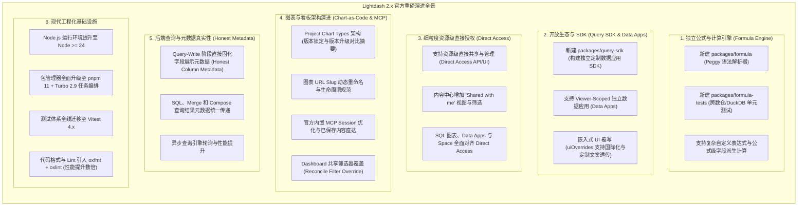
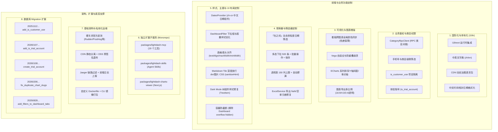
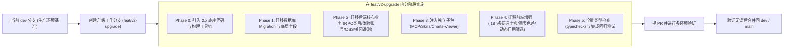

# Lightdash 2.x 升级与定制功能迁移全景指南

本文档全面梳理自基础版本（0.2091.x ~ 0.2513.0）以来：
1. **当前项目（`lightdash-i18n`）沉淀的全部自研与定制功能**；
2. **上游官方版本（Lightdash 2.x / 2.57.x）新增的架构演进与重磅能力**；
3. **在当前项目内**平滑升级至 2.x 且不破坏现有生产特性的分步迁移实施方案。

---

## 一、升级背景与目标

1. **升级背景**：
   - 当前项目自上游分支（commit `c8b2bbead0`）拉出后，持续自研了国际化、类目鉴权、MCP 独立服务、图表色差优化、动态日期筛选、遥测硬关等核心能力，积累了 1000+ commit，修改涉及 1300+ 文件。
   - 上游官方版本已大步演进至 `2.x`（如 2.57.0），重构了底层底层技术栈，推出了全新的独立公式计算引擎、自定义 Data Apps SDK、细粒度直接资源权限（Direct Access）、Chart/Dashboard-as-Code 增强体系等。
2. **迁移目标**：
   - 在**当前仓库内**建立升级分支，无缝引入 2.x 的上游最新特性与性能优化。
   - **零遗漏地继承**当前项目的所有自研业务逻辑、接口、配置和工具。
   - 保证平稳过渡，不影响现有生产功能。

---

## 二、上游 Lightdash 2.x 新增核心功能与架构演进盘点

从 `0.2513.0` 升级至 `2.57.0` 期间，上游官方进行了大刀阔斧的升级，主要涵盖以下 6 大维度：

### 上游新增能力详细对照表

| 核心领域 | 2.x 新增/改造特性 | 带来的价值与升级收益 |
|---|---|---|
| **公式引擎** | 新增 `packages/formula` 子包，基于 Peggy 实现专用公式语法解析；配合 `packages/formula-tests` 实现 DuckDB/数仓统一验证 | 用户可在界面直接使用丰富公式做派生计算，不再单纯依赖 dbt 或硬编码 SQL。 |
| **应用开放 SDK** | 新增 `packages/query-sdk`，支持在外部 React 应用中直接对接 Lightdash 语义层 | 便于后续业务系统无缝嵌入 Lightdash 指标查询、自定义数据小应用（Data Apps）。 |
| **嵌入与文案覆盖** | 官方新增 `uiOverrides` 机制（过滤操作符、时间单位、日期缩放文案注入） | 可与我方的 `i18n` 国际化系统深度配合，更优雅地实现全站文案覆写。 |
| **资源直接共享** | 新增 **Direct Access** 体系及 **Shared with me** 功能 | 摆脱以往必须将用户拉进整个 Space 的粗粒度限制，可精确把单张图表/看板分享给特定用户。 |
| **图表版本规范** | 引入 Project Chart Types 版本化管理与 Explorer 升级对比摘要 | 规范了自定义图表类型的发布周期与项目级版本锁定。 |
| **真实字段元数据** | SQL/Merge/Compose 查询结果携带真实字段元数据（Honest Column Metadata） | 解决以往复杂合并查询在前端字段类型展示不准、格式化丢失的问题。 |
| **现代工程体系** | Node 24 + pnpm 11 + Turbo + Vitest + oxfmt/oxlint | 构建、类型检查和单元测试速度提升 2~5 倍，Monorepo 任务编排更健壮。 |

---

## 三、当前项目自研/定制功能清单盘点

---

## 四、各模块详细功能与源码位置对照表

### 1. 前端国际化与本地化 (i18n)

| 功能项 | 关键文件与位置 | 迁移注意事项 |
|---|---|---|
| i18n 运行时初始化 | `packages/frontend/src/plugins/i18n.ts` | 挂载到 2.x 的 `MantineProvider` 或根 `App.tsx` |
| 中英文翻译字典 | `packages/frontend/public/locales/zh/translation.json` `packages/frontend/public/locales/en/translation.json` | 保留全量词条，对齐 2.x 新增界面的 key |
| CDN 语言包加载 | `packages/frontend/src/plugins/i18n.ts` (`loadPath` 逻辑) | 支持 `window.__CDN_BASE_URL__` 动态前缀 |
| 中文时间格式转换 | `packages/frontend/src/hooks/useTimeAgo.ts` | 结合 dayjs/date-fns 对中文相对时间做格式化 |

### 2. 业务鉴权、类目权限与体验账号

| 功能项 | 关键文件与位置 | 迁移注意事项 |
|---|---|---|
| RPC 类目服务客户端 | `packages/backend/src/clients/CategoryRpcClient/` | 注册进 `ClientRepository.ts` |
| 手机号与类目权限模型 | `packages/backend/src/models/UserDashboardCategoryModel.ts` | 注册进 `ModelRepository.ts` |
| 看板级联类目筛选 | `packages/backend/src/services/DashboardService/` `packages/frontend/src/utils/categoryFilters.ts` | 首次与联动统一使用无 `isInit` 的校验逻辑 |
| Customer Use 标记 | `packages/backend/src/database/entities/projects.ts` `packages/common/src/types/projects.ts` | 拦截非授权项目的看板操作 |
| 体验账号与登录拦截 | `packages/backend/src/database/migrations/20260108020640_create_trial_account.ts` `packages/backend/src/utils/trailAccount.ts` | 迁移默认初始化账号及只读/受限逻辑 |

### 3. 独立子包 (Zero-coupling)

| 功能项 | 关键文件与位置 | 迁移注意事项 |
|---|---|---|
| 独立 MCP 服务 | `packages/lightdash-mcp/` | 复制目录，在根 `pnpm-workspace.yaml` 与 `package.json` 添加 script |
| LLM Agent 技能定义 | `packages/lightdash-skills/` | 同步 SKILL.md、ROUTER-SOP.md 及 `.mcp.json` 模板 |
| 独立可视化查看器 | `packages/lightdash-charts-viewer/` | Next.js 独立工程，验证与 2.x backend 的 API 兼容 |

### 4. 图表与可视化增强

| 功能项 | 关键文件与位置 | 迁移注意事项 |
|---|---|---|
| 跨图表全局颜色同步 | `packages/frontend/src/hooks/useChartColorConfig/` `packages/frontend/src/utils/colorUtils.ts` | FNV-1a 哈希、72 色扩展与欧氏色差保底顺延 |
| 自定义图表 (Vega) 尺寸自适应 | `packages/frontend/src/components/CustomVisualization/` | ResizeObserver 防抖，避免连续缩放重叠崩溃 |
| ECharts 交互与展示优化 | `packages/common/src/visualizations/` `packages/frontend/src/hooks/echarts/` | 堆叠条形图顺序、Y 轴标签间距、单点时间轴展示 |
| 图表图片导出扩展 | `packages/frontend/src/utils/chartDownloadUtils.ts` | 支持 16:9、4:3、3:4 及透明/白底切换 |

### 5. 探索器与筛选器定制

| 功能项 | 关键文件与位置 | 迁移注意事项 |
|---|---|---|
| 「在之间」动态日期切换 | `packages/common/src/types/filter.ts` `packages/common/src/utils/filters.ts` `packages/frontend/src/components/common/Filters/` | 日/月/季/年粒度切换，开始至最新月动态限制 |
| 多选下拉批量操作 | `packages/frontend/src/components/common/Filters/FilterMultiSelect.tsx` | 500 条上限、批量反选/清空、日期倒序 |
| 透视表列数与列宽控制 | `packages/common/src/constants/pivot.ts` `packages/frontend/src/components/Explorer/VisualizationCard/` | 最大列数扩展至 150，支持列宽自适应撑满 |
| Excel 导出服务修复 | `packages/backend/src/services/ExcelService/ExcelService.ts` | 空白单元格兜底、数值精度与单位处理 |

### 6. 样式、主题与 UI 布局定制

| 功能项 | 关键文件与位置 | 迁移注意事项 |
|---|---|---|
| 日期组件中文语言 Provider | `packages/frontend/src/providers/MantineProvider.tsx` | 引入 `@mantine/dates` 的 `<DatesProvider settings={{ locale: 'zh-cn' }}>` 与 `dayjs/locale/zh-cn` |
| Filter 下拉框与胶囊样式重构 | `packages/frontend/src/components/DashboardFilter/filterDropdownStyles.ts` `packages/frontend/src/components/DashboardFilter/filterPillStyles.ts` | 优化下拉菜单阴影、圆角、间距与选项选中态 |
| 容器防截断 (移除 overflow:hidden) | `packages/frontend/src/components/DashboardTiles/TileBase/TileBase.styles.tsx` | 避免看板卡片 overflow 隐藏导致 Filter 下拉面板或 Tooltip 被外层容器遮挡截断 |
| 表格与表头对齐样式同步 | `packages/frontend/src/components/common/Table/Table.styles.ts` `packages/frontend/src/components/common/Table/ScrollableTable/BodyCell.tsx` `packages/frontend/src/components/common/Table/ScrollableTable/TableHeader.tsx` | 同步表头与单元格 `$textAlign`（左/中/右对齐），支持 `$maxWidth`、`$minWidth` 动态约束 |
| Markdown Tile 深度放行 CSS 样式 | `packages/common/src/utils/sanitizeHtml.ts` | 允许 `div` 标签使用 Flexbox、Grid、Border、Background、Transform 等丰富样式，放行 `picture/source/srcset` 图片标签 |
| 暗黑模式树组件背景修复 | `packages/frontend/src/components/common/Tree/TreeItem.module.css` | 修复 Dark Mode 下 Tree 目录树背景被默认类覆盖的问题（使用 `!important` 修正透明与 hover 背景） |
| 无权限页与移动端/小程序适配 | `packages/frontend/src/pages/NoDashboardPermission.tsx` `packages/frontend/src/features/` | 调整无权限页面 padding/scale 响应式比例，适配移动端与微信小程序环境 |

### 7. 基础架构、安全与私有化运维

| 功能项 | 关键文件与位置 | 迁移注意事项 |
|---|---|---|
| 硬关闭官方遥测 | `packages/backend/src/config/parseConfig.ts` `packages/backend/src/analytics/LightdashAnalytics.ts` `packages/frontend/src/providers/Tracking/TrackingProvider.tsx` `packages/cli/src/analytics/analytics.ts` | RudderStack、PostHog、Intercom、Headway、Pylon 彻底静默 |
| CDN/OSS 静态分离 | `packages/backend/src/services/OssService.ts` `packages/backend/src/controllers/ossController.ts` `packages/common/src/types/api/oss.ts` | 后端运行时注入 HTML 静态路径，大文件直传 |
| Jaeger 链路过滤与日志上报 | `packages/backend/src/instrumentation/jaeger-filter-span-processor.ts` `packages/backend/src/controllers/logController.ts` | 按 `jaeger-debug-id` 按需上报 trace |
| 构建与 CI/CD 镜像 | `dockerfile`、`dockerfile-dev`、`.github/workflows/` | 对齐 Node 24 运行时环境与 CLI 镜像打包 |

### 8. 数据库 Migration 扩展

| 功能项 | 关键文件与位置 | 迁移注意事项 |
|---|---|---|
| 项目客户使用标记 | `packages/backend/src/database/migrations/20251112101916_add_is_customer_use_to_projects.ts` | 项目表新增 `is_customer_use` 字段 |
| 用户体验账号标记 | `packages/backend/src/database/migrations/20260107080255_add_is_trial_account_to_users.ts` | 用户表新增 `is_trial_account` 字段 |
| 体验账号数据种子初始化 | `packages/backend/src/database/migrations/20260108020640_create_trial_account.ts` | 初始化 `dev-trial@brandct.cn` 账号与加密密码 |
| 修复图表 Slug 重复问题 | `packages/backend/src/database/migrations/20260206100000_fix_duplicate_chart_slugs.ts` | 修复历史图表 slug 冲突 |
| 看板 Tab 筛选器保存扩展 | `packages/backend/src/database/migrations/20250828164124_add_filters_to_saved_dashboard_tabs.ts` | 支持在 Tab 维度持久化筛选配置 |

---

## 五、当前项目内的平滑迁移演进路线

为确保现有业务不受任何影响，推荐在当前仓库内遵循**「分支隔离 -> 分层移植 -> 逐步验证 -> 最终切流」**的节奏：

### 实施阶段划分

1. **Phase 0: 准备工作与依赖链对齐**
   - 在当前仓库创建分支 `feat/v2-upgrade`。
   - 对齐 Node.js (>=24)、pnpm (v11) 及 Turbo 构建配置。
2. **Phase 1: 数据库与模型迁移**
   - 导入 5 个自研迁移脚本至 `packages/backend/src/database/migrations/`。
   - 验证 `knex migrate:latest` 与 `rollback` 幂等性。
3. **Phase 2: 基础设施与后端逻辑移植**
   - 移植硬关遥测配置。
   - 移植 CategoryRpcClient、UserDashboardCategoryModel 及 DashboardService 权限逻辑。
   - 移植 OssService / OssController 及 LogController。
   - 执行 `pnpm generate-api` 重新生成 TSOA 路由。
4. **Phase 3: 独立子包同步**
   - 将 `packages/lightdash-mcp`、`packages/lightdash-skills`、`packages/lightdash-charts-viewer` 复制并挂载到 workspace。
   - 针对 2.x API 验证 MCP 工具集。
5. **Phase 4: 前端核心能力与国际化**
   - 挂载 `i18n.ts` 并合并 `public/locales/zh/translation.json`。
   - 移植全局颜色分配器、ECharts 细节优化与动态日期筛选器。
6. **Phase 5: 全量测试与上线准备**
   - 执行 `pnpm common-typecheck`、`pnpm backend-typecheck`、`pnpm frontend-typecheck`。
   - 构建 Docker 镜像，进行前后端功能全量冒烟与回归测试。
