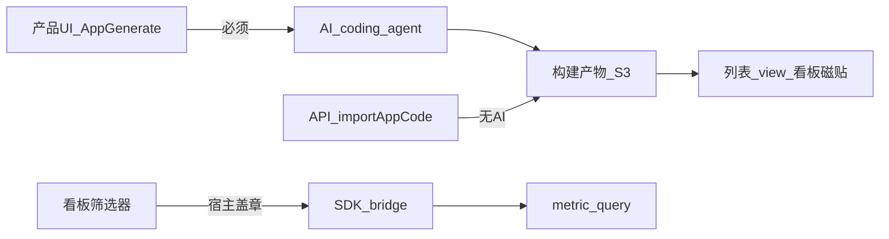

# Data Apps 专题（现状 / 用法 / 跟进）

> **日期**：2026-09-10  
> **用途**：Data Apps 专项追踪页；不替代短版发版说明。  
> **索引**：[`README.md`](README.md) · 发版：[`CHANGELOG.md`](CHANGELOG.md) / [`CHANGELOG-ops.md`](CHANGELOG-ops.md)  
> **交测口径**：入口 / 列表 / 看板磁贴可测；**不测** AI generate 端到端、Sandbox 真跑通。

---

## 1. 现状与交付边界

| 状态 | 能力 |
|------|------|
| **已交付** | 导航入口、全部数据应用列表、CASL 权限、看板 Data App 磁贴、后端 AppModel / API / preview 基建、相关 DB migration |
| **不交付（本窗口）** | AI 一键 generate 端到端、Sandbox 真构建出 `ready`、CLI `upload --apps`、产品内代码 IDE |

开关：`APPS_RUNTIME_ENABLED=true`（改完需重启 backend）。关闭时界面不出现数据应用入口。

---

## 2. 预发踩坑（加图块 Failed to load apps）

症状：看板编辑 → 添加图块 → 数据应用 → 弹窗「Failed to load apps」；Network 中

`GET /api/v2/content?...&contentTypes=data_app&dataAppVizsFilter=exclude` 返回 **500**，日志含 `routine: 'errorMissingColumn'`。

| 结论 | 说明 |
|------|------|
| 原因 | 库未跑齐 `apps` / `app_versions` 等 migration（缺 `template`、`views_count` 等列） |
| **不是** | 本仓相对上游 `../lightdash` 缺核心 apps migration 文件（已对齐） |
| 处理 | 预发执行 `pnpm -F backend migrate-production`（或确认容器 entrypoint 已跑成功），再查 `\d apps` 与 `knex_migrations` |

---

## 3. 产品怎么用

### 3.1 入口

- 顶部 **新建 → 数据应用** → `/projects/{uuid}/apps/generate`
- **浏览 → 全部数据应用** → 列表；可打开 `/apps/{appUuid}` 或 `/view`
- 可建多个

### 3.2 嵌进看板

1. 看板标题旁 **铅笔** 进入编辑  
2. **添加图块** → **数据应用**  
3. 选择已有 app（需列表接口正常；要有可展示版本才有意义）

### 3.3 Select model

页面右下角 **选择模型** 选的是 **AI coding 模型**（Claude / Codex），**不是** Explore 数据集。

| 配置 | 作用 |
|------|------|
| `APPS_CODING_AGENT=claude\|codex` | Agent 类型 |
| `ANTHROPIC_API_KEY` / `OPENAI_API_KEY` 等 | 对应厂商 Key |
| 组织 AI 设置 `visibleDataAppModels` / `dataAppCodingAgent` | 下拉可见模型 |

本仓 generate 未交付时，选模型也无法保证生成成功。

---

## 4. 创建路径

| 路径 | 说明 |
|------|------|
| 产品 UI（含「从零开始」） | **只能 AI**：自然语言 → generate / iterate；不是代码编辑器 |
| 开发者手写 | `POST .../apps/upload`（`importAppCode`）上传 `src/` + manifest → **仅构建**；本仓无 IDE；CLI `--apps` **未实现** |

---

## 5. 前端手写能力边界

| 能 | 不能 / 限制 |
|----|-------------|
| Vite + React 脚手架内自绘（KPI、recharts / tanstack-table / d3） | 任意框架、任意后端 API |
| `@lightdash/query-sdk` 查语义层（字段、filters、parameters、saved chart） | 宿主无现成主站图表组件；要自绘 |
| `lightdash-app.yml` + 上传构建 | 产品内 IDE；本仓 CLI `--apps` |
| 自定义 npm（需权限与安全校验） | build 脚本强制 vite；依赖受策略约束 |

典型形态：KPI 墙、讲解幻灯、打印向报告、单磁贴 viz（`data_app_viz`）。本质是 **query-sdk 取数 + React 自绘**。

注意：Sandbox 未交付时，上传也难出 `ready`，磁贴可能显示无可用版本。

---

## 6. 看板筛选联动

**有（部分、盖章式）：**

- 宿主把 `dashboardFilters`（含 tileTargets）盖进 SDK bridge 的 metric/chart 查询  
- 筛选变更可触发 iframe 重载  
- 字段对不上 explore 时后端丢弃无效条件  
- App **一般不用**自己读筛选；**不能**从 App UI 回写看板筛选  

相关代码：`DashboardDataAppTile.tsx`、`useAppSdkBridge.ts`、`useDashboardFiltersForTile.ts`。

---

## 7. 存储与预览

- Postgres：`apps`、`app_versions` 等  
- 产物：S3（source / bundle）  
- 预览：preview JWT + iframe（`postMessage` + query-sdk bridge）

---

## 8. i18n 状态

| 区域 | 状态 |
|------|------|
| 导航、列表、`AddTile` / 磁贴编辑表单 | 已中文 |
| 生成落地页、模板卡、Select model、同页 Header / 常见 toast | 本批补中文 |
| Inspector / Promote 等深路径 | 可后续第二刀 |

---

## 9. 后期跟进清单

- [ ] Sandbox 真构建 → `ready` 预览闭环  
- [ ] AI generate / iterate 端到端（Key、agent、组织模型设置）  
- [ ] CLI `lightdash upload --apps` / download  
- [ ] 手写开发样例与内部文档  
- [ ] Inspector / Modal 等剩余 i18n  
- [ ] Chart Types / External Sources（依赖 Data Apps 深挖）  
- [ ] 预发确认 apps migration 每次部署必跑通  

---

## 10. 相关代码索引

| 用途 | 路径 |
|------|------|
| 生成页 | `packages/frontend/src/pages/AppGenerate.tsx` |
| features | `packages/frontend/src/features/apps/` |
| 模板 | `packages/frontend/src/features/apps/templates.ts` |
| 看板磁贴 | `packages/frontend/src/components/DashboardTiles/DashboardDataAppTile.tsx` |
| Content 列表 | `packages/backend/src/models/ContentModel/ContentConfigurations/DataAppContentConfiguration.ts` |
| 上传 API | `packages/backend/src/ee/controllers/appGenerateController.ts`（`importAppCode`） |
| SDK | `packages/query-sdk/` |
| 建表 migration | `packages/backend/src/database/migrations/20260330120000_create_apps_tables.ts` 起 |

---

## 11. 修订记录

| 日期 | 说明 |
|------|------|
| 2026-09-10 | 初版：交付边界、用法、手写能力、筛选联动、预发缺列踩坑、跟进清单 |
