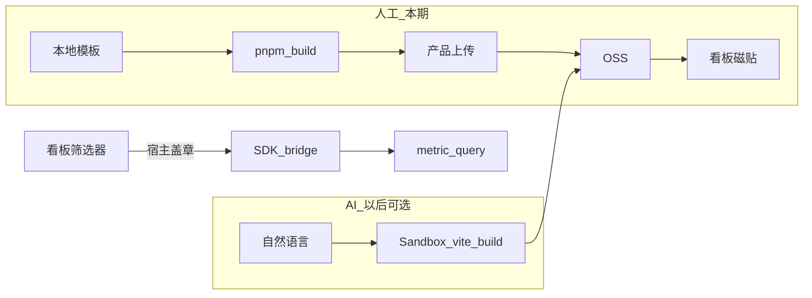

# Data Apps 专题（现状 / 用法 / 跟进）

> **日期**：2026-09-22  
> **用途**：Data Apps 专项追踪页；不替代短版发版说明。  
> **索引**：[`README.md`](README.md) · 发版：[`CHANGELOG.md`](CHANGELOG.md) / [`CHANGELOG-ops.md`](CHANGELOG-ops.md)  
> **交测口径**：浏览列表、管理员上传预构建包、预览、看板磁贴与筛选盖章可测；**不测** AI generate 端到端、Sandbox 真跑通。

---

## 1. 现状与交付边界

闸门：`APPS_RUNTIME_ENABLED=true`（License 已解绑；改完需重启 backend）。关闭时导航不出现，列表跳首页。

| 状态 | 能力 |
|------|------|
| **已交付（人工主路径）** | 本地模板 `pnpm build` 后上传 `src/` + `dist/`；服务端校验后版本直接 `ready`；列表 / 预览 / 看板磁贴；管理员更新包 |
| **不交付（本期）** | AI generate / iterate、云端 sandbox 构建、CLI `upload --apps`、产品内代码 IDE、设置页入口 |

**人工 vs AI**

| 路径 | 构建 | 本期 |
|------|------|------|
| **人工（主路径）** | 本地模板里 `pnpm build`，上传 `src/` + `dist/` | 做 |
| **AI generate** | 云端 sandbox 里 vite build | 不做；入口隐藏。Sandbox 代码保留，以后开 AI 再用 |

开关：

- 总闸：`APPS_RUNTIME_ENABLED` → feature flag `EnableDataApps`
- AI 另开 `APPS_AI_GENERATE_ENABLED`（默认 false，本期未接 UI；入口一律隐藏）
- 产物复用 `S3_*` / `APPS_S3_BUCKET`；iframe 跨域时设 `APP_RUNTIME_PREVIEW_ORIGIN`

---

## 2. 预发踩坑（加图块 Failed to load apps）

症状：看板编辑 → 添加图块 → 数据应用 → 弹窗「Failed to load apps」；Network 中

`GET /api/v2/content?...&contentTypes=data_app&dataAppVizsFilter=exclude` 返回 **500**，日志含 `routine: 'errorMissingColumn'`。

| 缺列（日志原文） | 原因 | 处理 |
|------------------|------|------|
| `apps.template` / `apps.views_count` 等 | 库未跑齐 apps 相关 migration | 确认镜像含 apps migrations 后执行 `migrate-production` |
| `spaces.deleted_at` | Data Apps 查询过滤已删空间；本仓曾缺 soft-delete migration | 已补入 `20260206163809_add_soft_delete_to_spaces.ts`（及图表/看板等 soft-delete）；发版后必须再跑 migrate |

发版后建议在库里自检：

```sql
\d spaces
-- 应有 deleted_at、deleted_by_user_uuid
SELECT name FROM knex_migrations WHERE name LIKE '%soft_delete_to_spaces%';
```

---

## 3. 产品怎么用

入口只放在内容库，**不进设置页**。上传过的应用和图表/看板一样，是项目内容；看板「添加图块」也从这里挑。

### 3.1 入口

- **浏览 → 全部数据应用** → `/projects/{uuid}/apps`
- 管理员右上角 **上传应用**（选本地已构建目录，须含 `src/`、`dist/index.html`、`lightdash-app.yml`）
- 顶部 **新建 → 数据应用**（仅管理员）→ 同一列表并打开上传弹层（`?upload=1`）
- `/apps/generate`、`/apps/:uuid` 编辑页一律重定向（无 AI 入口）
- 点行进入 `/apps/:uuid/view` 预览

### 3.2 权限

| 角色 | 列表 / 浏览菜单 | 上传 / 更新包 | 看板里用 |
|------|------------------|----------------|----------|
| viewer | 否 | 否 | 能看已嵌到自己有权看板里的磁贴 |
| interactive_viewer / editor / developer | 能看有权限的 | **否** | 能把已有 ready app 加成图块（仍受看板编辑权） |
| **admin**（组织或项目） | 能看全部 | **能（唯一上传入口）** | 能 |

判定：`manage:DataApp` 且只有 `organizationUuid` 或 `projectUuid`（无 space / createdBy / preview 条件）。CASL 里 editor 虽有 `create:DataApp`，上传不走这条。删除仍走现有 manage（空间/创建者/admin）。

### 3.3 嵌进看板

1. 看板标题旁 **铅笔** 进入编辑  
2. **添加图块** → **数据应用**  
3. 选择状态为「可使用」（`ready`）的 app  
4. 保存后刷新，磁贴仍能拉 preview（`dashboard_tile_data_apps` 读回 `appUuid`）

---

## 4. 创建路径



| 路径 | 说明 |
|------|------|
| 人工上传 | `POST /api/v1/ee/projects/:projectUuid/apps/upload`（`importAppCode`）要求 `src/` + `dist/index.html`；**不创建 sandbox**，dist 写入现有 S3 路径，版本标 `ready` |
| AI generate | 入口隐藏；`AppGenerateService` 保留但不暴露 UI |

第一版拒绝自定义 npm（只用模板依赖白名单）。无 `dist/index.html` 会明确报错，提示用本地模板 `pnpm build`，不回落到云构建。

---

## 5. 本地脚手架

包：[`packages/data-app-template/`](../../packages/data-app-template/)（不打进主站 bundle）。

```
my-kpi-app/
  lightdash-app.yml
  package.json
  src/main.jsx
  src/App.jsx
  dist/                 # pnpm build 后随包上传
```

1. 仓库根目录 `pnpm install` 且 `pnpm --filter @lightdash/query-sdk build`
2. `cd packages/data-app-template`，改 `src/App.jsx` 的 `EXPLORE` / `METRIC`
3. `pnpm build`
4. 管理员在「全部数据应用」上传该目录

嵌在 iframe 里时 SDK 走 postMessage，不需要本地 API Key。

---

## 6. 看板筛选联动

**有（部分、盖章式）：**

- 宿主把 `dashboardFilters`（含 tileTargets）盖进 SDK bridge 的 metric/chart 查询  
- 筛选变更会改 iframe URL 的 `f=` 并触发重载  
- 字段对不上 explore 时后端丢弃无效条件  
- App **一般不用**自己读筛选；**不能**从 App UI 回写看板筛选  

相关代码：`DashboardDataAppTile.tsx`、`useAppSdkBridge.ts`、`useDashboardFiltersForTile.ts`。

---

## 7. 存储与预览

- Postgres：`apps`、`app_versions`、`dashboard_tile_data_apps`
- 产物：S3（`apps/{uuid}/versions/{n}/`：`index.html`、`assets/`、`source.tar`）
- 预览：preview JWT + iframe（`postMessage` + query-sdk bridge）
- `dist` 只走 preview JWT + CSP，禁止当任意托管站

---

## 8. i18n 状态

| 区域 | 状态 |
|------|------|
| 导航、列表、上传弹层、状态列、`AddTile` / 磁贴编辑表单 | 已中英 |
| 生成落地页、模板卡、Select model | 文案保留，入口已隐藏 |
| Inspector / Promote 等深路径 | 可后续第二刀 |

---

## 9. 手工验收

1. 开 `APPS_RUNTIME_ENABLED`，能进「全部数据应用」
2. 脚手架 `pnpm build` 后由 **admin** 上传 → 状态「可使用」→ `/apps/{uuid}/view` 能开 iframe
3. 看板添加数据应用图块 → 保存刷新仍显示（不再因空 `appUuid` 跳过 preview）
4. 改看板筛选，iframe 查询带上筛选（`useAppSdkBridge` 盖章 `dashboardFilters`）
5. 无 AI 入口（`/apps/generate` 重定向到列表）；非 admin 看不到上传；admin 以外调 upload API 403
6. 第一版上传含自定义 npm 被拒绝

---

## 10. 后期跟进清单

- [ ] AI generate / iterate 端到端（接 `APPS_AI_GENERATE_ENABLED`、Key、agent、组织模型设置）
- [ ] Sandbox 真构建（仅 AI 路径）
- [ ] CLI `lightdash upload --apps` / download
- [ ] `SpacePermissionService` no-op 试用可过，正式开放前再收紧列表空间过滤
- [ ] Inspector / Modal 等剩余 i18n
- [ ] Chart Types / External Sources（依赖 Data Apps 深挖）
- [ ] 预发用真实 OSS/CDN 嵌一次 iframe；确认 apps migration 每次部署必跑通

---

## 11. 相关代码索引

| 用途 | 路径 |
|------|------|
| 列表 / 上传入口 | `packages/frontend/src/pages/SavedApps.tsx` |
| 上传弹层 | `packages/frontend/src/features/apps/components/AppUploadModal.tsx` |
| 脚手架 | `packages/data-app-template/` |
| 看板磁贴 | `packages/frontend/src/components/DashboardTiles/DashboardDataAppTile.tsx` |
| 磁贴读回 | `packages/backend/src/models/DashboardModel/DashboardModel.ts` |
| Content 列表 | `packages/backend/src/models/ContentModel/ContentConfigurations/DataAppContentConfiguration.ts` |
| 上传 API | `packages/backend/src/ee/services/AppGenerateService/AppGenerateService.ts`（`importAppCode`） |
| 包校验 | `packages/common/src/ee/apps/code.ts`（`splitDataAppUploadFiles`） |
| SDK | `packages/query-sdk/` |
| 建表 migration | `packages/backend/src/database/migrations/20260330120000_create_apps_tables.ts` 起 |

---

## 12. 修订记录

| 日期 | 说明 |
|------|------|
| 2026-09-10 | 初版：交付边界、用法、手写能力、筛选联动、预发缺列踩坑、跟进清单 |
| 2026-09-10 | 补记：`spaces.deleted_at` 缺列与 soft-delete migration 回填 |
| 2026-09-22 | 人工主路径：本地模板构建上传、跳过 sandbox、隐藏 AI、管理员上传、磁贴读回 |
