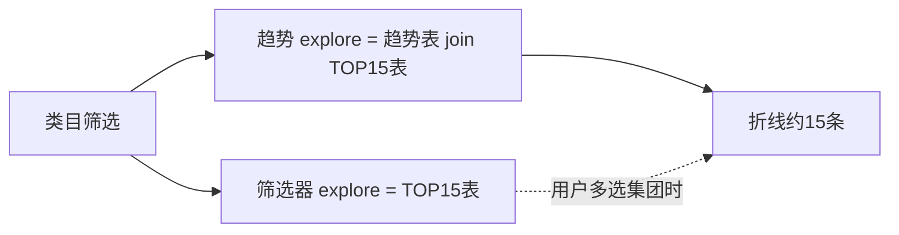

# 集团筛选「任何值」与趋势图 TOP15（两表优化版）

## 约束

- **必须两张表**：筛选器用 TOP15 表，趋势用长周期表，**不能合成一张业务表**。
- 任意值时产品不加集团条件 → 要在「趋势查询」里用 TOP15 表把集团裁掉。

---

## 最优做法（两表、尽量少新建）

**复用现有 TOP15 表，不要再抽一层 dim；不要把两表合成一张。**

| 优先级 | 做法 | 新建对象 |
|--------|------|----------|
| **首选** | Lightdash Explore：**趋势表 JOIN TOP15 表**（类目+集团） | 0 张新表 |
| 其次 | dbt 只建一个 **view** 给折线图用（仍 ref 两张原表） | 1 个 view，无新实体表 |



---

## 怎么接（关键）

两表都要有对齐的 **一~四级类目 + 集团**。  
Join：**类目 + 集团**（禁止只按集团）。

TOP15 侧只留「当期」名单（join 条件或 always filter），例如：

```sql
-- 折线图用 view（可选；Explore join 可达到同样效果）
select
    t.date_day,
    t.cat_l1, t.cat_l2, t.cat_l3, t.cat_l4,
    t.group_name,
    t.sales_amt
from {{ ref('ads_group_trend') }} t
inner join {{ ref('ads_group_rank_context') }} g   -- 现有筛选器/TOP15 表
    on t.group_name = g.group_name
   and t.cat_l1 = g.cat_l1
   and t.cat_l2 = g.cat_l2
   and t.cat_l3 = g.cat_l3
   and t.cat_l4 = g.cat_l4
where g.is_current_period = 1    -- 当期名单
  and g.rank_in_context <= 15    -- 若表里已是 TOP15 可省略
  and t.date_day >= date '2025-01-01'
```

口径：用 **TOP15 表的当期名单** 定集团，趋势表只提供这些集团的历史点。

---

## 看板

1. 集团筛选器：仍用 **TOP15 表**（保持两表分工）。
2. 折线图：用 **join 后的趋势 explore / view**（不是裸全量趋势表）。
3. 类目筛选：两边都映射到各自类目字段。
4. 集团筛选：映射到趋势侧 `group_name`；默认「任何值」即可（join 已裁到 ~15 条线）。
5. 用户多选集团：再收窄。

---

## 验收

- 任意值 → ≈ 当前类目 TOP15 条线  
- 换类目 → 名单与线一起变  
- 多选集团 → 再减少  
- 两表仍独立：筛选看 TOP15，趋势看长周期（经 join 裁剪）

---

## 不要做

- 合成一张「又当筛选又当全历史」的大表（你已排除）  
- 再单独建一层与 TOP15 重复的 dim（除非现有表口径对不齐）  
- 只按集团 join、写死默认 15 个、只改图块关联、用行数 limit  
